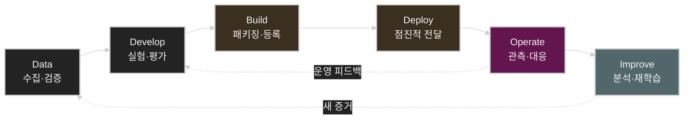
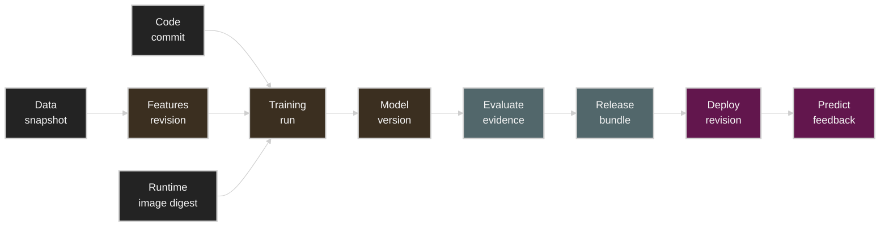
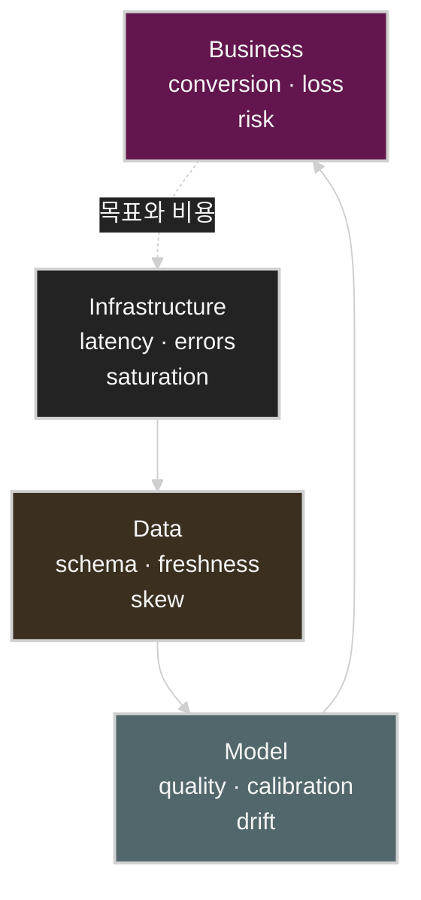
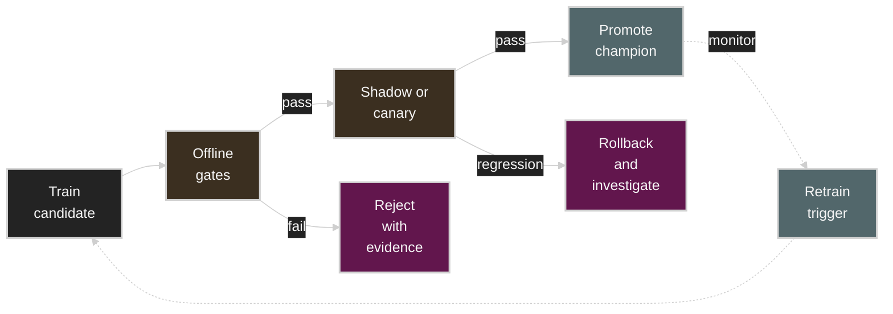
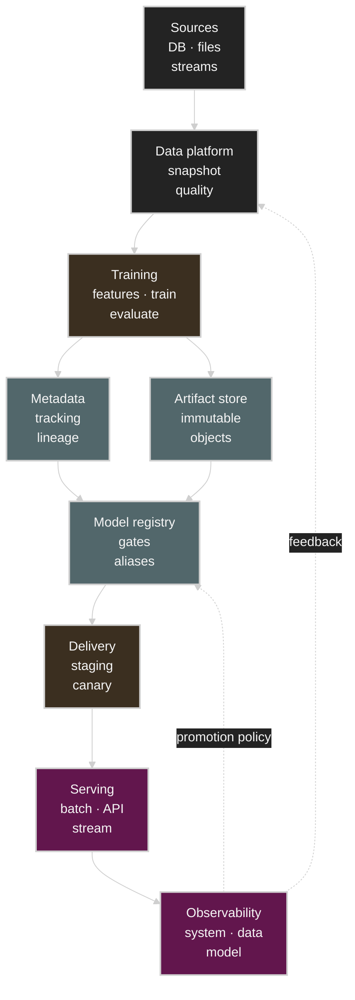

# MLOps: 모델을 배포하는 기술이 아니라 변경을 통제하는 운영 시스템

MLOps를 설명하는 인포그래픽은 보통 `Data → Develop → Build → Deploy → Operate → Improve`라는 순환 구조와 실험 추적, 모델 레지스트리, CI/CD, 컨테이너, 오케스트레이션, 모니터링 같은 도구를 한 장에 배치한다. 전체 지형을 빠르게 파악하기에는 유용하지만, 실제 운영에서 가장 어려운 질문은 그림의 박스 사이에 숨어 있다.


- 어떤 데이터와 코드가 현재 프로덕션 모델을 만들었는가?
- 오프라인 평가가 좋아진 모델을 어떤 증거로 프로덕션에 승격할 것인가?
- 데이터 분포가 바뀌었다는 이유만으로 재학습을 시작해도 되는가?
- 새 모델의 장애를 애플리케이션 장애와 어떻게 구분할 것인가?
- 롤백할 때 모델만 되돌리면 되는가, 전처리와 피처 정의도 함께 되돌려야 하는가?
- 지연 도착하는 정답 라벨 없이 모델 품질 저하를 어떻게 탐지할 것인가?

이 글은 인포그래픽의 항목을 도구 목록이 아니라 **변경 관리, 증거 수집, 점진적 전달, 피드백 제어**라는 시스템 관점으로 다시 읽는다. 전통적인 예측 모델을 기본으로 설명하되, 마지막에는 LLM 및 RAG 애플리케이션에 필요한 LLMOps 확장도 다룬다.

작성 기준: 2026년 7월

## 목차

1. [MLOps가 해결하는 실제 문제](#1-mlops가-해결하는-실제-문제)
2. [수명주기: 선형 파이프라인이 아니라 폐루프 제어](#2-수명주기-선형-파이프라인이-아니라-폐루프-제어)
3. [Data: 데이터 계약과 시점 정합성](#3-data-데이터-계약과-시점-정합성)
4. [Develop: 재현 가능한 실험의 조건](#4-develop-재현-가능한-실험의-조건)
5. [Build: 모델 파일을 릴리스 단위로 바꾸기](#5-build-모델-파일을-릴리스-단위로-바꾸기)
6. [CI, CD, CT를 분리해서 설계하기](#6-ci-cd-ct를-분리해서-설계하기)
7. [모델 레지스트리와 계보](#7-모델-레지스트리와-계보)
8. [Feature Store: 피처의 시간 의미를 보존하기](#8-feature-store-피처의-시간-의미를-보존하기)
9. [Deploy: 배포 전략은 실험 전략과 다르다](#9-deploy-배포-전략은-실험-전략과-다르다)
10. [Operate: 네 층의 관측성을 함께 보기](#10-operate-네-층의-관측성을-함께-보기)
11. [Improve: 재학습은 자동화보다 제어가 먼저다](#11-improve-재학습은-자동화보다-제어가-먼저다)
12. [참조 아키텍처와 도구 선택](#12-참조-아키텍처와-도구-선택)
13. [자주 실패하는 설계와 첫 점검 항목](#13-자주-실패하는-설계와-첫-점검-항목)
14. [프로덕션 준비 체크리스트](#14-프로덕션-준비-체크리스트)
15. [LLMOps로 확장할 때 달라지는 것](#15-llmops로-확장할-때-달라지는-것)
16. [결론](#16-결론)
17. [참고 자료](#17-참고-자료)

## 1. MLOps가 해결하는 실제 문제

MLOps를 “머신러닝을 위한 DevOps”라고만 정의하면 핵심 차이를 놓치기 쉽다. 일반 소프트웨어는 동일한 코드와 입력에 대해 기대 동작을 비교적 명확히 테스트할 수 있다. 반면 ML 시스템의 동작은 코드뿐 아니라 데이터, 학습 알고리즘, 확률적 실행, 모델 파라미터, 서빙 시점의 입력 분포에 의해 결정된다.

프로덕션 예측을 단순화하면 다음과 같이 쓸 수 있다.

$$
\hat{y} = f_{\theta}(T(x; \phi), c)
$$

- $x$: 원시 입력
- $T$: 전처리 및 피처 변환
- $\phi$: 피처 정의와 변환 파라미터
- $\theta$: 학습된 모델 파라미터
- $c$: 런타임 설정, 임계값, 라우팅 정책 같은 운영 컨텍스트

여기서 코드가 같아도 학습 데이터 스냅샷, 피처 계산 시점, 라이브러리 버전, 랜덤 시드, 하드웨어 커널이 달라지면 $\theta$가 달라질 수 있다. 모델이 같아도 임계값이나 전처리 정의가 달라지면 비즈니스 동작이 달라진다. 따라서 프로덕션 릴리스의 단위는 `model.pkl`이나 checkpoint 하나가 아니다.

```text
ML release
= code revision
+ data snapshot
+ feature definitions
+ training configuration
+ model artifact
+ runtime environment
+ serving configuration
+ validation evidence
```

MLOps의 첫 번째 목적은 이 복합 릴리스를 **식별 가능하고 재현 가능하며 롤백 가능하게 만드는 것**이다. 두 번째 목적은 새 릴리스가 오프라인 점수뿐 아니라 온라인 시스템과 비즈니스 목표에서도 안전한지 검증하는 것이다. 세 번째 목적은 운영에서 얻은 신호를 다음 데이터와 실험으로 되돌리되, 잘못된 피드백이 모델을 증폭시키지 않도록 제어하는 것이다.

Google의 *Hidden Technical Debt in Machine Learning Systems*가 지적했듯이 실제 ML 시스템에서는 모델 코드보다 데이터 의존성, 피드백 루프, 설정, 외부 세계의 변화가 더 큰 운영 부채를 만들 수 있다. 좋은 MLOps는 모델 학습을 빠르게 만드는 데서 끝나지 않고 이 숨은 결합을 드러낸다.

## 2. 수명주기: 선형 파이프라인이 아니라 폐루프 제어

인포그래픽의 여섯 단계는 다음처럼 읽는 것이 좋다.



이 흐름에서 가장 중요한 단계는 `Operate → Improve → Data`로 돌아오는 점선이다. 이 선이 없으면 자동화된 모델 전달 파이프라인일 뿐이고, 선을 아무 통제 없이 연결하면 위험한 자동 재학습 루프가 된다.

각 단계는 파일을 다음 단계로 넘기는 작업이 아니라 **검증된 상태 전이**여야 한다.

| 현재 상태 | 전이 조건 | 생성해야 하는 증거 |
| --- | --- | --- |
| Raw data → Validated data | 스키마, 범위, 완전성, 중복, 시점 검사 통과 | 데이터 품질 보고서, 스냅샷 ID |
| Experiment → Candidate | 기준 모델 대비 오프라인 평가 통과 | 실행 ID, 평가 결과, slice별 성능 |
| Candidate → Registered | 패키지 및 보안 검사 통과 | artifact digest, SBOM, model signature |
| Registered → Staging | 통합, 부하, 호환성 검사 통과 | 테스트 로그, 용량 계획 |
| Staging → Canary | 승인 정책 및 배포 전 검사 통과 | 승인 기록, 변경 요청, rollback target |
| Canary → Champion | 온라인 guardrail과 목표 지표 통과 | 비교 대시보드, 통계적 판단 |
| Champion → Retired | 대체 모델 안정화 및 보존 정책 충족 | 종료 사유, 보존 및 삭제 기록 |

파이프라인의 성숙도는 박스 수나 사용하는 제품 수로 측정하기 어렵다. 더 유용한 질문은 “각 상태 전이가 기계가 읽을 수 있는 정책과 증거로 남는가?”이다.

## 3. Data: 데이터 계약과 시점 정합성

### 데이터 버전은 파일 이름이 아니다

`dataset_final_v7.csv` 같은 이름은 재현성에 충분하지 않다. 학습 실행이 참조하는 데이터 버전은 최소한 다음 정보를 가져야 한다.

- 저장 위치와 immutable snapshot 또는 content digest
- 추출 쿼리와 원본 테이블 버전
- event time과 processing time의 정의
- 학습/검증/테스트 분할 규칙
- 라벨 생성 로직과 관측 가능한 지연 시간
- 제외, 샘플링, 비식별화 정책
- 데이터 소유자, 보존 기간, 접근 정책

소규모 파일 기반 프로젝트에서는 DVC 같은 도구가 Git revision과 외부 artifact storage를 연결할 수 있다. 데이터 레이크 규모에서는 table snapshot, object version, catalog metadata를 조합하는 편이 일반적이다. 중요한 것은 특정 도구가 아니라 **같은 데이터 논리 버전을 다시 해석할 수 있는가**이다.

### 데이터 계약은 파이프라인의 타입 시스템이다

스키마 검사만으로는 데이터 품질을 보장할 수 없다. `age` 열이 정수형이어도 단위가 년에서 개월로 바뀌면 모델은 정상적으로 잘못된 예측을 낸다. 데이터 계약에는 구문적 조건과 의미적 조건이 함께 필요하다.

| 계약 범주 | 예시 |
| --- | --- |
| Schema | 열 이름, 타입, null 허용 여부 |
| Domain | 값의 범위, 단위, enum 집합 |
| Distribution | 평균, 분위수, 범주 비율, 희소도 |
| Freshness | event time 기준 최대 지연 |
| Volume | 시간당 row 수, 결측/중복률 |
| Referential integrity | entity key 존재와 유일성 |
| Privacy | 민감정보 분류, 마스킹, retention |
| Ownership | producer, consumer, 장애 연락 경로 |

임계값은 모두 동일하게 hard fail로 처리하지 않는다. 스키마 파손이나 필수 키 누락은 파이프라인을 중단해야 하지만, 계절성 때문에 예상 가능한 분포 변화는 경고와 검토 대상으로 둘 수 있다.

### 시간 누수와 point-in-time correctness

오프라인 학습 데이터는 예측 시점에 알 수 있었던 정보만 포함해야 한다. 고객이 10시 00분에 이탈할지를 예측했다면, 10시 05분에 생성된 고객지원 상태를 학습 피처에 포함해서는 안 된다. 이 원칙이 point-in-time correctness다.

피처 $j$의 event time을 $t_j$라고 할 때 예측 시점 $t_p$에 사용할 수 있는 피처는 기본적으로 다음 조건을 만족해야 한다.

$$
t_j \leq t_p
$$

실제로는 late-arriving event, backfill, window aggregation 때문에 단순 비교보다 복잡해진다. 학습 데이터 생성기가 현재의 최신 테이블 상태만 읽으면 미래 정보가 과거 샘플에 섞이는 label leakage가 발생할 수 있다. Feast의 point-in-time join 같은 기능은 entity와 timestamp를 기준으로 당시 이용 가능했던 피처를 결합하기 위한 장치다.

> [!WARNING]
> 랜덤 train/test split은 시간에 따라 동작이 변하는 서비스에서 낙관적인 결과를 만들 수 있다. 온라인 예측 문제라면 시간 순서 분할과 backtest를 기본 후보로 검토해야 한다.

### 데이터 품질과 데이터 유용성을 구분한다

데이터가 계약을 통과했다고 해서 모델에 유용한 것은 아니다.

- 데이터 품질: 형식과 의미가 계약을 만족하는가?
- 데이터 대표성: 배포 환경의 모집단을 충분히 반영하는가?
- 라벨 품질: 정답 정의와 측정 과정이 일관적인가?
- 피처 유용성: 타깃을 예측하는 신호가 있으며 안정적인가?
- 운영 가능성: 동일 피처를 요구 지연 시간과 비용 안에서 제공할 수 있는가?

이 구분이 없으면 data validation 단계가 통과한 뒤에도 모델 품질이 지속적으로 하락하는 이유를 설명하기 어렵다.

## 4. Develop: 재현 가능한 실험의 조건

실험 추적 도구는 metric 표를 저장하는 UI가 아니다. 특정 결과가 어떤 입력과 실행 환경에서 나왔는지 설명하는 실험 장부다.

한 실행은 적어도 다음 튜플로 식별해야 한다.

$$
Run = (C, D, F, H, E, S, P, M, A)
$$

- $C$: code revision
- $D$: data snapshot
- $F$: feature definition revision
- $H$: hyperparameters와 학습 설정
- $E$: container image, dependency lock, runtime environment
- $S$: seed와 비결정적 연산 설정
- $P$: hardware 및 parallelism topology
- $M$: 평가 metric과 slice 결과
- $A$: 생성된 artifact와 digest

### 재현성에도 수준이 있다

분산 GPU 학습이나 비결정적 커널이 포함된 환경에서는 bitwise identical 결과가 항상 현실적이지 않다. 팀은 필요한 재현성 수준을 명시해야 한다.

| 수준 | 의미 | 대표 용도 |
| --- | --- | --- |
| Artifact reproducibility | 동일 artifact를 다시 가져올 수 있음 | 배포, 롤백 |
| Pipeline reproducibility | 동일 입력으로 파이프라인을 다시 실행할 수 있음 | 감사, 장애 분석 |
| Statistical reproducibility | 결과가 허용 분포와 오차 범위 안에서 반복됨 | 대규모 학습 |
| Bitwise reproducibility | 출력이 비트 단위로 동일함 | 일부 규제·과학 계산 |

“seed를 기록했다”는 것만으로 재현 가능하다고 단정하면 안 된다. CUDA/cuDNN 알고리즘, collective 순서, 데이터 로더 병렬성, worker 수, compiler optimization, accelerator 세대까지 결과에 영향을 줄 수 있다.

### 실험 평가에서 평균 하나를 버린다

전체 accuracy나 RMSE 하나만 비교하면 중요한 회귀를 숨긴다. candidate model은 다음 축으로 비교하는 것이 좋다.

- 기준 모델과의 paired comparison
- 시간, 지역, 디바이스, 고객군 등 중요 slice별 품질
- calibration과 임계값 민감도
- robustness, out-of-distribution, missing feature 테스트
- 학습 시간, peak memory, artifact size
- 서빙 latency, throughput, accelerator memory
- 요청당 compute 및 비용

모델 선택은 단일 metric 최대화보다 제약식이 있는 최적화에 가깝다.

$$
\max Q(m)
\quad \text{subject to} \quad
L_{p99}(m) \leq L_{SLO},\;
C(m) \leq C_{budget},\;
R_k(m) \geq R_{min,k}
$$

$Q$는 품질 목표, $L_{p99}$는 tail latency, $C$는 비용, $R_k$는 중요 slice 또는 안전성 요구조건이다.

## 5. Build: 모델 파일을 릴리스 단위로 바꾸기

학습이 끝난 checkpoint를 바로 배포하면 학습 환경의 우연한 상태가 프로덕션 계약이 된다. Build 단계는 실험 결과를 검증 가능한 불변 릴리스로 바꾸는 과정이다.

### 릴리스 번들에 포함할 것

- 가중치 또는 serialized model
- 전처리와 후처리 코드
- 입력·출력 schema와 model signature
- tokenizer, vocabulary, normalization statistics
- dependency lock과 container image digest
- 기본 runtime configuration
- model card 또는 운영 설명
- 평가 보고서와 승인 상태
- source run, data snapshot, code revision을 가리키는 lineage
- SBOM, 취약점 검사 결과, 서명 또는 provenance

모델 artifact는 object storage에 저장하고 레지스트리는 metadata와 상태를 관리하는 식으로 역할을 분리하는 경우가 많다. 레지스트리에 수 GB 또는 수백 GB의 checkpoint 자체를 관계형 데이터베이스 blob으로 넣는 설계는 피하는 편이 좋다.

### 가변 태그 대신 digest로 배포한다

`model:latest`, `image:prod` 같은 가변 태그만 배포 명세에 남기면 같은 manifest가 시간에 따라 다른 artifact를 가리킬 수 있다. 사람이 읽기 쉬운 alias는 승격에 유용하지만 실제 배포 이력에는 immutable version과 digest를 함께 기록해야 한다.

```text
Human-facing pointer: fraud-model@champion
Resolved model:       fraud-model version 42
Artifact digest:      sha256:...
Container digest:     sha256:...
Feature view:         fraud_features revision 18
```

롤백도 alias를 과거 모델로 옮기는 작업만으로 끝나지 않을 수 있다. 새 모델이 새 피처 schema나 tokenizer를 요구한다면 모델, 전처리, 피처 정의, serving configuration을 하나의 호환 가능한 release bundle로 되돌려야 한다.

## 6. CI, CD, CT를 분리해서 설계하기

인포그래픽에서 CI/CD는 하나의 파이프라인처럼 보이지만 ML 시스템에서는 CI, CD, CT가 서로 다른 변경을 다룬다.

| 루프 | 주된 트리거 | 검증 대상 | 결과 |
| --- | --- | --- | --- |
| CI | 코드, pipeline definition, feature logic 변경 | unit, component, contract, security test | 검증된 코드와 실행 이미지 |
| CD | 검증된 pipeline 또는 model release | integration, load, compatibility, rollout policy | staging/production 배포 |
| CT | 새 데이터, schedule, drift, 품질 저하 | data/model validation, candidate comparison | 새 model candidate |

### CI: 모델 점수 이전에 파이프라인을 테스트한다

ML용 CI에는 일반적인 lint, unit test 외에 다음 검사가 필요하다.

- 데이터 schema 및 feature contract test
- 전처리 transformation의 단위 테스트
- 작은 고정 dataset을 사용한 pipeline smoke test
- train/serve preprocessing parity test
- model serialization/deserialization test
- model signature와 API schema 호환성 검사
- inference determinism 또는 허용 오차 검사
- training throughput, memory, serving latency 회귀 검사
- dependency, container, secret, license 검사

전체 dataset과 GPU cluster를 매 pull request마다 사용하는 것은 비용 효율적이지 않다. 빠른 synthetic/sampled test, 주기적인 통합 학습, release 전 full-scale validation으로 테스트 피라미드를 나누는 편이 낫다.

### CD: 모델과 파이프라인을 모두 전달한다

MLOps에서 배포 대상은 두 종류다.

1. prediction service 또는 batch scoring job
2. 반복 실행될 training/validation pipeline

모델만 자동 배포하고 학습 파이프라인은 notebook과 수동 명령에 남겨두면 운영자는 모델이 어떻게 생성됐는지 재구성하기 어렵다. 반대로 pipeline code를 자동 배포하더라도 model promotion이 무조건 자동이면 품질 회귀가 프로덕션으로 바로 전파될 수 있다.

### CT: 재학습과 자동 승격을 분리한다

Continuous Training은 새 데이터나 성능 신호에 따라 학습 파이프라인을 반복 실행하는 것이다. 새 candidate 생성과 프로덕션 승격은 서로 다른 정책이어야 한다.

```text
trigger → retrain → validate → register candidate
                                 ↓
                         promotion decision
                     automatic or human-approved
```

고위험 서비스에서는 candidate 생성까지 자동화하고 승격에는 사람 승인을 요구할 수 있다. 충분한 온라인 검증과 rollback 자동화가 갖춰진 저위험 서비스는 정책 기반 자동 승격이 가능하다.

## 7. 모델 레지스트리와 계보

### 레지스트리는 모델 파일 창고가 아니다

모델 레지스트리가 관리해야 하는 핵심은 이름, 버전, 평가 증거, lineage, lifecycle state, alias, 승인 기록이다. MLflow Model Registry의 alias처럼 `champion`, `challenger` 같은 가변 포인터를 immutable model version과 분리하면 serving code를 바꾸지 않고 승격 대상을 교체할 수 있다.

다만 `Staging`, `Production` 같은 상태 이름 자체가 거버넌스를 만들어주지는 않는다. 누가 어떤 검증 결과를 근거로 상태를 변경했는지 기록되어야 한다.

### 계보는 원인을 역추적하는 그래프다



이 그래프가 있으면 다음 질문에 답할 수 있다.

- 특정 예측을 만든 model version과 serving revision은 무엇인가?
- 그 모델은 어떤 data snapshot과 feature revision으로 학습됐는가?
- 문제가 발생한 고객군이 어느 학습 slice에 포함됐는가?
- 같은 source data를 사용한 다른 모델은 무엇인가?
- 취약한 dependency가 포함된 모델과 배포는 무엇인가?

OpenLineage는 run, job, dataset과 facet을 중심으로 데이터 작업의 lineage event를 표현한다. 모델 레지스트리와 데이터 lineage 시스템을 별개로 운용하더라도 공통 run ID, dataset ID, artifact URI를 사용해 그래프를 연결해야 한다.

### 감사 로그와 일반 로그를 구분한다

일반 애플리케이션 로그의 retention과 접근 정책은 모델 승인 및 정책 변경 기록에 충분하지 않을 수 있다. 최소한 다음 이벤트는 변경 불가능한 감사 대상으로 검토한다.

- 데이터 접근 및 snapshot 생성
- 모델 등록, 승인, 거절, alias 이동
- 배포 시작, 중단, rollback
- 임계값과 라우팅 정책 변경
- 긴급 override와 권한 상승
- 개인정보 포함 inference payload 접근

## 8. Feature Store: 피처의 시간 의미를 보존하기

Feature Store의 본질은 “피처를 한곳에 모으는 데이터베이스”가 아니라 다음 계약을 제공하는 것이다.

1. 피처 정의를 발견하고 재사용할 수 있다.
2. 학습용 historical feature를 point-in-time correct하게 생성한다.
3. 온라인 예측에 필요한 최신 피처를 요구 지연 시간 안에 제공한다.
4. 학습과 서빙이 같은 변환 의미를 공유한다.
5. freshness, ownership, lineage를 추적한다.

일반적인 구조는 offline store와 online store로 나뉜다.

| 구성 요소 | 목적 | 중요 지표 |
| --- | --- | --- |
| Offline store | 대규모 historical feature와 학습 dataset 생성 | scan throughput, backfill time, PIT correctness |
| Online store | entity별 최신 feature 저지연 조회 | p99 latency, availability, freshness |
| Registry | feature definition, schema, owner, TTL | 변경 이력, 호환성 |
| Materialization | offline 결과를 online으로 반영 | lag, failure rate, completeness |

### training-serving skew의 세 유형

- Transformation skew: 학습과 서빙이 서로 다른 변환 코드를 사용한다.
- Data skew: 동일 피처 이름이 서로 다른 source 또는 window를 사용한다.
- Time skew: 학습에서는 미래 정보를 보지만 서빙에서는 볼 수 없다.

공통 transformation code와 feature registry는 첫 두 문제를 줄일 수 있지만, point-in-time join과 event-time 설계가 없으면 time skew는 남는다.

> [!TIP]
> 모든 팀에 Feature Store가 필요한 것은 아니다. batch prediction만 사용하고 피처가 단순하며 재사용 요구가 적다면 versioned SQL, table snapshot, transformation test가 더 단순한 해법일 수 있다. Feature Store의 운영 비용은 online store 자체보다 backfill, freshness, ownership, schema evolution에서 발생한다.

## 9. Deploy: 배포 전략은 실험 전략과 다르다

모델 서빙은 크게 batch, online API, streaming inference로 나눌 수 있다.

| 형태 | 최적화 목표 | 주요 실패 모드 |
| --- | --- | --- |
| Batch prediction | 완료 시간, 처리량, 재시작 가능성 | partial output, 중복 처리, stale input |
| Online API | tail latency, 가용성, autoscaling | cold start, overload, dependency timeout |
| Streaming inference | event-time 처리, lag, 순서 | replay, late event, state inconsistency |

배포 전략은 새 릴리스의 blast radius를 통제하는 방법이고, 실험 전략은 사용자 행동에 대한 인과 효과를 추정하는 방법이다. 둘은 트래픽 분할을 사용하지만 목적이 다르다.

| 전략 | 주된 목적 | 트래픽 특성 | 성공 판단 |
| --- | --- | --- | --- |
| Rolling update | 용량을 유지하며 교체 | 인스턴스를 점진 교체 | readiness, error, latency |
| Blue/Green | 빠른 전환과 rollback | 두 환경 중 하나로 전환 | 사전 검증 후 switch |
| Canary | 장애 범위 제한 | 새 버전에 작은 비율 | guardrail과 SLO |
| Shadow | 사용자 영향 없이 비교 | 요청 복제, 응답은 미사용 | output, latency, cost 비교 |
| A/B test | 비즈니스 인과 효과 측정 | 무작위·고정 실험군 | 사전 정의된 통계 분석 |

Kubernetes Deployment의 rolling update는 Pod 교체와 가용성을 관리하지만, 새 모델의 예측 품질을 판정하지 않는다. KServe 같은 serving layer는 serverless deployment mode에서 model revision 간 canary traffic 분할을 제공할 수 있지만, 승격 조건과 통계적 검정은 별도 운영 정책으로 정의해야 한다.

### Canary에서 확인할 것

- crash, readiness, dependency error
- p50/p95/p99 latency와 timeout
- GPU/CPU/memory 사용량과 saturation
- prediction distribution과 abstain rate
- 중요 slice별 guardrail
- 사용자 또는 비즈니스 지표
- 요청당 비용과 capacity headroom

Canary 표본이 작으면 희귀 실패와 tail latency를 놓칠 수 있다. 반대로 짧은 시간의 계절성 변화를 모델 회귀로 오판할 수도 있다. 최소 표본 수, 관측 시간, 시간대, rollback 조건을 rollout 전에 정의해야 한다.

### Shadow deployment의 주의점

Shadow는 모델 응답을 사용자에게 반환하지 않으므로 안전한 비교에 유용하다. 그러나 쓰기 작업, 알림, 결제, 재고 차감처럼 side effect가 있는 downstream 호출까지 복제하면 안 된다. 개인정보가 포함된 payload의 복제와 저장도 별도 정책이 필요하다.

## 10. Operate: 네 층의 관측성을 함께 보기

프로덕션 모델을 제대로 관측하려면 infrastructure, data, model, business 네 층을 연결해야 한다.



### Infrastructure와 serving telemetry

- request rate와 concurrency
- success/error/timeout rate
- queue time, preprocessing, inference, postprocessing의 구간별 latency
- p50, p95, p99 tail latency
- CPU, GPU, accelerator memory, host memory, disk, network
- batch size, cache hit rate, model load time, cold start
- autoscaler desired/current replica와 scale-up delay
- 요청당 accelerator-second, energy, cloud cost

평균 latency는 tail 문제를 숨긴다. 여러 replica에서 percentile을 집계해야 한다면 Prometheus summary의 client-side quantile보다 histogram 계열이 일반적으로 적합하다. bucket 설계가 SLO 경계를 충분히 표현하는지도 확인해야 한다.

### 데이터 상태: drift보다 먼저 schema와 freshness

현장에서 model drift로 신고되는 문제 상당수는 upstream schema 변경, timestamp 오류, null 급증, stale feature, join 누락이다. 따라서 탐지 순서는 다음처럼 두는 편이 효율적이다.

1. schema와 타입
2. volume, missing, duplicate
3. freshness와 event-time lag
4. categorical cardinality와 unseen value
5. feature distribution
6. prediction distribution
7. 실제 model quality

### drift 용어를 구분한다

- Covariate drift: $P(X)$가 변한다.
- Label shift: $P(Y)$가 변한다.
- Concept drift: $P(Y \mid X)$가 변한다.
- Training-serving skew: 학습과 서빙의 생성 과정 또는 구현이 다르다.
- Model quality degradation: 실제 업무 metric이 악화된다.

$P(X)$가 바뀌어도 결정 경계와 무관한 영역이면 품질이 유지될 수 있다. 반대로 전체 분포 변화가 작아도 중요한 소수 slice에서 concept drift가 발생할 수 있다. 따라서 drift alarm은 품질 저하의 증거가 아니라 **조사 또는 평가를 시작하는 신호**로 다뤄야 한다.

분포 차이를 요약하는 한 방법인 PSI는 bin별 reference 비율 $p_i$와 current 비율 $q_i$를 사용한다.

$$
PSI = \sum_i (q_i - p_i)\ln\left(\frac{q_i}{p_i}\right)
$$

하지만 PSI 값은 binning, sample size, smoothing, 계절성에 민감하다. 고정된 “0.2 이상이면 재학습” 같은 임계값을 모든 피처에 적용하기보다 historical backtest로 정상 변동 범위를 정하고 slice와 업무 영향도를 함께 보는 편이 낫다.

### 정답 라벨이 늦게 오는 문제

사기 탐지의 chargeback, 추천의 장기 재방문, 유지보수의 실제 고장처럼 정답은 수일 또는 수개월 뒤 도착할 수 있다. 이때 즉시 관측 가능한 proxy와 지연된 ground truth를 분리한다.

| 시간 축 | 관측 신호 | 용도 |
| --- | --- | --- |
| 즉시 | schema, freshness, score distribution, abstain rate | 파이프라인 이상 탐지 |
| 단기 | 클릭, 수동 검토, 사용자 신고 | 조기 품질 proxy |
| 장기 | 확정 라벨, 매출, 손실, 재방문 | 실제 성능과 재학습 판단 |

proxy가 실제 목표와 분리되면 Goodhart's law 형태의 최적화 오류가 생긴다. proxy 개선만으로 자동 승격하지 말고 장기 label cohort를 이용해 정기적으로 proxy의 유효성을 재검증해야 한다.

### 로그, metric, trace, prediction record

- 로그: 개별 오류와 상태 변화의 상세 정보
- metric: 집계된 시계열과 SLO 판단
- trace: gateway, feature lookup, inference, downstream 호출의 경로
- prediction record: model version, feature reference, output, outcome을 연결하는 분석·감사 레코드

prediction payload 전체를 무제한 보관하면 개인정보와 비용 문제가 발생한다. 원문 대신 허용된 feature, hash, sampling, redaction, encryption, retention 정책을 사용하고 접근을 감사해야 한다.

## 11. Improve: 재학습은 자동화보다 제어가 먼저다

재학습 트리거는 여러 종류가 있다.

| 트리거 | 장점 | 위험 | 필요한 guardrail |
| --- | --- | --- | --- |
| Schedule | 단순하고 예측 가능 | 변화가 없어도 비용 발생 | freshness, 최소 신규 데이터 |
| 새 데이터 도착 | 데이터 흐름과 정렬 | 잘못된 batch가 즉시 전파 | schema, quality, quarantine |
| Drift | 변화에 빠르게 반응 | false positive, label 부재 | persistence, slice, manual review |
| 품질 저하 | 목표에 직접 연결 | label 지연 | cohort 정합성, confidence interval |
| 수동 요청 | 고위험 변경 통제 | 느린 대응 | 승인 SLA, runbook |

### 자동 재학습 루프의 위험

프로덕션 모델의 결정이 다음 학습 데이터를 바꾸는 경우가 많다. 추천 모델이 노출한 상품만 클릭 데이터를 얻고, 사기 모델이 차단한 거래는 사후 결과를 관측하기 어렵다. 이를 그대로 재학습하면 selection bias가 강화된다.

```text
model decision
→ user/environment response
→ observed data
→ retraining dataset
→ next model
```

이 루프에는 exploration traffic, randomized holdout, counterfactual logging, propensity score, 별도 라벨 수집 같은 설계가 필요할 수 있다. “최신 데이터로 자주 학습”은 피드백 편향이 없다면 좋은 전략일 수 있지만, 편향된 데이터에서는 잘못된 확신을 더 빠르게 축적한다.

### Champion/Challenger 상태 기계



모든 실패를 재학습으로 해결해서는 안 된다.

- schema 오류 → upstream 계약 또는 transformation 수정
- serving latency 증가 → runtime, batching, capacity 수정
- stale feature → materialization과 freshness 수정
- concept drift → 새 데이터와 feature/model 재검토
- 비즈니스 정책 변경 → objective, label, threshold 수정

원인 분류 없이 재학습부터 실행하면 새 모델도 같은 장애를 반복한다.

## 12. 참조 아키텍처와 도구 선택

### Control plane과 data plane

MLOps 플랫폼을 두 평면으로 보면 책임 경계가 선명해진다.

- Control plane: pipeline 정의, scheduling, metadata, registry, 정책, 승인, 배포 상태
- Data plane: 데이터 처리, 학습 job, artifact 전송, online/batch inference, telemetry 생성

Control plane 장애가 기존 prediction data plane을 즉시 중단시키지 않게 설계하는 것이 좋다. 반대로 data plane의 실패와 비용이 control plane에 정확한 상태와 lineage로 반영되어야 한다.



### 도구는 제품명이 아니라 capability로 비교한다

인포그래픽에는 Git, DVC, MLflow, Docker, Kubernetes, Airflow, Prometheus, Grafana 같은 익숙한 이름이 나온다. 실제 플랫폼 설계에서는 제품 목록보다 다음 capability와 integration contract를 먼저 정의한다.

| Capability | 핵심 질문 | 대표 구현 후보 |
| --- | --- | --- |
| Source control | 코드와 pipeline 정의를 어떻게 review하는가? | Git 기반 저장소 |
| Data versioning | snapshot과 추출 논리를 재현할 수 있는가? | DVC, lakeFS, table snapshot/catalog |
| Orchestration | retry, cache, backfill, artifact 전달이 명시적인가? | Airflow, Argo Workflows, Kubeflow Pipelines, Prefect |
| Experiment tracking | run 입력·metric·artifact를 연결하는가? | MLflow, W&B 등 |
| Artifact storage | immutable, 대용량, 수명주기 관리가 가능한가? | S3 호환 object storage, cloud object storage |
| Model registry | version, alias, lineage, 승인 상태가 있는가? | MLflow Registry, managed registries |
| Feature management | PIT join과 online freshness가 필요한가? | Feast, managed feature stores |
| Build and supply chain | image digest, SBOM, 서명을 남기는가? | OCI registry, CI system, signing/scanning tools |
| Serving | batch/online/streaming 요구와 rollout을 지원하는가? | Kubernetes, KServe, Seldon, managed serving |
| Observability | metric/log/trace와 model context를 연결하는가? | OpenTelemetry, Prometheus, Grafana, log backend |
| Lineage | dataset-run-model-deployment 그래프가 연결되는가? | OpenLineage/Marquez, data catalog |

특정 행에 하나의 제품만 있어야 하는 것은 아니다. 반대로 여러 제품이 같은 metadata를 서로 다른 ID로 관리하면 운영자는 네 개의 UI를 열고도 하나의 장애를 설명하지 못한다. 다음 공통 식별자를 먼저 표준화하는 것이 효과적이다.

- correlation/request ID
- pipeline run ID
- experiment run ID
- dataset snapshot ID
- model name/version/digest
- deployment revision
- feature service/revision

### 작은 팀의 최소 구성

모델 수와 배포 빈도가 낮다면 거대한 플랫폼을 먼저 구축할 필요가 없다.

```text
Git
+ versioned data snapshot
+ reproducible container
+ pipeline runner
+ experiment tracking
+ artifact store and registry
+ deployment manifest
+ service/data/model monitoring
+ rollback runbook
```

규모가 커질 때 feature store, 전사 catalog, policy engine, multi-tenant GPU scheduling, self-service portal을 추가한다. 플랫폼의 목표는 도구 도입률이 아니라 모델 팀이 표준 경로를 벗어나지 않고도 빠르게 릴리스할 수 있게 만드는 것이다.

이 저장소의 다른 트랙은 이 참조 아키텍처의 data plane을 더 깊게 다룬다.

- [Training](../training/README.md): 분산 학습, MLPerf workload, checkpoint와 scaling 병목
- [Efficient LLM Inference Systems](../inference/efficient-llm-inference-systems/README.md): KV cache, batching, quantization, model serving 성능
- [Storage](../storage/README.md): dataset과 checkpoint의 storage data path
- [Network](../network/README.md): RDMA, InfiniBand, RoCE, Clos fabric
- [Systems Performance](../systems-performance/README.md): GPU, OS, container, CUDA, PyTorch 튜닝

## 13. 자주 실패하는 설계와 첫 점검 항목

### Notebook을 파이프라인으로 포장했지만 재실행할 수 없다

증상:

- 셀 실행 순서에 따라 결과가 달라진다.
- 로컬 파일과 전역 상태를 암묵적으로 사용한다.
- 수동으로 수정한 데이터가 학습에 포함된다.

첫 점검:

- 각 단계의 입력, 출력, parameter를 명시한다.
- 실행 환경을 image와 lockfile로 고정한다.
- 작은 데이터로 처음부터 끝까지 새 환경에서 재실행한다.

### 실험 추적은 있지만 데이터 lineage가 없다

증상:

- metric과 hyperparameter는 보이지만 dataset을 복구할 수 없다.
- 같은 dataset name이 시간에 따라 내용을 바꾼다.

첫 점검:

- run에 snapshot ID, query revision, feature revision을 필수 tag로 둔다.
- mutable path 대신 immutable snapshot을 참조한다.

### 모델 레지스트리가 수동 승인 게시판이 된다

증상:

- Production 상태인데 평가 보고서와 승인 사유가 없다.
- alias가 언제 누구에 의해 변경됐는지 알 수 없다.

첫 점검:

- promotion API가 필요한 evidence ID를 검사하게 한다.
- 상태 변경과 긴급 override를 감사 로그로 남긴다.

### Drift 경보가 너무 많아 무시된다

증상:

- 수십 개 피처가 매일 경보를 낸다.
- drift와 실제 품질 저하의 상관이 낮다.

첫 점검:

- schema, freshness, pipeline 오류를 drift보다 먼저 분리한다.
- 중요 피처와 slice에 우선순위를 둔다.
- seasonality와 표본 크기로 baseline을 재설계한다.
- 경보에 owner, runbook, expected action을 연결한다.

### 평균 latency는 정상인데 사용자가 느리다

증상:

- 평균은 SLO 이하지만 timeout과 불만이 증가한다.
- 특정 model revision 또는 feature lookup에서만 tail이 길다.

첫 점검:

- p95/p99와 queue, preprocessing, feature lookup, inference를 분리한다.
- replica, accelerator, model version, request shape별로 slice한다.
- histogram bucket과 timeout 경계를 확인한다.

### 자동 재학습 후 성능이 더 나빠진다

증상:

- 최신 데이터인데 오프라인 및 온라인 성능이 하락한다.
- 특정 사용자군이 학습 데이터에서 급감한다.

첫 점검:

- 모델 결정이 데이터 수집을 바꾸는 feedback loop를 찾는다.
- label maturity window와 sample selection을 비교한다.
- 이전 champion dataset으로 pipeline regression을 재현한다.
- 새 candidate 자동 생성과 자동 승격을 분리한다.

### GPU는 할당됐지만 처리량이 나오지 않는다

증상:

- GPU utilization이 낮거나 주기적으로 떨어진다.
- dataloader, feature lookup, checkpoint, network에서 stall이 발생한다.

첫 점검:

- 할당량이 아니라 유효 처리량과 accelerator idle reason을 본다.
- CPU/NUMA, local NVMe, network fabric, batch shape를 함께 측정한다.
- training과 serving의 peak가 같은 자원을 경쟁하는지 확인한다.

빠른 참조표:

| 증상 | 먼저 볼 계층 | 첫 확인 |
| --- | --- | --- |
| 예측값이 갑자기 한쪽으로 몰림 | Data/Model | schema, null, feature freshness, score distribution |
| 정확도 저하, drift는 작음 | Model/Business | 중요 slice, concept drift, label pipeline |
| p99만 상승 | Infrastructure | queue, cold start, replica/accelerator 편차 |
| 재학습마다 결과 변동 큼 | Develop | seed, data order, runtime, hardware topology |
| rollback 후에도 오류 지속 | Build/Deploy | preprocessing, feature, config 호환성 |
| 비용만 증가 | System/Business | batch, autoscaling, idle capacity, 요청당 비용 |
| 경보가 행동으로 이어지지 않음 | Operations | owner, severity, runbook, promotion linkage |

## 14. 프로덕션 준비 체크리스트

### 데이터와 피처

- [ ] immutable data snapshot 또는 재실행 가능한 추출 기준이 있다.
- [ ] schema, domain, freshness, volume 계약이 있다.
- [ ] label 정의와 maturity window가 문서화되어 있다.
- [ ] time-based validation과 leakage 검사가 있다.
- [ ] online feature가 있다면 PIT join과 freshness SLO를 검증했다.
- [ ] 개인정보의 수집, 접근, retention 정책이 있다.

### 학습과 평가

- [ ] code, data, feature, environment, seed, topology가 run에 기록된다.
- [ ] 기준 모델 대비 평가와 중요 slice별 guardrail이 있다.
- [ ] quality뿐 아니라 latency, throughput, memory, cost를 평가한다.
- [ ] pipeline smoke/integration/regression test가 자동화되어 있다.
- [ ] 비결정성이 있을 때 허용되는 통계적 변동 범위를 정의했다.

### Artifact와 공급망

- [ ] model, preprocessing, tokenizer, signature가 하나의 호환 단위로 관리된다.
- [ ] artifact와 container가 immutable digest로 식별된다.
- [ ] dependency lock, SBOM, 취약점 또는 서명 정책이 있다.
- [ ] registry version에서 source run과 data snapshot을 추적할 수 있다.
- [ ] alias 변경과 승격 승인이 감사 로그에 남는다.

### 배포와 복구

- [ ] staging과 production의 runtime 차이를 알고 있다.
- [ ] canary/shadow/A/B의 목적과 성공 조건을 구분했다.
- [ ] rollout 전 최소 표본, 관측 시간, abort threshold를 정했다.
- [ ] model뿐 아니라 feature/config를 포함한 rollback target이 있다.
- [ ] rollback 명령과 담당자가 runbook에 있으며 정기적으로 연습한다.

### 관측과 운영

- [ ] system, data, model, business metric이 model version으로 연결된다.
- [ ] 평균이 아닌 tail latency와 saturation을 본다.
- [ ] schema/freshness 오류와 statistical drift를 구분한다.
- [ ] 즉시 proxy와 지연 ground truth를 따로 관리한다.
- [ ] alert마다 owner, severity, runbook, expected action이 있다.
- [ ] prediction logging은 sampling, redaction, retention 정책을 따른다.

### 지속 개선과 거버넌스

- [ ] retraining trigger와 promotion trigger가 분리되어 있다.
- [ ] feedback loop와 selection bias 위험을 분석했다.
- [ ] 고위험 변경에는 승인과 segregation of duties가 있다.
- [ ] 모델 폐기, 보존, 삭제 기준이 있다.
- [ ] 장애 후 code만이 아니라 data와 policy까지 회고한다.

Google의 *ML Test Score*가 제안하는 방향처럼, 프로덕션 준비 상태는 모델 품질 테스트만으로 평가할 수 없다. 데이터, feature, infrastructure, monitoring 테스트가 함께 있어야 한다. 체크리스트의 목적은 모든 항목을 한 번에 도입하는 것이 아니라 현재 시스템에서 실패 비용이 큰 빈칸을 드러내는 것이다.

## 15. LLMOps로 확장할 때 달라지는 것

전통적인 예측 모델의 MLOps 원칙은 LLM 애플리케이션에도 그대로 적용된다. 다만 릴리스 단위와 평가·관측 대상이 넓어진다.

```text
LLM application release
= base/fine-tuned model
+ prompt and system policy
+ tool definitions
+ retrieval corpus and index
+ embedding model
+ reranker
+ decoding configuration
+ safety policy
+ evaluation suite
+ application code and runtime
```

### 추가로 버전 관리할 대상

| 구성 요소 | 변경 시 발생할 수 있는 회귀 |
| --- | --- |
| System prompt / template | 형식, 거절, 도구 선택 변화 |
| Base model / endpoint | 품질, latency, tokenization, 비용 변화 |
| Retrieval corpus | 최신성, 권한, 오염, 삭제 반영 문제 |
| Chunking / embedding / index | recall과 context 구성 변화 |
| Tool schema / MCP server | 잘못된 호출, side effect, 권한 확대 |
| Guardrail / policy | false accept/reject와 사용자 경험 변화 |
| Decoding / context budget | 품질, 결정성, latency, 비용 변화 |

### 평가를 한 숫자로 축소하지 않는다

LLM 애플리케이션은 정답이 하나가 아니고 확률적이므로 다음 평가를 조합한다.

- 고정 회귀 세트와 golden cases
- task success와 structured output validity
- retrieval recall, context precision, groundedness
- hallucination, citation correctness
- tool selection과 argument correctness
- safety, privacy, prompt injection 저항
- 중요 사용자 journey에 대한 human review
- latency, time-to-first-token, tokens/sec
- input/output/cache token과 요청당 비용

LLM-as-a-judge를 사용한다면 judge model, prompt, sampling, rubric도 평가 시스템의 versioned dependency다. 자동 평가 결과의 일부를 사람 평가와 주기적으로 보정하고, judge와 candidate가 공유하는 편향을 경계해야 한다.

### 관측성은 trace 중심으로 확장한다

한 요청이 gateway, retrieval, reranking, 여러 model call, tool call을 통과하므로 최종 latency와 비용만으로는 원인을 알기 어렵다. trace에는 허용 범위 안에서 다음 context를 연결한다.

- application release와 prompt revision
- model/provider와 request configuration
- retrieval query, index revision, 문서 ID
- tool name, duration, result status
- input/output/cache token
- safety filter와 fallback 경로
- user feedback와 eventual outcome

OpenTelemetry의 semantic convention과 같은 공통 명명 체계를 사용하면 provider 또는 framework가 달라도 trace를 비교하기 쉬워진다. 단, prompt와 response 원문에는 개인정보와 영업 정보가 포함될 수 있으므로 기본 수집이 아니라 명시적 sampling과 redaction 정책이 필요하다.

### LLM에서 rollback의 의미

모델 endpoint만 과거 버전으로 돌려도 embedding space와 index가 새 버전이면 retrieval 품질이 복구되지 않을 수 있다. prompt가 새 tool schema를 기대하는데 tool server만 rollback되어도 장애가 난다. 따라서 LLMOps에서는 **application graph 전체의 호환 가능한 revision**을 배포와 rollback 단위로 관리해야 한다.

## 16. 결론

인포그래픽의 마지막 문구인 “Automate, Monitor, Improve, Repeat”는 방향은 맞지만, 운영 시스템으로 완성하려면 한 단어가 더 필요하다.

```text
Identify.
Validate.
Automate.
Observe.
Control.
Improve.
```

MLOps의 핵심은 모델을 자주 배포하는 것이 아니라 다음 다섯 가지 능력이다.

1. 프로덕션 동작을 만든 데이터·코드·모델·설정을 식별한다.
2. 각 상태 전이에 필요한 품질·성능·보안 증거를 검증한다.
3. 반복 가능한 실행과 전달을 자동화한다.
4. 시스템·데이터·모델·비즈니스 신호를 같은 release context에서 관측한다.
5. 피드백 루프의 편향과 blast radius를 통제하면서 개선한다.

도구는 이 능력을 구현하는 수단이다. Git, DVC, MLflow, Feast, Kubernetes, KServe, Prometheus, OpenLineage 중 무엇을 선택하든 공통 식별자, immutable artifact, 명시적 gate, progressive delivery, rollback, actionable monitoring이 없다면 도구 사이의 빈칸은 결국 사람의 기억과 수동 작업으로 채워진다.

반대로 작은 팀이라도 데이터 snapshot, 재현 가능한 실행, 모델 계보, 배포 gate, 네 층의 monitoring, 검증된 rollback을 갖추면 충분히 강한 MLOps 기반을 만들 수 있다. 성숙한 MLOps는 가장 많은 플랫폼을 가진 상태가 아니라, **새로운 변경이 어떤 증거를 거쳐 사용자에게 도달했고 문제가 생겼을 때 무엇을 되돌려야 하는지 즉시 설명할 수 있는 상태**다.

## 17. 참고 자료

- Google Cloud Architecture Center, [MLOps: Continuous delivery and automation pipelines in machine learning](https://docs.cloud.google.com/architecture/mlops-continuous-delivery-and-automation-pipelines-in-machine-learning)
- Google for Developers, [Rules of Machine Learning](https://developers.google.com/machine-learning/guides/rules-of-ml/)
- Google for Developers, [Production ML systems: Monitoring pipelines](https://developers.google.com/machine-learning/crash-course/production-ml-systems/monitoring)
- D. Sculley et al., [Hidden Technical Debt in Machine Learning Systems](https://research.google/pubs/hidden-technical-debt-in-machine-learning-systems/)
- Eric Breck et al., [The ML Test Score: A Rubric for ML Production Readiness and Technical Debt Reduction](https://research.google/pubs/the-ml-test-score-a-rubric-for-ml-production-readiness-and-technical-debt-reduction/)
- MLflow, [Model Registry Workflows](https://mlflow.org/docs/latest/ml/model-registry/workflow/)
- Feast, [Point-in-time joins](https://docs.feast.dev/getting-started/concepts/point-in-time-joins)
- OpenLineage, [OpenLineage specification](https://github.com/OpenLineage/OpenLineage/blob/main/spec/OpenLineage.md)
- Kubernetes, [Deployments](https://kubernetes.io/docs/concepts/workloads/controllers/deployment/)
- KServe, [Canary Rollout Example](https://kserve.github.io/website/docs/model-serving/predictive-inference/rollout-strategies/canary-example)
- Prometheus, [Histograms and summaries](https://prometheus.io/docs/practices/histograms/)
- OpenTelemetry, [Semantic Conventions](https://opentelemetry.io/docs/specs/semconv/)
- NIST, [AI Risk Management Framework](https://www.nist.gov/itl/ai-risk-management-framework)
