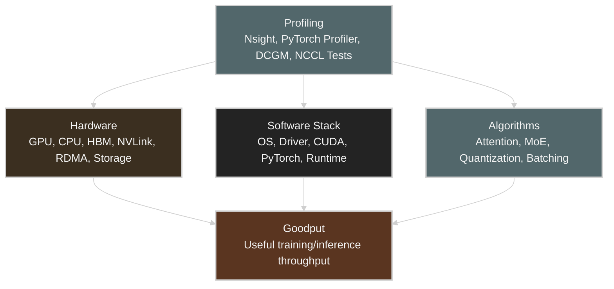
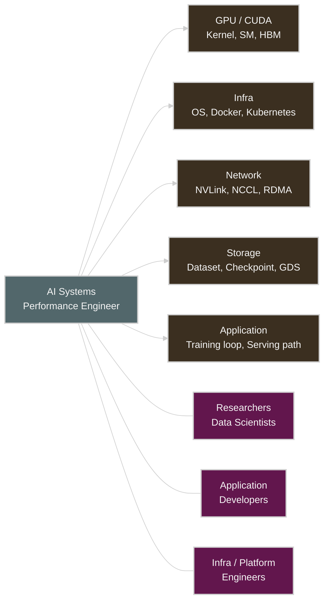
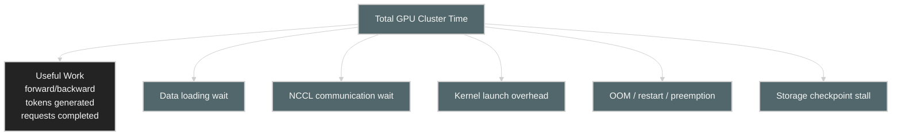
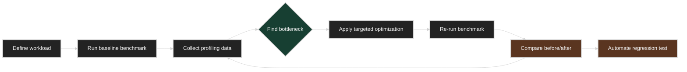
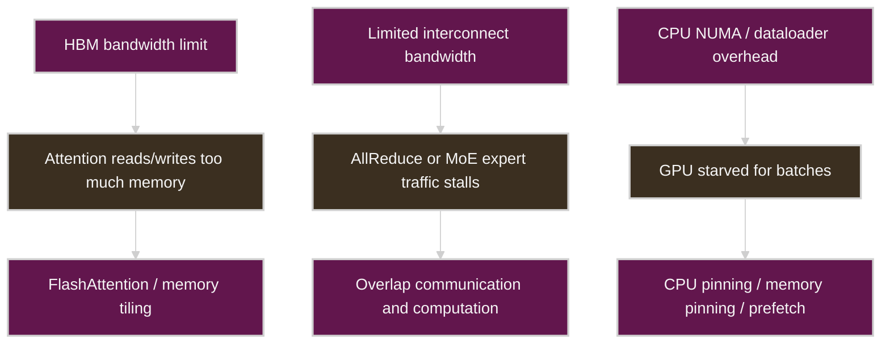
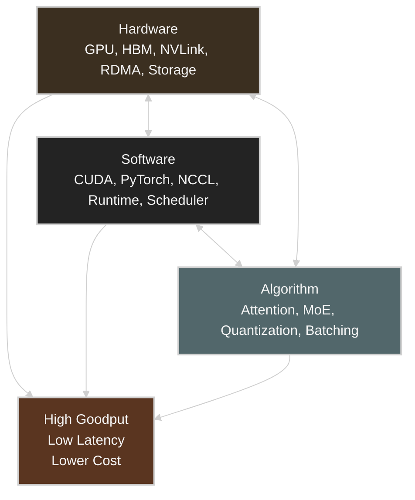
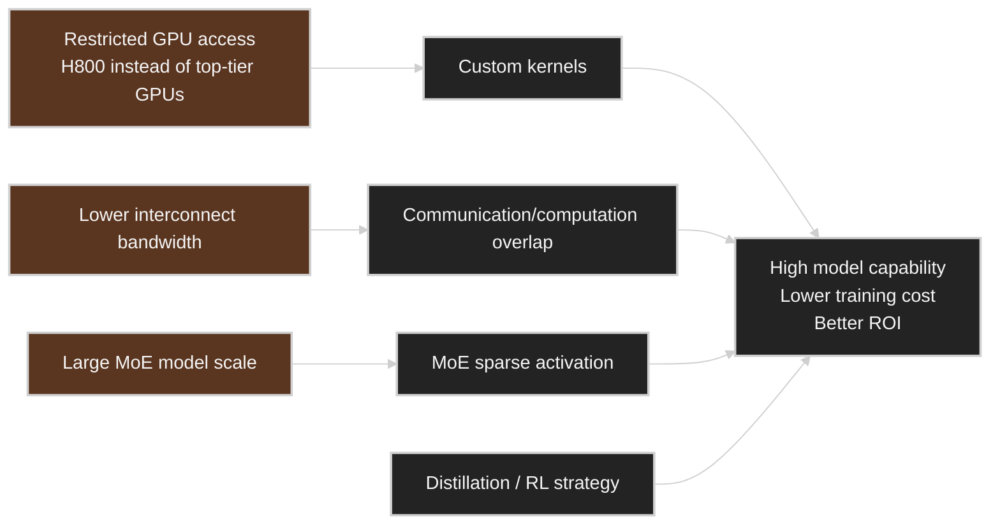
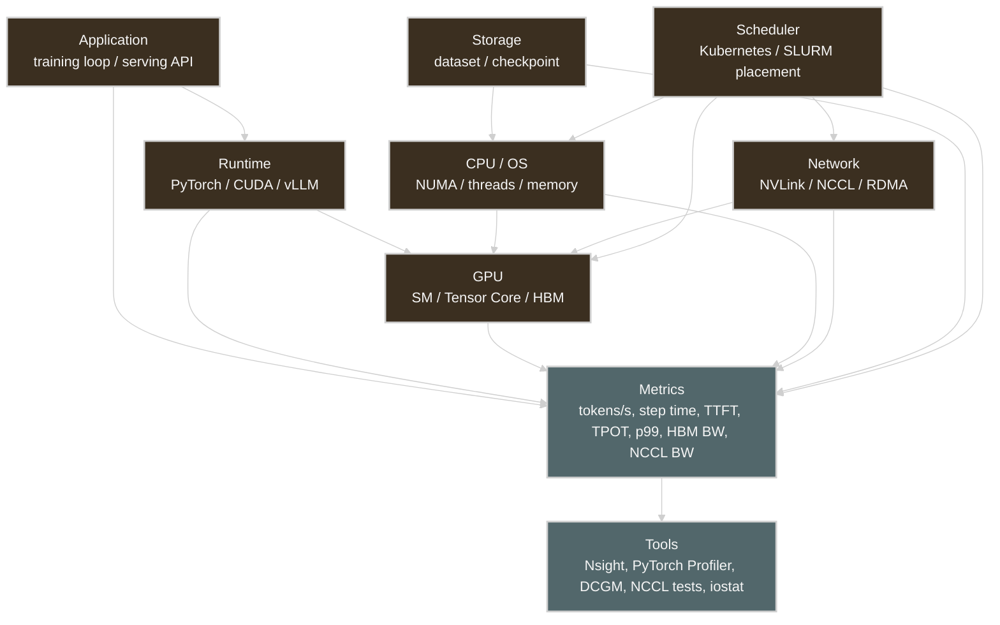
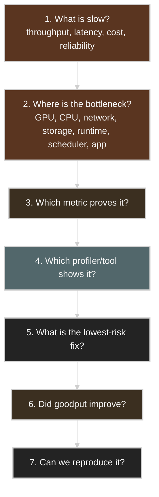

# Chapter 1: Introduction and AI System Overview

## Table of Contents

* [Goal](#goal)
* [Core Message](#core-message)
* [AI Systems Performance Engineer](#ai-systems-performance-engineer)
* [Why Goodput Matters](#why-goodput-matters)
* [Benchmarking and Profiling](#benchmarking-and-profiling)
* [Mechanical Sympathy](#mechanical-sympathy)
* [Hardware-Software-Algorithm Codesign](#hardware-software-algorithm-codesign)
* [DeepSeek Case Study](#deepseek-case-study)
* [Performance Bottleneck Lens](#performance-bottleneck-lens)
* [Practical Metrics and Tools](#practical-metrics-and-tools)
* [AI Performance Engineering Workflow](#ai-performance-engineering-workflow)
* [Design Decision Matrix](#design-decision-matrix)
* [Operational Validation Checklist](#operational-validation-checklist)
* [Chapter Summary](#chapter-summary)
* [Key Terms](#key-terms)
* [Questions](#questions)
* [Answers](#answers)
* [References](#references)


## Goal

이 챕터는 **AI Systems Performance Engineering**을 바라보는 사고 모델(mental model)을 소개한다.

핵심 아이디어는 다음과 같다.

> AI performance engineering은 GPU를 바빠 보이게 만드는 일이 아니다.
> hardware, software, runtime, network, storage, scheduler, application 계층 전반에서 useful work — 즉 goodput — 을 극대화하는 일이다.

Chapter 1은 책 전체의 토대를 놓는 장이다.

* AI 시스템은 full-stack 시스템이다.
* 성능 병목은 어느 계층에서든 나타날 수 있다.
* raw GPU utilization만으로는 부족하다.
* 진짜 목표는 goodput이다.
* 최적화는 직관이 아니라 profiling에 근거해야 한다.
* hardware, software, algorithm은 함께 codesign해야 한다.




## Core Message

AI systems performance engineering은 결국 세 가지 질문에 답하는 분야다.

1. **병목은 어디에 있는가?**
2. **그것을 어떻게 측정할 것인가?**
3. **어느 계층을 고쳐야 하는가?**

여기서 중요한 것은 다음과 같은 관점의 전환이다. 즉,

```text
"GPU utilization이 높으니 시스템은 건강하다."
```

라는 시각에서

```text
"시스템 capacity 중 실제로 useful training/inference work를 하는 비율은 얼마인가?"
```

라는 시각으로 넘어가는 것이다.

그래서 Chapter 1은 **goodput**, **mechanical sympathy**, **hardware-software-algorithm codesign**을 일찌감치 소개한다.


## AI Systems Performance Engineer

AI Systems Performance Engineer는 여러 도메인 사이에 위치한다.



이 역할은 단순한 "GPU administrator"나 "ML engineer"에 그치지 않는다.

다음 영역을 두루 아우르는 역할이다.

| Area                | Responsibility                                                     |
| ------------------- | ------------------------------------------------------------------ |
| Benchmarking        | throughput, latency, memory usage, scaling efficiency 측정            |
| Profiling           | system/GPU profiler로 병목 식별                                          |
| Debugging           | 성능 regression을 root cause까지 추적                                       |
| Optimization        | kernel, runtime, data pipeline, communication, scheduling 개선       |
| Scaling             | single GPU에서 multi-GPU, multinode, multirack 시스템으로 확장              |
| Resource efficiency | performance per dollar, performance per watt 개선                     |
| Reproducibility     | benchmark 결과를 반복·비교 가능하게 유지                                         |


## Why Goodput Matters

Goodput은 **useful throughput**, 즉 쓸모 있는 처리량을 의미한다.

Raw throughput은 이렇게 묻는다.

```text
얼마나 많은 일이 일어나는 것처럼 보이는가?
```

반면 goodput은 이렇게 묻는다.

```text
실제로 얼마나 많은 useful model progress가 일어나고 있는가?
```

useful하지 않은 work의 예시는 다음과 같다.

* dataloader를 기다리는 GPU
* NCCL synchronization을 기다리는 GPU
* 과도한 CPU-GPU memory copy
* 실패한 job의 restart
* 비효율적인 kernel launch overhead
* pipeline parallelism의 communication bubble
* inference serving의 request queueing delay
* KV cache eviction 또는 recomputation



단순화한 goodput 관점:

```text
Goodput = Useful completed work / End-to-end elapsed time
```

Training의 경우:

```text
Goodput = 초당 처리한 useful tokens 또는 samples
```

Inference의 경우:

```text
Goodput = SLO를 만족하며 완료한 초당 requests 또는 generated tokens
```

핵심은 다음과 같다.

> GPU utilization은 높은데 goodput은 낮을 수 있다.

예시:

| Situation                                          | GPU Utilization |       Goodput | Likely Bottleneck             |
| -------------------------------------------------- | --------------: | ------------: | ----------------------------- |
| GPU는 바쁘지만 all-reduce를 기다리는 중                        |            High |           Low | Network / NCCL                |
| 매 batch 직전마다 GPU가 주기적으로 idle 상태                      | Low or unstable |           Low | CPU / dataloader / storage    |
| GPU memory가 거의 가득 차 KV cache eviction이 잦음           |            High |           Low | Memory / serving scheduler    |
| 평균 throughput은 좋지만 p99 latency가 높음                  |            High | Low under SLO | Application / batching policy |
| training job이 자주 restart됨                           |        Variable |           Low | Reliability / orchestration   |


## Benchmarking and Profiling

Chapter 1은 성능 작업이 **profile-driven**, 즉 profiling에 근거해 이뤄져야 한다고 강조한다.

workflow는 다음과 같은 흐름이어야 한다.



나쁜 최적화 방식:

```text
"이걸 바꿨더니 더 빨라진 것 같다."
```

좋은 최적화 방식:

```text
"Before: 1,200 tokens/s, p99 900 ms.
After: 1,580 tokens/s, p99 710 ms.
Profiler를 보면 NCCL wait가 27%에서 12%로 줄었다."
```

### Benchmarking targets

| Workload               | Primary Metric                     | Secondary Metrics                                     |
| ---------------------- | ---------------------------------- | ----------------------------------------------------- |
| Training               | samples/sec, tokens/sec, step time | GPU util, NCCL time, dataloader wait, checkpoint time |
| Inference              | tokens/sec, requests/sec           | TTFT, TPOT, p95/p99 latency, queue time               |
| Distributed training   | scaling efficiency                 | all-reduce time, network bandwidth, straggler ratio   |
| Storage-heavy training | data pipeline throughput           | IOPS, read BW, dataloader latency                     |
| LLM serving            | SLO-compliant throughput           | KV cache usage, batch size, decode latency            |


## Mechanical Sympathy

Mechanical sympathy는 다음을 의미한다.

> 기계가 어떻게 동작하는지 이해한 뒤, 그것과 협력하도록 software와 algorithm을 설계하라.

AI 시스템에서 말하는 "기계"에는 다음이 포함된다.

* GPU SMs
* Tensor Cores
* HBM
* L2 cache
* CPU NUMA topology
* PCIe / NVLink / NVSwitch
* RDMA NICs
* storage hierarchy
* CUDA runtime
* PyTorch execution model
* Kubernetes scheduler placement



예시:

| Hardware Reality                              | Performance Problem                   | Mechanically Sympathetic Fix                     |
| --------------------------------------------- | ------------------------------------- | ------------------------------------------------ |
| HBM은 빠르지만 용량이 제한적                             | attention이 너무 많은 data를 옮김               | FlashAttention, MLA                              |
| NVLink가 IB보다 빠름                               | cross-node communication 비용이 큼         | 가능하면 traffic을 intra-node/intra-rack에 유지          |
| Tensor Core는 특정 precision/shape을 선호           | compute efficiency가 낮음                 | FP8/FP4, padding, fused kernels                  |
| CPU-GPU transfer 비용이 큼                        | dataloader가 GPU를 stall시킴               | pinned memory, async copy, prefetch              |
| distributed collective가 bubble을 만듦            | scaling efficiency가 떨어짐                | communication과 computation을 overlap              |


## Hardware-Software-Algorithm Codesign

Chapter 1은 현대 AI 성능을 **codesign 문제**로 규정한다.



하나의 성능 문제는 여러 계층에서 해결할 수 있는 경우가 많다.

예를 들어 inference latency가 너무 높다고 하자.

| Layer       | Possible Fix                       | Trade-off                    |
| ----------- | ---------------------------------- | ---------------------------- |
| Hardware    | A100/H100 대신 B200/H200 사용           | 비용이 큼                        |
| Precision   | FP8/FP4 quantization               | accuracy 손실 가능성              |
| Kernel      | optimized attention kernel         | engineering 복잡도              |
| Runtime     | CUDA Graphs                        | shape/static 제약              |
| Serving     | continuous batching                | latency-throughput trade-off |
| Application | prompt compression                 | quality 손실 가능성               |
| Scheduler   | long prompt를 별도로 routing            | 운영 복잡도                       |

이때 시니어 엔지니어가 던지는 질문은 다음과 같다.

```text
이 병목에 대해 어느 계층이 가장 높은 ROI의 fix를 주는가?
```


## DeepSeek Case Study

Chapter 1은 DeepSeek을 대표적인 사례로 든다.

여기서 얻을 교훈은 단순히 "DeepSeek이 더 적은 GPU를 썼다"가 아니다.

더 깊은 performance engineering 교훈은 다음과 같다.

> hardware가 제약될수록 software와 algorithm 최적화는 전략적 무기가 된다.



핵심 교훈:

| Constraint                         | Engineering Response                     |
| ---------------------------------- | ---------------------------------------- |
| limited GPU interconnect bandwidth | communication을 줄이고 overlap                |
| limited hardware availability      | kernel과 runtime을 최적화                      |
| large model size                   | MoE sparse activation 사용                  |
| high training cost                 | algorithmic efficiency 개선                 |
| inference cost pressure            | attention과 KV cache 동작 최적화                |

DGX B200/H100 환경에서도 같은 교훈이 그대로 적용된다.

```text
GPU를 더 넣는 것이 첫 번째 답이라고 단정하지 마라.
병목이 compute, memory, network, storage, runtime, scheduling 중 어디인지 먼저 증명하라.
```


## Performance Bottleneck Lens

Chapter 1은 overview 성격의 챕터이므로, bottleneck lens도 full-stack 전체를 아우른다.



### Bottleneck table

| Bottleneck Layer | Symptom                         | Metric                                | Tool                         | Example Fix                             |
| ---------------- | ------------------------------- | ------------------------------------- | ---------------------------- | --------------------------------------- |
| GPU Compute      | 달성 FLOPS가 낮음                     | SM occupancy, tensor core utilization | Nsight Compute               | kernel fusion, mixed precision          |
| GPU Memory       | GPU는 바쁜데 느림                      | HBM bandwidth, memory stall           | Nsight Compute               | FlashAttention, tiling, cache reuse     |
| CPU / OS         | GPU가 batch를 기다림                  | dataloader time, CPU util             | PyTorch Profiler, perf       | num_workers, CPU pinning, pinned memory |
| Network          | multi-GPU scaling이 나쁨            | NCCL time, RDMA BW                    | NCCL tests, Nsight Systems   | topology-aware placement, overlap       |
| Storage          | epoch 시작/checkpoint가 느림          | read BW, IOPS, latency                | iostat, fio, gdsio           | local cache, prefetch, GDS              |
| Runtime          | 작은 kernel이 너무 많음                 | kernel launch overhead                | Nsight Systems               | CUDA Graphs, torch.compile              |
| Scheduler        | placement에 따라 성능이 달라짐            | GPU/NIC locality                      | kubectl, DCGM, topology view | topology-aware scheduling               |
| Application      | p99 latency가 높음                  | TTFT, TPOT, queue time                | vLLM/SGLang metrics          | continuous batching, prefix cache       |


## Practical Metrics and Tools

### Training metrics

| Metric             | Meaning                                      |
| ------------------ | -------------------------------------------- |
| step time          | end-to-end training iteration 시간             |
| samples/sec        | training throughput                          |
| tokens/sec         | LLM training throughput                      |
| GPU utilization    | GPU가 active한지 여부                              |
| SM occupancy       | GPU execution resource가 채워졌는지 여부             |
| HBM bandwidth      | kernel이 memory-bound인지 여부                     |
| NCCL time          | communication overhead                       |
| dataloader wait    | CPU/storage pipeline 병목                       |
| checkpoint latency | storage write 병목                              |
| scaling efficiency | GPU를 늘렸을 때 성능이 얼마나 잘 개선되는지                    |

### Inference metrics

| Metric                   | Meaning                                        |
| ------------------------ | ---------------------------------------------- |
| TTFT                     | time to first token; 주로 prefill에 민감            |
| TPOT                     | time per output token; 주로 decode에 민감           |
| requests/sec             | serving throughput                             |
| tokens/sec               | generation throughput                          |
| p50 / p95 / p99 latency  | 사용자 체감 latency 분포                               |
| queue time               | scheduler/batching 압력                          |
| KV cache usage           | memory 압력                                       |
| batch size               | throughput-latency 균형                          |
| SLO-compliant throughput | useful inference goodput                       |

### Tools

| Tool                 | Best For                                  |
| -------------------- | ----------------------------------------- |
| `nvidia-smi`         | 빠른 GPU utilization, memory, power 확인       |
| DCGM                 | cluster-level GPU telemetry               |
| Nsight Systems       | end-to-end timeline, CPU/GPU/NCCL overlap |
| Nsight Compute       | kernel-level SM, memory, warp 분석          |
| PyTorch Profiler     | PyTorch operator-level 병목                  |
| NVTX                 | custom profiling range                    |
| NCCL tests           | communication bandwidth와 latency           |
| `iostat`, `fio`      | storage I/O 병목                             |
| `perf`               | CPU-level hotspot                         |
| `nvidia-smi topo -m` | GPU/NIC/CPU topology                       |
| Kubernetes metrics   | placement, throttling, resource 압력        |


## AI Performance Engineering Workflow

이 챕터에서 활용할 수 있는 실전 workflow는 다음과 같다.



핵심 습관:

```text
baseline 없이 최적화하지 마라.
before/after 수치 없이 개선을 주장하지 마라.
GPU utilization 하나에만 의존하지 마라.
```


## Design Decision Matrix

### 성능이 나쁠 때, 어디를 먼저 봐야 하는가?

| Symptom                                 | First Suspect                     | Confirm With               | Likely Fix                           |
| --------------------------------------- | --------------------------------- | -------------------------- | ------------------------------------ |
| GPU utilization이 낮음                      | CPU/dataloader/storage            | PyTorch Profiler, iostat   | prefetch, pin_memory, more workers   |
| GPU utilization은 높은데 throughput이 낮음      | GPU memory-bound kernel           | Nsight Compute             | memory tiling, fused kernel          |
| 8→64 GPU scaling이 나쁨                     | NCCL/network                      | NCCL tests, Nsight Systems | topology-aware placement, overlap    |
| serving에서 p99 latency가 높음                | batching/scheduler/KV cache       | serving metrics            | long prompt 분리, batching 튜닝           |
| N step마다 training이 멈춤                     | checkpoint I/O                    | iostat, storage metrics    | async checkpoint, faster storage     |
| run 간 편차가 큼                              | scheduler/topology/noisy neighbor | DCGM, placement logs       | placement 고정, resource 격리            |
| OOM 또는 잦은 eviction                       | memory 압력                          | GPU memory, KV cache stats | quantization, offload, cache policy  |


## Operational Validation Checklist

Chapter 1을 다 읽은 뒤 이 체크리스트를 활용하라.

### Baseline

* [ ] workload 정의: training, inference, fine-tuning, batch inference, online serving
* [ ] hardware 기록: GPU type, GPU count, CPU, memory, NIC, storage
* [ ] software stack 기록: driver, CUDA, PyTorch, NCCL, container image
* [ ] baseline throughput 측정
* [ ] serving이라면 baseline latency 측정
* [ ] GPU utilization과 memory usage 측정
* [ ] profiler trace 저장

### Goodput

* [ ] useful work metric 식별: samples/sec, tokens/sec, requests/sec
* [ ] useful compute time과 wait time 분리
* [ ] dataloader wait 확인
* [ ] communication wait 확인
* [ ] checkpoint 또는 storage stall 확인
* [ ] failure/restart/preemption overhead 확인
* [ ] goodput gap 추정

### Profiling

* [ ] framework-level 병목은 PyTorch Profiler 사용
* [ ] CPU/GPU/NCCL timeline은 Nsight Systems 사용
* [ ] kernel 병목은 Nsight Compute 사용
* [ ] network baseline은 NCCL tests 사용
* [ ] dataset/checkpoint path는 storage 도구 사용
* [ ] 중요한 code 영역에 NVTX range 추가

### Optimization

* [ ] 증명된 가장 큰 병목부터 최적화
* [ ] 한 번에 하나의 주요 변수만 변경
* [ ] benchmark 재실행
* [ ] before/after 비교
* [ ] trade-off 기록
* [ ] 가능하면 regression test 추가


## Chapter Summary

Chapter 1은 책 전체를 관통하는 운영 철학을 제시한다.

이 챕터의 핵심 메시지는 다음과 같다.

> AI systems performance engineering은 full-stack이고, 경험적(empirical)이며, goodput-driven이다.

핵심 takeaway는 다음과 같다.

1. GPU utilization 하나만으로는 부족하다.
2. Goodput이야말로 의미 있는 성능 목표다.
3. 병목은 GPU, CPU, memory, network, storage, runtime, scheduler, application 어느 계층에서든 나타날 수 있다.
4. 성능 최적화는 profile-driven이어야 한다.
5. DeepSeek은 영리한 engineering이 hardware 제약을 상쇄할 수 있음을 보여준다.
6. Mechanical sympathy란 hardware 현실에 맞춰 software와 algorithm을 설계하는 것을 뜻한다.
7. hardware, software, algorithm은 함께 codesign해야 한다.
8. Reproducibility는 중요하다. 반복 가능한 benchmark가 뒷받침되지 않는 성능 주장은 설득력이 약하기 때문이다.
9. AI scale에서는 작은 efficiency 개선이 큰 비용 절감으로 이어진다.
10. AI Systems Performance Engineer의 일은 비싼 raw compute를 useful model progress로 바꿔내는 것이다.


## Key Terms

| Term                | Meaning                                                                   |
| ------------------- | ------------------------------------------------------------------------- |
| Goodput             | overhead를 제외한 useful training/inference throughput                        |
| Throughput          | 단위 시간당 처리된 전체 work                                                         |
| GPU utilization     | GPU가 active하게 보이는 시간의 비율                                                   |
| Mechanical Sympathy | hardware를 이해한 software/algorithm 설계                                        |
| Codesign            | hardware, software, algorithm을 함께 최적화                                      |
| Profiling           | 시간/자원이 어디에 쓰이는지 측정                                                          |
| Benchmarking        | 재현 가능한 성능 측정                                                                |
| NCCL                | NVIDIA collective communication library                                   |
| NIXL                | distributed inference data movement를 위한 NVIDIA inference transfer library |
| RDMA                | CPU copy 없이 network 너머로 직접 memory transfer                                 |
| FlashAttention      | memory traffic을 줄이는 hardware-aware attention algorithm                    |
| MoE                 | sparse activation을 사용하는 mixture-of-experts model                          |
| TTFT                | time to first token                                                       |
| TPOT                | time per output token                                                     |
| Scaling Efficiency  | ideal speedup 대비 실제로 달성한 speedup                                          |


## Questions

1. throughput과 goodput의 차이는 무엇인가?
2. GPU utilization이 왜 오해를 부를 수 있는가?
3. AI Systems Performance Engineer는 무엇을 최적화하는가?
4. mechanical sympathy란 무엇인가?
5. Chapter 1은 왜 reproducible benchmarking을 강조하는가?
6. GPU utilization은 95%인데 training throughput이 낮다. 가능한 원인 세 가지는?
7. multi-GPU training이 8 GPU에서 64 GPU로 갈 때 scaling이 나쁘다. 어떤 metric을 확인하겠는가?
8. inference의 p99 latency는 높지만 평균 latency는 수용 가능하다. 무엇을 살펴봐야 하는가?
9. training job이 수백 step마다 멈춘다. 어느 계층이 원인일 수 있는가?
10. model serving system의 TTFT는 높지만 TPOT는 수용 가능하다. 어느 phase가 병목일 가능성이 높은가?
11. DGX B200/H100 cluster에서 topology-aware scheduling이 왜 중요한가?
12. GPU compute 병목과 network 병목을 구분하려면 어떤 도구를 쓰겠는가?
13. dataloader 최적화가 goodput을 개선했음을 어떻게 증명하겠는가?
14. GPU를 더 사는 대신 algorithm-level 최적화를 고려해야 할 때는 언제인가?
15. performance regression test에는 무엇이 포함되어야 하는가?


## Answers

### A1. throughput과 goodput의 차이는 무엇인가?

**Throughput**은 단위 시간당 처리된 전체 work를 뜻한다. **Goodput**은 여기서 wait, restart, stall, overhead를 제외한, 단위 시간당 실제로 완료된 useful work다.

### A2. GPU utilization이 왜 오해를 부를 수 있는가?

GPU utilization은 GPU가 active하다는 사실만 알려줄 뿐, GPU가 useful model progress를 내고 있다는 것까지 보장하지는 않는다. GPU는 비효율적인 kernel, memory movement, synchronization overhead 때문에 바쁠 수도 있기 때문이다.

### A3. AI Systems Performance Engineer는 무엇을 최적화하는가?

이 역할은 hardware, software, algorithm, runtime, network, storage, scheduler 계층 전반에서 end-to-end AI workload 성능을 최적화한다.

### A4. mechanical sympathy란 무엇인가?

Mechanical sympathy란 hardware의 실제 동작을 이해한 뒤, 그 강점은 살리고 약점은 피하도록 software/algorithm을 설계하는 것을 의미한다.

### A5. Chapter 1은 왜 reproducible benchmarking을 강조하는가?

같은 workload, environment, metric으로 반복·비교·검증할 수 없는 성능 주장은 아무 의미가 없기 때문이다.

### A6. GPU utilization은 95%인데 training throughput이 낮다. 가능한 원인 세 가지는?

가능한 원인: NCCL wait, memory-bound kernel, 작은 batch size, dataloader stall, storage jitter, CPU NUMA 문제, synchronization bubble.

### A7. multi-GPU training이 8 GPU에서 64 GPU로 갈 때 scaling이 나쁘다. 어떤 metric을 확인하겠는가?

NCCL bandwidth, all-reduce time, step time breakdown, GPU/NIC topology, RDMA counter, NVLink/NVSwitch usage, straggler 동작을 확인한다.

### A8. inference의 p99 latency는 높지만 평균 latency는 수용 가능하다. 무엇을 살펴봐야 하는가?

queue time, request length distribution, batch size, KV cache usage, prefill/decode split, TTFT, TPOT, scheduler policy를 살펴본다.

### A9. training job이 수백 step마다 멈춘다. 어느 계층이 원인일 수 있는가?

checkpoint I/O, storage bandwidth, filesystem latency, 또는 distributed synchronization이 원인일 수 있다.

### A10. model serving system의 TTFT는 높지만 TPOT는 수용 가능하다. 어느 phase가 병목일 가능성이 높은가?

TTFT가 높다는 것은 보통 prefill phase, prompt processing, scheduling queue, 또는 긴 input context에서의 병목을 가리킨다.

### A11. DGX B200/H100 cluster에서 topology-aware scheduling이 왜 중요한가?

placement가 잘못되면 GPU, NIC, CPU thread가 비효율적인 topology path에 흩어져 NCCL latency가 커지고 goodput이 떨어질 수 있기 때문이다.

### A12. GPU compute 병목과 network 병목을 구분하려면 어떤 도구를 쓰겠는가?

timeline과 NCCL overlap에는 Nsight Systems, kernel-level compute/memory 분석에는 Nsight Compute, network baseline에는 NCCL tests를 사용한다.

### A13. dataloader 최적화가 goodput을 개선했음을 어떻게 증명하겠는가?

before/after samples/sec 또는 tokens/sec, dataloader wait time, GPU idle time, CPU utilization을 측정하고, 같은 조건에서 benchmark를 반복한다.

### A14. GPU를 더 사는 대신 algorithm-level 최적화를 고려해야 할 때는 언제인가?

profiling 결과 병목이 raw compute capacity가 아니라 memory movement, communication, attention complexity, batching policy, 또는 KV cache 동작일 때다.

### A15. performance regression test에는 무엇이 포함되어야 하는가?

workload 정의, 고정된 input shape/data, hardware/software 버전, baseline metric, 허용 threshold, profiler artifact, 자동화된 비교.
