# Chapter 3: OS, Docker, and Kubernetes Tuning for GPU-Based Environments

## Table of Contents

* [Goal](#goal)
* [Why System Tuning Matters for GPU Performance](#why-system-tuning-matters-for-gpu-performance)
* [GPU Software Stack](#gpu-software-stack)
* [Operating System Layer](#operating-system-layer)
* [NVIDIA Driver, CUDA, and Runtime](#nvidia-driver-cuda-and-runtime)
* [Python-Facing CUDA Libraries](#python-facing-cuda-libraries)
* [CUDA Compatibility Model](#cuda-compatibility-model)
* [PyTorch to GPU Execution Path](#pytorch-to-gpu-execution-path)
* [CPU Feeding Bottleneck](#cpu-feeding-bottleneck)
* [NUMA Awareness and CPU Pinning](#numa-awareness-and-cpu-pinning)
* [Memory Pinning and NUMA-Friendly Allocation](#memory-pinning-and-numa-friendly-allocation)
* [Transparent Hugepages](#transparent-hugepages)
* [Scheduler, Interrupt Affinity, and OS Jitter](#scheduler-interrupt-affinity-and-os-jitter)
* [Virtual Memory and Swapping](#virtual-memory-and-swapping)
* [Filesystem Caching and Write-Back](#filesystem-caching-and-write-back)
* [CPU Frequency and C-states](#cpu-frequency-and-c-states)
* [Host CPU Memory Allocator Tuning](#host-cpu-memory-allocator-tuning)
* [GPU Runtime Settings](#gpu-runtime-settings)
* [GPU Persistence Mode](#gpu-persistence-mode)
* [MPS](#mps)
* [MIG](#mig)
* [GPU Clock Speeds and ECC](#gpu-clock-speeds-and-ecc)
* [GPU Memory Fragmentation and OOM](#gpu-memory-fragmentation-and-oom)
* [Container Runtime Optimizations](#container-runtime-optimizations)
* [NVIDIA Container Toolkit](#nvidia-container-toolkit)
* [Avoiding Overlay Filesystem Overhead](#avoiding-overlay-filesystem-overhead)
* [Container Image Startup Cost](#container-image-startup-cost)
* [Kubernetes for GPU Environments](#kubernetes-for-gpu-environments)
* [Kubernetes Topology Manager](#kubernetes-topology-manager)
* [Kubernetes, SLURM, and Job Scheduling](#kubernetes-slurm-and-job-scheduling)
* [MIG on Kubernetes](#mig-on-kubernetes)
* [Network Communication in Kubernetes](#network-communication-in-kubernetes)
* [Reducing Kubernetes Orchestration Jitter](#reducing-kubernetes-orchestration-jitter)
* [Resource Guarantees and OOM Avoidance](#resource-guarantees-and-oom-avoidance)
* [I/O Isolation](#io-isolation)
* [System Bottleneck Lens](#system-bottleneck-lens)
* [Operational Validation Checklist](#operational-validation-checklist)
* [Practical Tips and Notes](#practical-tips-and-notes)
* [Chapter Summary](#chapter-summary)
* [Key Terms](#key-terms)
* [Questions](#questions)
* [Answers](#answers)
* [References](#references)

## Goal

이번 장의 목표는 GPU 서버의 OS, Docker, Kubernetes 환경을 단순한 설치 대상이 아니라 **GPU goodput을 결정하는 성능 계층**으로 이해하는 것이다.

핵심 아이디어는 다음과 같다.

> GPU 성능은 CUDA kernel만으로 결정되지 않는다.
> OS scheduler, NUMA locality, CPU memory allocation, container runtime, Kubernetes placement, resource isolation이 잘못되면 비싼 GPU는 기다리기만 한다.

이 챕터는 다음 주제를 다룬다.

* Linux OS와 NVIDIA GPU device model
* NVIDIA Driver, CUDA Toolkit, CUDA Runtime
* CUDA forward/backward compatibility
* PyTorch → CUDA Runtime → CUDA Library → Driver → GPU 흐름
* CPU dataloader와 GPU feeding 병목
* NUMA awareness와 CPU pinning
* pinned memory, memory binding, hugepages
* interrupt affinity, CPU frequency, C-states
* GPU persistence mode, MPS, MIG
* GPU memory oversubscription, fragmentation, OOM
* NVIDIA Container Toolkit과 GPU container runtime
* container overlay filesystem overhead
* Kubernetes Topology Manager
* Kubernetes resource requests/limits, CPU Manager, cgroups
* MIG slicing on Kubernetes
* Kubernetes network, I/O, orchestration jitter
* OOM killer와 memory isolation
* AI training/inference 환경에서의 실무 tuning checklist

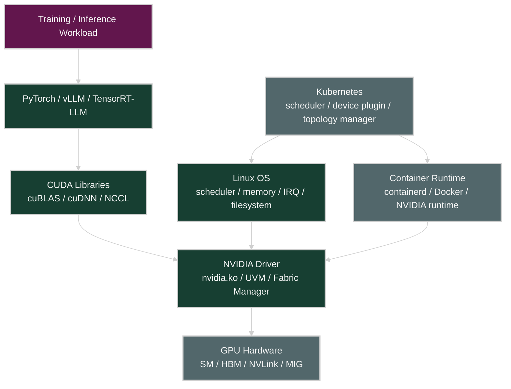

## Why System Tuning Matters for GPU Performance

AI workload에서 GPU가 낮은 utilization을 보일 때, 원인이 항상 GPU kernel에 있는 것은 아니다.

많은 경우 병목은 GPU 바깥에 있다.

| 증상                                   | 가능한 병목                                                       |
| ------------------------------------ | ------------------------------------------------------------ |
| GPU utilization이 낮다                  | CPU dataloader, storage I/O, process scheduling              |
| GPU utilization이 들쭉날쭉하다              | CPU jitter, interrupt storm, Kubernetes noisy neighbor       |
| GPU memory는 남는데 throughput이 낮다       | CPU-to-GPU transfer, pinned memory 부족, NUMA mismatch         |
| 첫 요청 latency가 크다                     | GPU cold start, persistence mode 비활성화                        |
| inference pod 여러 개가 GPU를 비효율적으로 공유한다 | MPS/MIG/time-slicing 정책 부재                                   |
| K8s에서 bare metal보다 느리다               | topology mismatch, CPU Manager 미사용, overlay FS, CNI overhead |
| long-running training이 갑자기 죽는다       | OOM killer, memory limit, host memory pressure               |
| multi-GPU job scale-out이 안 된다        | GPU/NIC topology mismatch, NCCL interface 선택 문제              |

핵심은 다음이다.

> Chapter 3은 “GPU가 왜 놀고 있는가?”를 OS와 orchestration 계층에서 추적하는 장이다.

## GPU Software Stack

GPU workload는 단순히 PyTorch 코드가 GPU에서 실행되는 구조가 아니다. 여러 계층이 순서대로 맞물린다.

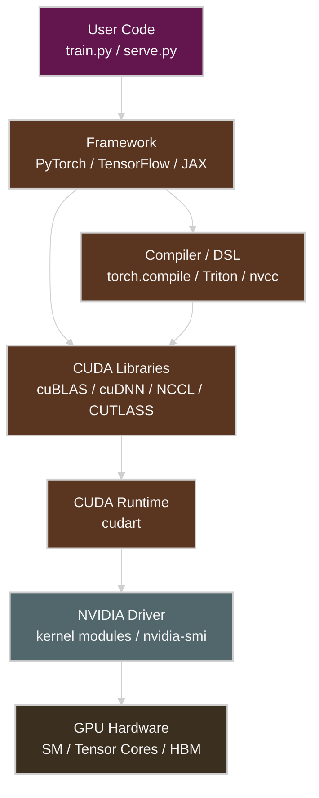

| Layer             | Role                                | Tuning Point                               |
| ----------------- | ----------------------------------- | ------------------------------------------ |
| User Code         | model, dataloader, inference server | batching, async copy, worker count         |
| Framework         | PyTorch, TensorFlow, JAX            | torch.compile, CUDA stream, profiler       |
| CUDA Libraries    | cuBLAS, cuDNN, NCCL                 | library version, kernel selection          |
| CUDA Runtime      | memory allocation, kernel launch    | allocator, CUDA graph, stream usage        |
| NVIDIA Driver     | device control, GPU scheduling      | driver version, persistence, MIG/MPS       |
| OS                | CPU, memory, IRQ, filesystem        | NUMA, THP, swappiness, CPU governor        |
| Container Runtime | image, filesystem, device mount     | NVIDIA runtime, overlay overhead           |
| Kubernetes        | scheduling and isolation            | topology manager, requests/limits, cgroups |

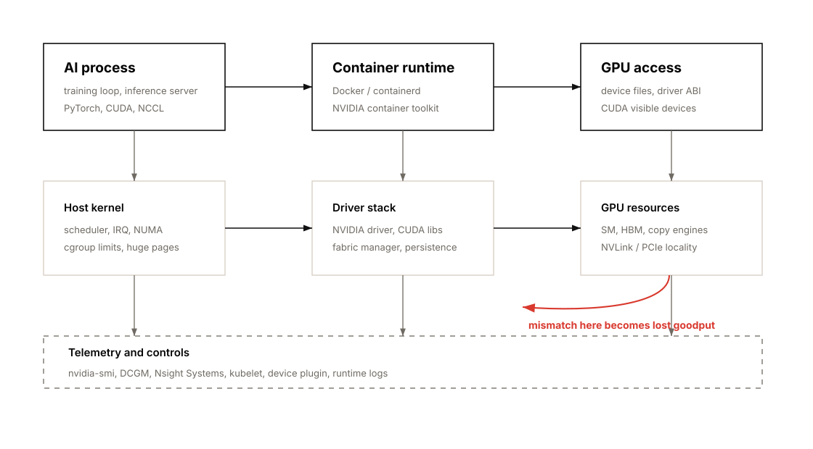

## Operating System Layer

Linux OS는 GPU workload를 직접 계산하지 않지만, GPU에 일을 공급하는 모든 주변 경로를 관리한다.

OS가 담당하는 것:

* CPU scheduling
* memory allocation
* NUMA placement
* filesystem cache
* network interrupts
* process isolation
* device file management
* cgroups
* virtual memory and swapping

GPU node에서는 다음 device file들이 중요하다.

| Device                         | Meaning                            |
| ------------------------------ | ---------------------------------- |
| `/dev/nvidia0`, `/dev/nvidia1` | 개별 GPU device                      |
| `/dev/nvidiactl`               | NVIDIA driver control              |
| `/dev/nvidia-uvm`              | Unified Virtual Memory             |
| `/dev/nvidia-modeset`          | mode setting and buffer management |

성능 관점에서는 OS를 “기본값으로 잘 돌아가는 계층”으로 보면 안 된다.

> GPU cluster에서는 OS default가 안정성에는 괜찮아도, throughput consistency에는 최적이 아닐 수 있다.

## NVIDIA Driver, CUDA, and Runtime

NVIDIA software stack의 기본 순서는 다음과 같다.

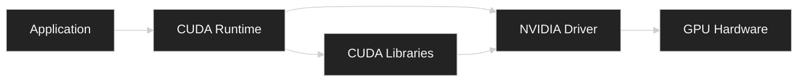

### GPU Driver

GPU driver는 Linux kernel과 GPU hardware 사이의 low-level interface다.

주요 역할:

* GPU memory allocation
* kernel launch coordination
* device file exposure
* ECC status query
* GPU mode control
* MIG/MPS/persistence support
* `nvidia-smi` metric 제공

성능 관점에서는 driver version이 중요하다.

| Issue                   | Why It Matters                        |
| ----------------------- | ------------------------------------- |
| old driver              | 최신 GPU architecture와 CUDA feature 미지원 |
| driver/runtime mismatch | container 내부 CUDA와 host driver 호환성 문제 |
| persistence disabled    | cold start latency 증가                 |
| Fabric Manager 미구동      | NVSwitch/NVLink topology 관리 문제 가능     |

### CUDA Toolkit and Runtime

CUDA Toolkit은 `nvcc`, CUDA runtime, CUDA libraries를 포함한다.

| Component | Role                                   |
| --------- | -------------------------------------- |
| `nvcc`    | CUDA C++ compiler                      |
| `cudart`  | CUDA runtime                           |
| cuBLAS    | matrix multiplication                  |
| cuDNN     | neural network primitives              |
| NCCL      | multi-GPU communication                |
| CUTLASS   | high-performance CUDA template library |

실무에서는 framework container가 CUDA library를 포함하고, host는 NVIDIA driver를 제공하는 형태가 일반적이다.

## Python-Facing CUDA Libraries

Chapter 3은 CUDA Toolkit이 C++ 중심 생태계에서 출발했지만, 최신 GPU programming과 AI framework에서는 Python-facing CUDA layer가 점점 중요해지고 있다고 설명한다.

| Library / DSL | Chapter 3 Point | Performance Meaning |
| --- | --- | --- |
| CUDA Python | low-level CUDA driver/runtime 접근을 Python에서 제공 | Python code에서 CUDA API를 직접 다룰 때 사용 |
| cuPyNumeric | NumPy와 유사한 API를 GPU-backed array operation으로 제공 | 기존 NumPy style code를 GPU로 옮기는 진입 장벽을 낮춘다. |
| cuTile | large matrix를 tile 단위로 다루는 Python abstraction | memory access pattern과 block-wise compute를 더 쉽게 구성한다. |
| NVIDIA Warp | Python에서 GPU kernel을 작성하는 framework | simulation/geometry style GPU workload에 유용하다. |
| Triton | Python DSL과 compiler로 custom GPU kernel 작성 | PyTorch TorchInductor backend에서도 kernel fusion/autotuning에 사용된다. |
| CUTLASS | C++ template library | cuBLAS 같은 library 밑에서 high-performance GEMM 구현에 활용된다. |

실무적으로 중요한 점은 PyTorch, TensorFlow, JAX 같은 framework가 “Python 코드”처럼 보이지만, 실제 성능은 CUDA library, compiler backend, kernel selection, autotuning 결과에 의해 결정된다는 것이다.

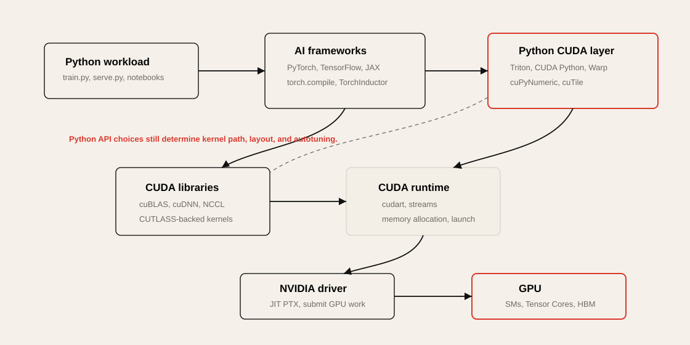

## CUDA Compatibility Model

CUDA binary는 보통 다음 두 가지를 포함할 수 있다.

| Format       | Meaning                             | Compatibility        |
| ------------ | ----------------------------------- | -------------------- |
| PTX          | virtual intermediate representation | forward-compatible   |
| CUBIN / SASS | architecture-specific binary        | 특정 GPU architecture용 |

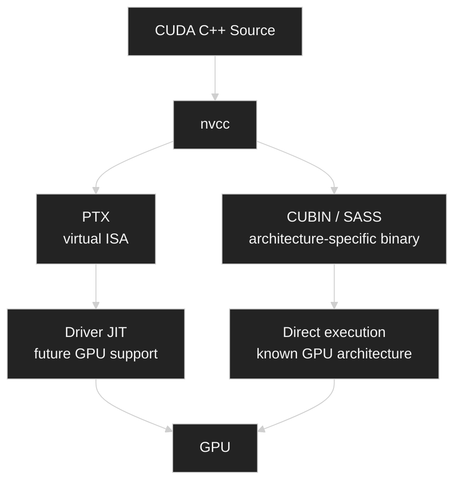

### Practical Meaning

* 미래 GPU에서 실행 가능성을 높이려면 PTX를 포함해야 한다.
* known architecture에서는 CUBIN/SASS가 JIT overhead 없이 빠르게 실행된다.
* container image를 만들 때 target architecture를 명시하지 않으면 새 GPU에서 성능이 기대보다 낮거나 실행이 실패할 수 있다.
* Blackwell/B200 같은 최신 GPU에서는 CUDA, PyTorch, Triton, TensorRT-LLM, vLLM image가 해당 compute capability를 지원하는지 확인해야 한다.

Chapter 3의 container compatibility 예시는 다음처럼 정리할 수 있다.

| Container CUDA runtime | Example minimum Linux host driver branch from Chapter 3 |
| --- | --- |
| CUDA 13.x | R580 or newer |
| CUDA 12.x | R525 or newer |

이 표는 운영 checklist의 출발점일 뿐이다. 실제 배포 전에는 사용 중인 CUDA Toolkit, framework image, host driver, GPU architecture의 공식 compatibility matrix를 확인해야 한다.

## PyTorch to GPU Execution Path

PyTorch 코드 한 줄은 내부적으로 여러 계층을 지난다.

```python
y = torch.matmul(x, w)
```

실제 흐름은 대략 다음과 같다.

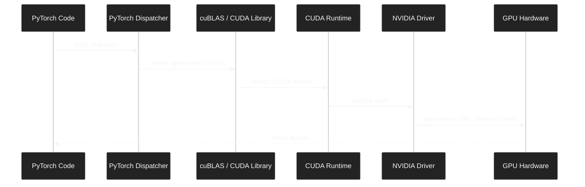

성능 병목은 어느 계층에서든 생길 수 있다.

| Layer        | Bottleneck Example                 | Tool                           |
| ------------ | ---------------------------------- | ------------------------------ |
| PyTorch      | slow dataloader, graph break       | PyTorch Profiler               |
| CUDA Library | inefficient kernel selection       | Nsight Systems, Nsight Compute |
| CUDA Runtime | memory allocation overhead         | Nsight Systems                 |
| Driver       | cold start, context overhead       | nvidia-smi, DCGM               |
| OS           | CPU scheduling, NUMA mismatch      | perf, numactl, mpstat          |
| GPU          | memory-bound kernel, low occupancy | Nsight Compute                 |

## CPU Feeding Bottleneck

GPU utilization이 낮을 때 가장 먼저 의심할 것 중 하나는 CPU feeding 병목이다.

Training loop에서 CPU는 보통 다음 일을 한다.

* dataset read
* decompression
* tokenization
* image/video preprocessing
* batch collation
* pinned memory allocation
* host-to-device copy
* GPU kernel launch
* distributed process coordination


GPU가 놀고 있다면 질문은 단순하다.

> GPU가 느린가, 아니면 GPU에게 일을 공급하는 경로가 느린가?

### Symptoms

| Symptom                                  | Interpretation                              |
| ---------------------------------------- | ------------------------------------------- |
| GPU util sawtooth pattern                | batch 준비가 GPU compute보다 느림                  |
| GPU memory usage stable but compute idle | dataloader 또는 CPU preprocessing 병목          |
| CPU core 일부만 100%                        | Python GIL, worker imbalance                |
| high iowait                              | storage 또는 filesystem 병목                    |
| H2D copy가 길다                             | pinned memory, NUMA, PCIe/NVLink path 확인 필요 |

## NUMA Awareness and CPU Pinning

NUMA는 CPU, memory, PCIe device, GPU, NIC가 물리적으로 가까운 단위로 묶인 구조다.

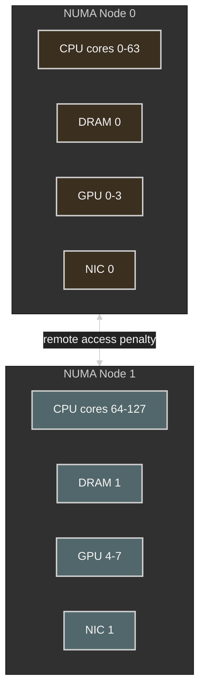

### Why NUMA Matters

| Bad Placement                           | Result             |
| --------------------------------------- | ------------------ |
| GPU 4를 쓰는 process가 NUMA node 0 CPU에서 실행 | cross-NUMA latency |
| dataloader memory가 remote DRAM에 할당      | H2D copy path 비효율  |
| NIC와 GPU가 다른 NUMA domain에 있음            | RDMA/NCCL path 비효율 |
| worker process가 OS scheduler에 의해 이동     | jitter 증가          |

### Basic NUMA Pinning

```bash
numactl --cpunodebind=1 --membind=1 \
  python train.py --gpu 4
```

### GPU Topology 확인

```bash
nvidia-smi topo -m
numactl --hardware
lscpu
hwloc-ls
```

### Practical Rule

> GPU를 담당하는 CPU thread, dataloader worker, pinned host memory는 가능한 한 해당 GPU와 가까운 NUMA node에 묶어야 한다.

## Memory Pinning and NUMA-Friendly Allocation

Pinned memory는 OS가 swap out하지 못하도록 page-locked된 host memory다. GPU로 데이터를 비동기 복사할 때 중요하다.

PyTorch에서는 보통 다음 조합을 사용한다.

```python
loader = DataLoader(
    dataset,
    batch_size=32,
    num_workers=8,
    pin_memory=True,
    persistent_workers=True,
    prefetch_factor=2,
)

for batch in loader:
    batch = batch.to("cuda", non_blocking=True)
```

| Option                    | Meaning                    |
| ------------------------- | -------------------------- |
| `pin_memory=True`         | page-locked host memory 사용 |
| `non_blocking=True`       | async H2D copy 가능          |
| `persistent_workers=True` | epoch마다 worker 재생성 방지      |
| `prefetch_factor`         | batch prefetch depth 조절    |

### Bottleneck Lens

| Metric                             | Interpretation       |
| ---------------------------------- | -------------------- |
| long H2D memcpy                    | pinned memory 미사용 가능 |
| CPU memory allocation latency      | allocator 또는 NUMA 문제 |
| dataloader worker restart overhead | persistent worker 필요 |
| high remote memory access          | memory binding 필요    |

### 주의점

Pinned memory는 좋지만 무한정 많이 쓰면 host memory pressure가 커진다.

```bash
ulimit -l
```

큰 pinned buffer를 쓸 경우 locked memory limit도 확인해야 한다.

## Transparent Hugepages

Linux는 기본적으로 4KB page를 사용한다. 대규모 AI workload에서는 수십~수백 GB memory를 다루므로 page table과 TLB overhead가 커질 수 있다.

Hugepage는 더 큰 page를 사용해 TLB miss와 page fault overhead를 줄이는 방식이다.

| Mode          | Use Case                               |
| ------------- | -------------------------------------- |
| THP `always`  | throughput-oriented training           |
| THP `madvise` | application-controlled hugepage        |
| THP `never`   | latency-sensitive inference에서 pause 회피 |

확인:

```bash
cat /sys/kernel/mm/transparent_hugepage/enabled
cat /sys/kernel/mm/transparent_hugepage/defrag
```

설정 예시:

```bash
echo madvise | sudo tee /sys/kernel/mm/transparent_hugepage/enabled
echo never | sudo tee /sys/kernel/mm/transparent_hugepage/defrag
```

### Trade-off

| Benefit                | Risk                              |
| ---------------------- | --------------------------------- |
| TLB miss 감소            | background compaction pause       |
| page fault overhead 감소 | latency-sensitive workload jitter |
| 큰 memory pool에 유리      | workload별 검증 필요                   |

### Practical Rule

> Training은 THP가 도움이 될 가능성이 높고, low-latency inference는 THP compaction jitter를 조심해야 한다.

## Scheduler, Interrupt Affinity, and OS Jitter

GPU workload는 CPU의 작은 jitter에도 영향을 받는다. 특히 dataloader, NCCL bootstrap, inference server event loop, network interrupt가 중요한 경우 그렇다.

### Sources of OS Jitter

| Source                | Impact                              |
| --------------------- | ----------------------------------- |
| Linux CFS scheduling  | critical thread migration           |
| IRQ handling          | CPU core stealing                   |
| ksoftirqd             | network-heavy workload jitter       |
| background daemon     | dataloader latency 증가               |
| noisy neighbor pod    | CPU cache pollution, context switch |
| CPU frequency scaling | latency variance                    |

### 확인 명령

```bash
mpstat -P ALL 1
pidstat -t -p <PID> 1
cat /proc/interrupts
watch -n1 'grep . /proc/irq/*/smp_affinity_list'
```

### Tuning 방향

* dataloader와 training rank를 GPU-local CPU에 pinning
* NIC interrupt를 별도 CPU core에 배치
* OS daemon과 workload core 분리
* Kubernetes CPU Manager static policy 사용
* latency-sensitive inference는 dedicated node 또는 isolated CPU 사용

## Virtual Memory and Swapping

GPU node에서 swapping은 치명적이다.

Swap이 발생하면 CPU-side batch buffer, dataloader memory, pinned memory 주변에서 latency spike가 발생할 수 있다.

확인:

```bash
cat /proc/sys/vm/swappiness
free -h
vmstat 1
```

설정 예시:

```bash
sudo sysctl -w vm.swappiness=0
```

영구 설정:

```bash
echo "vm.swappiness=0" | sudo tee /etc/sysctl.d/99-gpu.conf
sudo sysctl --system
```

### Practical Rule

> GPU training/inference node에서는 swap을 성능 안전장치로 믿으면 안 된다.
> memory pressure는 monitoring과 scheduling으로 제어해야 한다.

## Filesystem Caching and Write-Back

AI workload는 storage I/O를 강하게 사용한다.

* dataset streaming
* checkpoint write
* model artifact load
* tokenizer/model cache
* container image pull
* local NVMe cache
* object storage sync

Linux page cache는 read 성능에 도움이 되지만, write-back이 몰리면 latency spike를 만들 수 있다.

확인:

```bash
iostat -xz 1
vmstat 1
cat /proc/meminfo | egrep "Dirty|Writeback|Cached"
```

관련 sysctl:

```bash
vm.dirty_ratio
vm.dirty_background_ratio
vm.dirty_expire_centisecs
vm.dirty_writeback_centisecs
```

### Bottleneck Lens

| Symptom              | Possible Cause                         |
| -------------------- | -------------------------------------- |
| checkpoint 시 학습 멈춤   | synchronous write, dirty page flush    |
| dataloader delay     | remote storage latency                 |
| image pull 느림        | registry/network/storage path          |
| container startup 느림 | large image, overlay metadata overhead |

## CPU Frequency and C-states

CPU가 GPU workload의 control plane 역할을 할 때, CPU power saving 기능이 latency jitter를 만들 수 있다.

| Feature               | Benefit           | Risk                      |
| --------------------- | ----------------- | ------------------------- |
| CPU frequency scaling | power saving      | burst latency             |
| deep C-states         | idle power saving | wake-up latency           |
| turbo boost           | peak performance  | thermal/power variability |

확인:

```bash
cpupower frequency-info
cat /sys/devices/system/cpu/cpu*/cpufreq/scaling_governor
```

성능 우선 설정:

```bash
sudo cpupower frequency-set -g performance
```

실무적으로는 training throughput job과 low-latency inference job을 구분해야 한다.

| Workload              | Recommended Direction                    |
| --------------------- | ---------------------------------------- |
| long training         | performance governor, predictable clocks |
| low-latency inference | deep C-state 제한 검토                       |
| shared dev cluster    | power/perf trade-off 고려                  |

## Host CPU Memory Allocator Tuning

Chapter 3은 GPU node에서 CPU utilization이 낮아 보이더라도 CPU-side allocator pause가 GPU feeding jitter를 만들 수 있다고 설명한다. DataLoader, tokenizer, preprocessing, request batching, checkpoint serialization은 CPU heap allocation을 많이 만들 수 있다.

Allocator tuning의 목표는 다음과 같다.

> CPU thread가 batch를 준비하다가 allocator lock, fragmentation, OS page return 때문에 멈추지 않게 만드는 것.

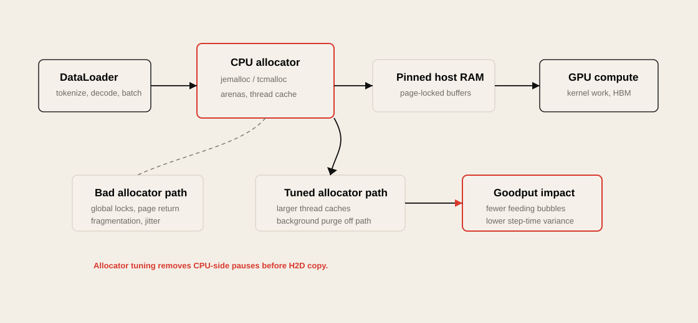

### jemalloc

`jemalloc`은 per-arena allocation과 background purge tuning으로 lock contention과 fragmentation을 줄일 수 있다.

```bash
export MALLOC_CONF="narenas:8,dirty_decay_ms:10000,muzzy_decay_ms:10000,background_thread:true"
```

| Option | Meaning |
| --- | --- |
| `narenas` | allocation arena 수를 조정해 contention을 줄인다. |
| `dirty_decay_ms` | freed dirty pages를 OS로 즉시 반환하지 않도록 지연한다. |
| `muzzy_decay_ms` | lazy-purged pages 반환 timing을 조정한다. |
| `background_thread` | purge work를 foreground allocation path 밖으로 옮긴다. |

### tcmalloc

`tcmalloc`은 per-thread cache를 키워 small allocation이 global lock과 syscall을 덜 타게 할 수 있다.

```bash
export TCMALLOC_MAX_TOTAL_THREAD_CACHE_BYTES=$((512*1024*1024))
export TCMALLOC_RELEASE_RATE=16
```

### Practical Rule

Allocator tuning은 GPU kernel을 빠르게 만드는 최적화가 아니다. CPU가 GPU에 batch를 넘기기 전의 unpredictable pause를 줄이는 최적화다. 적용 전후에는 GPU utilization 평균보다 `step time` variance, DataLoader wait time, CPU run queue, allocator-related stall을 비교해야 한다.

## GPU Runtime Settings

GPU runtime 설정은 job startup latency, GPU sharing, isolation, memory behavior에 영향을 준다.

| Feature           | Main Use                                 |
| ----------------- | ---------------------------------------- |
| Persistence Mode  | GPU cold start 감소                        |
| MPS               | multiple process concurrency             |
| MIG               | hardware-level GPU partitioning          |
| GPU clock setting | performance consistency                  |
| ECC               | reliability vs slight capacity/perf cost |
| allocator tuning  | fragmentation and OOM mitigation         |

## GPU Persistence Mode

Persistence mode는 GPU가 idle 상태일 때도 driver context와 hardware readiness를 유지하는 설정이다.

활성화:

```bash
sudo systemctl enable nvidia-persistenced
sudo systemctl start nvidia-persistenced
```

또는:

```bash
sudo nvidia-smi -pm 1
```

### When It Helps

| Scenario                | Benefit                                |
| ----------------------- | -------------------------------------- |
| batch job startup       | CUDA context initialization latency 감소 |
| interactive development | 첫 CUDA call 지연 감소                      |
| inference server        | cold start variance 감소                 |
| Kubernetes cluster      | pod start 후 GPU readiness 안정화          |

### Trade-off

* idle power draw가 약간 증가할 수 있다.
* 실제 matrix multiplication이 빨라지는 것은 아니다.
* startup latency와 consistency를 개선하는 설정이다.

## MPS

MPS는 Multi-Process Service다. 여러 process가 하나의 GPU를 공유할 때 context switching과 idle gap을 줄이고, kernel execution을 더 잘 overlap하도록 돕는다.

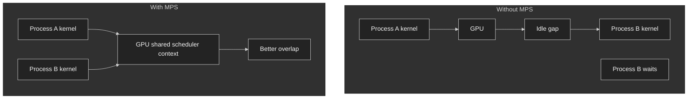

### Useful For

| Workload                           | MPS Fit   |
| ---------------------------------- | --------- |
| many small inference jobs          | 좋음        |
| multiple underutilizing processes  | 좋음        |
| one large training process per GPU | 보통 불필요    |
| strong tenant isolation required   | MIG가 더 적합 |
| debugging/profiling                | 복잡도 증가 가능 |

### MPS vs Time-Slicing vs MIG

| Method                  | Isolation | Overlap     | Best For                    |
| ----------------------- | --------- | ----------- | --------------------------- |
| Default time-slicing    | 낮음        | 낮음          | simple sharing              |
| Kubernetes time-slicing | 중간        | 낮음          | interactive/dev workloads   |
| MPS                     | 낮음~중간     | 높음          | throughput-oriented sharing |
| MIG                     | 높음        | partitioned | multi-tenant isolation      |

## MIG

MIG는 Multi-Instance GPU다. 하나의 GPU를 hardware-level slice로 나눠 여러 개의 독립적인 logical GPU처럼 사용하는 기능이다.

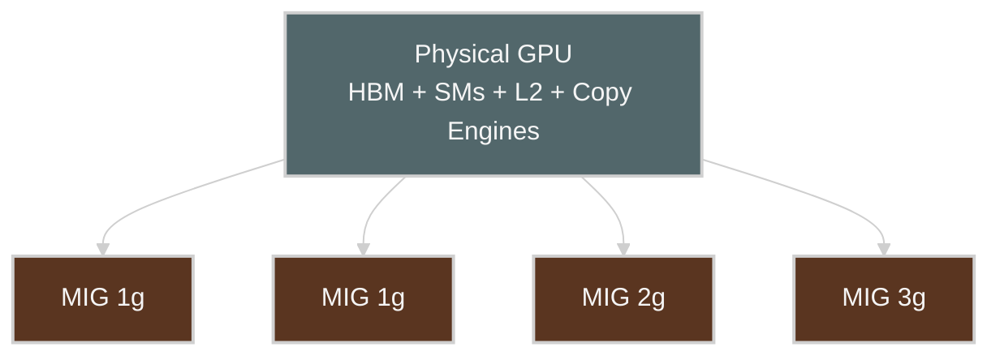

### MIG Profile Meaning

MIG profile은 보통 다음 형태다.

```text
1g.23gb
2g.45gb
3g.90gb
7g.180gb
```

| Part                            | Meaning         |
| ------------------------------- | --------------- |
| `1g`, `2g`, `3g`, `7g`          | compute slice 수 |
| `23gb`, `45gb`, `90gb`, `180gb` | 할당된 HBM 크기      |

### When MIG Helps

| Scenario                          | Why                |
| --------------------------------- | ------------------ |
| inference service 여러 개를 한 GPU에 배치 | resource isolation |
| team/user별 GPU slice 제공           | multi-tenancy      |
| 작은 model serving                  | full GPU 낭비 방지     |
| latency consistency 필요            | noisy neighbor 완화  |

### Trade-off

* idle MIG slice의 resource를 다른 slice가 자동으로 빌려 쓸 수 없다.
* profile 조합이 hardware-supported profile로 제한된다.
* 재구성 시 workload drain이 필요하다.
* large training job에는 full GPU가 더 적합할 수 있다.
* GPU가 MIG mode에 있으면 GPU-to-GPU P2P communication이 제한될 수 있다.

> [!WARNING]
> Chapter 3은 MIG mode에서 GPU-to-GPU peer-to-peer communication, NVLink, PCIe P2P, CUDA IPC가 제한될 수 있다고 경고한다. Large-scale distributed training이나 sparse MoE inference처럼 GPU 간 communication이 많은 workload는 MIG보다 full GPU allocation이 보통 더 적합하다.

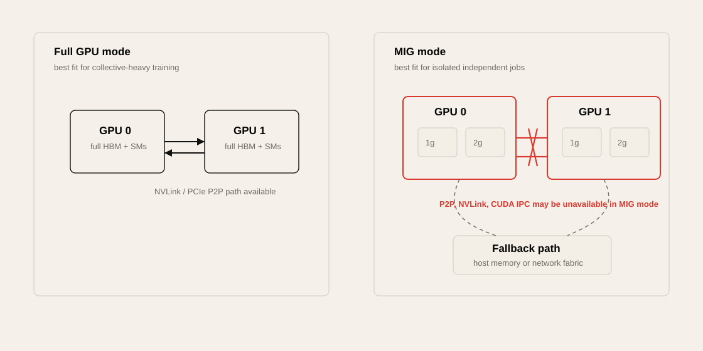

## GPU Clock Speeds and ECC

NVIDIA GPU는 GPU Boost를 통해 power/thermal envelope 안에서 clock을 자동 조절한다. 대부분의 training/inference workload에서는 기본 auto-boost 동작을 그대로 두는 것이 합리적이다. 다만 benchmark에서는 clock variability가 결과 해석을 흔들 수 있다.

| Knob | Use Case | Risk |
| --- | --- | --- |
| `nvidia-smi -lgc` | benchmark reproducibility를 위해 core clock 고정 | thermal headroom이 부족하면 throttling 또는 불안정 |
| `nvidia-smi -ac` | memory/core application clock 고정 | GPU/driver/model별 지원 차이 |
| `nvidia-smi -pl` | power limit을 TDP보다 낮춰 thermal throttling 완화 | peak throughput 감소 가능 |
| GPU Boost default | 일반 training/inference | run-to-run variance가 있을 수 있음 |

ECC는 data center GPU에서 reliability를 위한 기본 기능이다.

| ECC Setting | Benefit | Trade-off |
| --- | --- | --- |
| enabled | single-bit error correction, double-bit error detection, long job reliability | small capacity/performance overhead |
| disabled | 일부 memory/cost overhead 감소 가능 | silent corruption 또는 job crash risk 증가 |

Practical rule:

* serious training/inference job에서는 ECC를 켜 둔다.
* ECC toggle은 GPU reset과 job interruption을 요구할 수 있으므로 빈번한 운영 knob로 보지 않는다.
* benchmark에서는 clock, power, temperature, ECC state를 함께 기록한다.

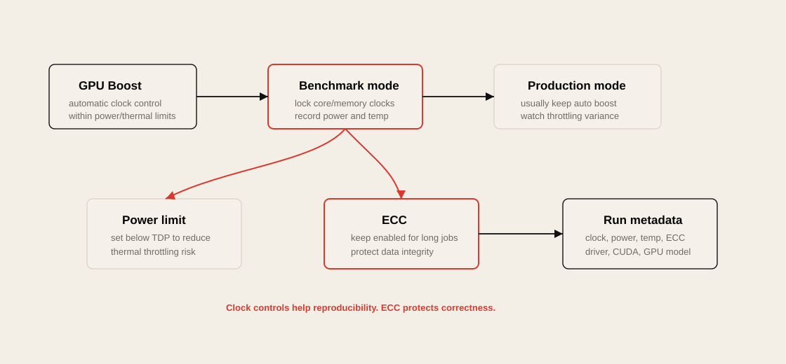

## GPU Memory Fragmentation and OOM

GPU OOM은 단순히 “memory가 부족하다”가 아니다.

가능한 원인은 여러 가지다.

| Cause                  | Example                                          |
| ---------------------- | ------------------------------------------------ |
| true capacity shortage | model + activation + optimizer state가 HBM 초과     |
| fragmentation          | 총 free memory는 있지만 contiguous block 부족           |
| allocator behavior     | PyTorch CUDA caching allocator fragmentation     |
| dynamic shape          | batch/sequence length 변화로 allocation pattern 불안정 |
| KV cache growth        | inference decode 중 KV cache 증가                   |
| multi-tenant sharing   | 다른 process가 memory 점유                            |

### 확인

```bash
nvidia-smi
nvidia-smi pmon -s m
```

PyTorch:

```bash
export PYTORCH_CUDA_ALLOC_CONF=expandable_segments:True
```

또는 memory summary:

```python
print(torch.cuda.memory_summary())
```

### Mitigation

| Strategy                    | Use Case               |
| --------------------------- | ---------------------- |
| static batch/sequence shape | allocation pattern 안정화 |
| preallocation               | inference serving      |
| CUDA Graphs                 | 반복 실행 workload         |
| allocator tuning            | fragmentation 완화       |
| activation checkpointing    | training memory 절약     |
| tensor/model parallelism    | model이 단일 GPU에 안 들어갈 때 |
| KV cache limit              | inference OOM 방지       |

## Container Runtime Optimizations

GPU container는 host driver와 container 내부 CUDA library의 경계가 중요하다.

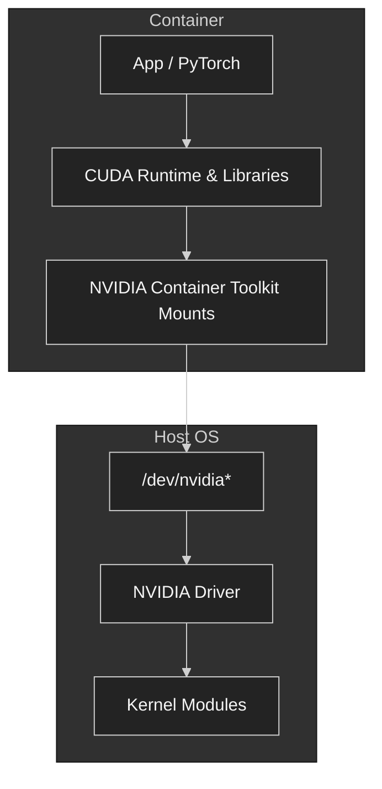

### Container Performance Risks

| Risk                        | Symptom                              |
| --------------------------- | ------------------------------------ |
| CUDA-driver mismatch        | container starts but GPU unavailable |
| image too large             | slow pod startup                     |
| overlay filesystem overhead | dataset/model access 느림              |
| missing device mount        | CUDA initialization failure          |
| wrong base image            | latest GPU architecture unsupported  |
| many small files in image   | image pull/extract latency           |

## NVIDIA Container Toolkit

NVIDIA Container Toolkit은 container가 host GPU device와 driver library에 접근할 수 있게 해준다.

확인:

```bash
nvidia-container-cli info
docker run --rm --gpus all nvidia/cuda:12.4.1-base-ubuntu22.04 nvidia-smi
```

containerd/Kubernetes 환경에서는 NVIDIA runtime class나 GPU Operator 구성이 중요하다.

예시:

```yaml
apiVersion: node.k8s.io/v1
kind: RuntimeClass
metadata:
  name: nvidia
handler: nvidia
```

Pod 예시:

```yaml
apiVersion: v1
kind: Pod
metadata:
  name: cuda-test
spec:
  runtimeClassName: nvidia
  containers:
    - name: cuda
      image: nvidia/cuda:12.4.1-base-ubuntu22.04
      command: ["nvidia-smi"]
      resources:
        limits:
          nvidia.com/gpu: 1
```

## Avoiding Overlay Filesystem Overhead

Container overlay filesystem은 application binary에는 괜찮지만, 대규모 dataset이나 model weight 접근에는 병목이 될 수 있다.

### Avoid

* training dataset을 container layer 안에 넣기
* model checkpoint를 writable overlay에 저장하기
* container 내부에 대량의 small files 생성
* overlay filesystem 위에서 random I/O workload 수행

### Prefer

* hostPath
* local NVMe mount
* CSI volume
* parallel filesystem mount
* object storage cache
* read-only model volume
* initContainer로 local cache warming

```yaml
volumeMounts:
  - name: model-cache
    mountPath: /models
  - name: local-nvme
    mountPath: /data
volumes:
  - name: model-cache
    persistentVolumeClaim:
      claimName: model-cache-pvc
  - name: local-nvme
    hostPath:
      path: /local-nvme
```

## Container Image Startup Cost

Chapter 3은 container runtime overhead 자체보다 startup path가 문제가 되는 경우를 구분한다. Long-running training에서는 image pull 몇 분이 전체 job 시간에 비해 작을 수 있지만, autoscaling inference나 batch job churn이 큰 환경에서는 image startup cost가 p95/p99 latency와 queueing delay에 직접 반영된다.

| Cause | Symptom | Mitigation |
| --- | --- | --- |
| huge image | pod startup 지연 | multi-stage build, 불필요한 build tool 제거 |
| many small files | image extract/metadata overhead | dependency 정리, layer 수와 file count 관리 |
| model weight in image | image pull이 model load와 결합 | model volume, local cache, initContainer warming |
| base image mismatch | runtime error or slow fallback | NGC/PyTorch official image와 driver matrix 확인 |

실무 rule:

* dataset과 checkpoint는 image layer에 넣지 않는다.
* model artifact는 image가 아니라 cacheable volume/object storage 경로로 관리한다.
* inference autoscaling 환경에서는 `image pull time + model load time + CUDA context init`을 cold-start budget으로 따로 측정한다.

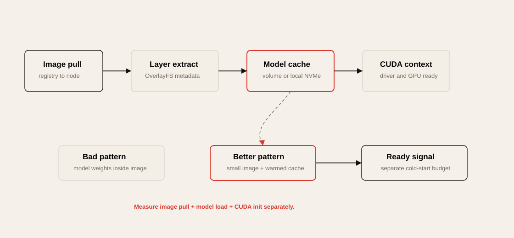

## Kubernetes for GPU Environments

Kubernetes는 GPU cluster 운영에 유용하지만, 기본 scheduler는 GPU topology를 깊게 이해하지 못한다.

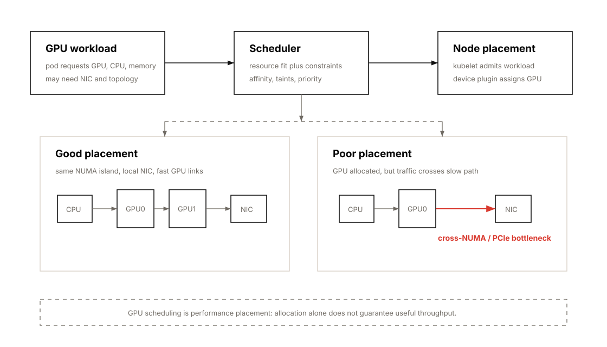

GPU workload에서 Kubernetes가 잘못 설정되면 다음 문제가 생긴다.

| Problem           | Example                                   |
| ----------------- | ----------------------------------------- |
| topology mismatch | GPU와 NIC가 멀리 떨어진 NUMA node에 배치            |
| CPU contention    | dataloader CPU를 다른 pod가 사용                |
| memory pressure   | OOM killer로 training job 종료               |
| network jitter    | CNI path, noisy pod, interrupt contention |
| startup delay     | large image pull, model download          |
| poor GPU sharing  | MIG/MPS policy 부재                         |

## Kubernetes Topology Manager

Kubernetes Topology Manager는 CPU, device, hugepage 등의 NUMA alignment를 맞추는 기능이다.

관련 kubelet 설정:

```yaml
topologyManagerPolicy: "single-numa-node"
cpuManagerPolicy: "static"
memoryManagerPolicy: "Static"
```

### Policy Meaning

| Policy             | Meaning                      |
| ------------------ | ---------------------------- |
| `none`             | topology alignment 안 함       |
| `best-effort`      | 가능하면 맞춤                      |
| `restricted`       | topology hint가 맞지 않으면 reject |
| `single-numa-node` | 같은 NUMA node에 resource 배치 강제 |

### Practical Rule

> GPU + NIC + CPU core + memory locality가 중요한 RDMA/NCCL workload에서는 `single-numa-node` 정책을 검토해야 한다.

### Case Study: Kubernetes에서 GPU Workload를 NUMA-Local하게 유지하기

Ronak Nathani의 ["Keeping GPU Workloads NUMA-Local in Kubernetes"](https://ronaknathani.com/blog/2026/05/keeping-gpu-workloads-numa-local-in-kubernetes/)는 이 장의 NUMA, CPU pinning, Kubernetes Topology Manager 내용을 실제 운영 문제로 연결하는 좋은 사례다.

Related articles:

* [Keeping GPU Workloads NUMA-Local in Kubernetes](../articles/keeping-gpu-workloads-numa-local-in-kubernetes.ko.md)는 이 case study의 kubelet policy, failure mode, topology-aware scheduling을 더 자세히 정리한다.
* [Never Underestimate Memory Architecture](../articles/never-underestimate-memory-architecture.ko.md)는 Grafana의 production NUMA 사례, cloud VM topology, Kubernetes CPU Manager, uncore bottleneck을 더 넓게 정리한다.

핵심은 GPU workload가 GPU 안에서만 실행되지 않는다는 점이다. CPU는 training에서는 dataloader, preprocessing, pinned memory staging, kernel launch를 담당하고, inference에서는 tokenization, request batching, input formatting, postprocessing, server event loop를 담당한다. 이 CPU thread와 host memory가 GPU가 붙은 PCIe root complex와 다른 NUMA node에 있으면 H2D/DMA 경로가 socket interconnect를 건너게 된다. workload는 정상처럼 보이지만 step time, p99 latency, dataloader wait time이 조용히 나빠질 수 있다.

Kubernetes에서는 locality 보장이 단계적으로 강해진다.

| Level | Kubelet setting | What it gives | Workload requirement |
| --- | --- | --- | --- |
| 1 | `cpuManagerPolicy: static` | Guaranteed QoS pod에 exclusive logical CPU 할당 | 모든 container의 CPU/memory `requests == limits`, integer CPU request |
| 2 | `cpuManagerPolicyOptions: full-pcpus-only=true` | SMT sibling을 나누지 않고 physical core 단위로 할당 | exclusive CPU request가 SMT thread 수의 배수여야 함 |
| 3 | `topologyManagerPolicy: single-numa-node` | CPU/device/hugepage topology hint가 한 NUMA node에 맞을 때만 admit | critical container가 한 NUMA node 안에 들어야 함 |
| 3+ | `memoryManagerPolicy: Static` | memory request도 NUMA admission에 포함 | `reservedMemory` 설정과 NUMA별 memory capacity planning 필요 |

중요한 실패 모드는 "느리게 성공"과 "빠르게 실패"의 차이다. `cpuManagerPolicy: static`만 쓰면 kubelet CPU allocator가 보통 NUMA-local하게 pack하려고 하지만, node fragmentation이 생기면 한 container의 CPU가 여러 NUMA node에 걸칠 수 있다. Pod는 Running이고 GPU도 보이지만 p99나 step time만 나빠진다. 반대로 `single-numa-node`를 켜면 맞지 않는 pod는 `TopologyAffinityError`로 admission 단계에서 실패한다. 운영 관점에서는 조용한 성능 저하보다 명시적 실패가 디버깅하기 쉽다.

다만 기본 Kubernetes scheduler는 node 전체의 aggregate CPU/memory/GPU만 보고 placement를 결정한다. NUMA node별 남은 CPU가 `20 + 40`처럼 쪼개져 있어도 "총 60 vCPU available"로 보일 수 있다. 이 경우 scheduler는 pod를 보냈지만 kubelet이 `TopologyAffinityError`로 거부하는 루프가 생긴다. 큰 GPU cluster에서는 `NodeResourceTopology` CRD, NFD Topology Updater, `NodeResourceTopologyMatch` scheduler plugin 같은 topology-aware scheduling 구성이 필요할 수 있다.

실무 검증은 먼저 node topology를 확인하고, 그 다음 container 안의 실제 CPU affinity를 확인한다.

```bash
lscpu -e=CPU,CORE,SOCKET,NODE
numactl -H
nvidia-smi topo -m

kubectl exec <pod-name> -c <container-name> -- taskset -cp 1
kubectl exec <pod-name> -c <container-name> -- grep Cpus_allowed_list /proc/1/status
```

Training workload에서는 dataloader worker, pinned memory, GPU-local preprocessing thread가 같은 NUMA domain에 있는지 봐야 한다. Inference workload에서는 tokenization, batching thread, model server worker, GPU copy path가 p99 tail latency에 영향을 준다. 둘 다 "GPU utilization"보다 GPU가 기다린 시간, H2D copy time, CPU run queue, remote memory access, p95/p99 latency 또는 step time variance를 같이 봐야 한다.

## Kubernetes, SLURM, and Job Scheduling

AI cluster에서는 Kubernetes와 SLURM이 모두 쓰인다.

| Scheduler                  | Strength                                                         |
| -------------------------- | ---------------------------------------------------------------- |
| Kubernetes                 | service orchestration, inference serving, cloud-native ecosystem |
| SLURM                      | HPC batch scheduling, gang scheduling, large training job        |
| Kueue / Volcano / YuniKorn | Kubernetes batch scheduling 보완                                   |
| Ray                        | distributed AI application scheduler                             |

### Scheduling Question

GPU job을 schedule할 때 핵심 질문은 다음이다.

* GPU 몇 개가 필요한가?
* 같은 node 안에 있어야 하는가?
* 같은 NVLink/NVSwitch domain 안에 있어야 하는가?
* GPU와 NIC locality가 중요한가?
* CPU core와 memory도 보장되어야 하는가?
* job이 latency-sensitive인가 throughput-oriented인가?
* MIG slice로 충분한가 full GPU가 필요한가?

## MIG on Kubernetes

NVIDIA GPU Operator와 device plugin은 MIG resource를 Kubernetes resource로 노출할 수 있다.

예시 resource name:

```text
nvidia.com/mig-1g.23gb
nvidia.com/mig-2g.45gb
nvidia.com/mig-7g.180gb
```

Pod 예시:

```yaml
apiVersion: v1
kind: Pod
metadata:
  name: mig-inference
spec:
  containers:
    - name: server
      image: nvcr.io/nvidia/pytorch:latest
      resources:
        limits:
          nvidia.com/mig-1g.23gb: 1
```

### MIG Scheduling Pitfall

| Pitfall             | Impact                                |
| ------------------- | ------------------------------------- |
| slice fragmentation | 남는 slice가 생겨 GPU 낭비                   |
| wrong profile       | memory 부족 또는 overprovision            |
| mixed workload      | latency variance                      |
| dynamic reconfig    | workload drain 필요                     |
| monitoring 미흡       | physical GPU 기준 metric과 MIG metric 혼동 |

## Network Communication in Kubernetes

GPU training에서는 Kubernetes network path도 중요하다.

| Path           | Concern                             |
| -------------- | ----------------------------------- |
| Pod network    | CNI overhead, MTU, routing          |
| Host network   | lower overhead but weaker isolation |
| RDMA device    | SR-IOV, device plugin, Multus       |
| NCCL bootstrap | wrong interface selection           |
| Service mesh   | latency overhead 가능                 |
| DNS            | startup and service discovery delay |

### NCCL Interface 확인

```bash
NCCL_DEBUG=INFO
NCCL_SOCKET_IFNAME=ib0
NCCL_IB_HCA=mlx5
NCCL_PORT_RANGE=50000-51000
```

### Kubernetes RDMA Pattern

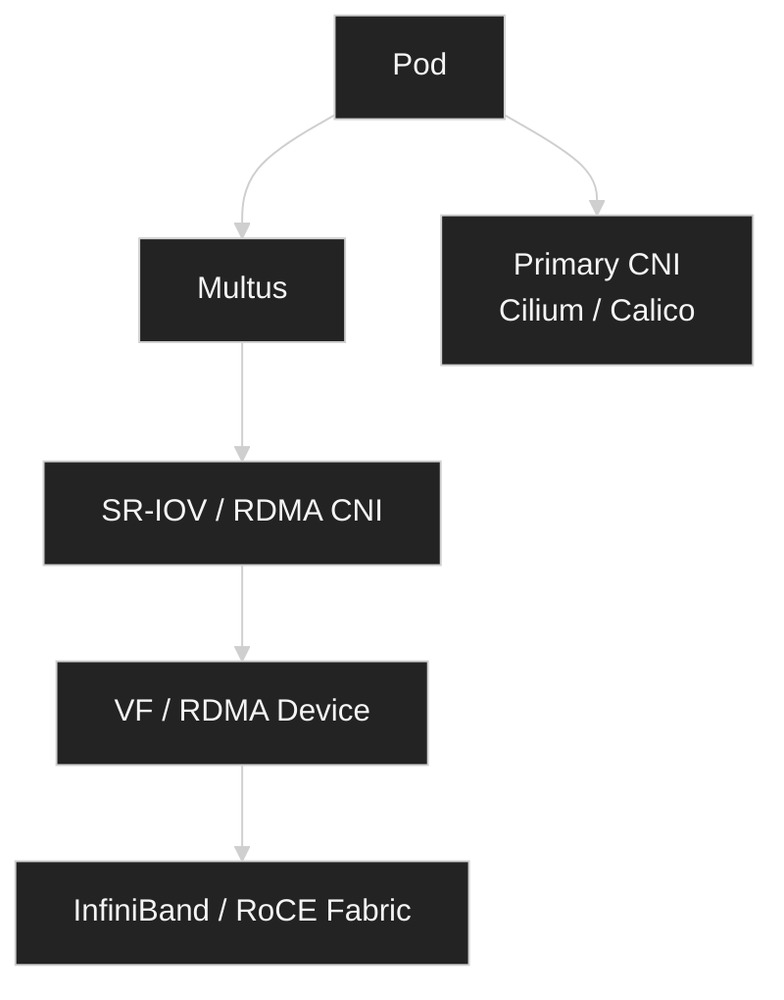

### Practical Rule

> Distributed training pod는 “IP가 있다”로 충분하지 않다.
> NCCL이 의도한 NIC, 의도한 NUMA path, 의도한 RDMA device를 쓰는지 확인해야 한다.

정책이 허용한다면, performance-sensitive NCCL/MPI job에서는 `hostNetwork: true`로 pod overlay/NAT overhead를 없앨 수 있다. host networking이 허용되지 않는다면 CNI MTU, kernel-space datapath, firewall rule, service mesh bypass, NCCL bootstrap port를 명시적으로 검증해야 한다.

## Reducing Kubernetes Orchestration Jitter

Kubernetes는 편리하지만 jitter source가 많다.

| Jitter Source      | Mitigation                              |
| ------------------ | --------------------------------------- |
| CPU sharing        | CPU requests/limits, CPU Manager static |
| pod eviction       | QoS Guaranteed                          |
| image pull         | pre-pull, smaller image                 |
| CNI setup          | warm pool, simpler network path         |
| DNS delay          | NodeLocal DNSCache                      |
| noisy neighbor     | dedicated GPU node pool                 |
| daemonset overhead | system-reserved/kube-reserved           |
| logging overhead   | async logging, rate limit               |

### Guaranteed QoS

Guaranteed QoS를 얻으려면 CPU와 memory의 request와 limit이 같아야 한다.

```yaml
resources:
  requests:
    cpu: "32"
    memory: "256Gi"
    nvidia.com/gpu: "8"
  limits:
    cpu: "32"
    memory: "256Gi"
    nvidia.com/gpu: "8"
```

성능 민감 job에서는 가능하면 node 전체를 예약하는 방식이 가장 예측 가능하다.

## Resource Guarantees and OOM Avoidance

Kubernetes memory limit은 조심해야 한다.

AI training job은 host memory를 많이 쓴다.

* dataloader prefetch buffer
* pinned memory
* tokenizer buffer
* CPU offload
* checkpoint staging
* dataset cache

memory limit이 너무 낮으면 long-running job이 며칠 뒤 OOM으로 죽을 수 있다.

### QoS Classes

| QoS        | Condition                         | Eviction Risk |
| ---------- | --------------------------------- | ------------- |
| Guaranteed | requests == limits for CPU/memory | 낮음            |
| Burstable  | 일부 request/limit 설정               | 중간            |
| BestEffort | request/limit 없음                  | 높음            |

### Practical Rule

> Training job은 “memory limit을 빡빡하게 걸어서 안전하게 만든다”보다, 실제 peak memory를 측정하고 충분한 headroom을 둬야 한다.

## I/O Isolation

Kubernetes는 CPU와 memory isolation은 비교적 잘 제공하지만, I/O isolation은 상대적으로 약하다.

문제 예시:

* 같은 node의 다른 pod가 local NVMe를 많이 사용
* checkpoint write가 dataset read를 방해
* container log write가 disk I/O를 잠식
* object storage cache가 eviction thrash 발생
* NFS/GPFS client가 page cache를 과도하게 사용

### 확인

```bash
iostat -xz 1
pidstat -d 1
iotop
cat /sys/fs/cgroup/io.stat
```

### Mitigation

* dedicated node for large training
* local NVMe cache 분리
* checkpoint path와 dataset path 분리
* cgroup v2 I/O controller 검토
* log volume과 data volume 분리
* storage QoS가 필요한 경우 CSI/storage layer에서 제어

## System Bottleneck Lens

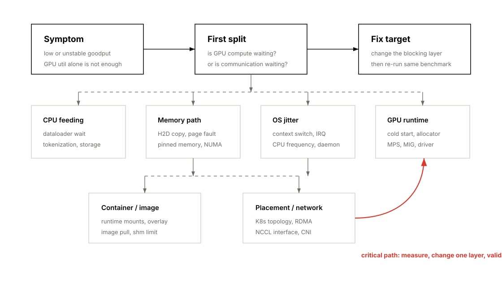

| Bottleneck Location   | Symptom                         | Metric                            | Tool                        | Fix                              |
| --------------------- | ------------------------------- | --------------------------------- | --------------------------- | -------------------------------- |
| CPU dataloader        | GPU util sawtooth               | batch wait time, CPU util         | PyTorch Profiler, pidstat   | worker tuning, prefetch, pinning |
| NUMA                  | throughput 낮고 jitter 큼          | remote memory access              | numactl, hwloc, perf        | CPU/memory bind                  |
| Host memory           | OOM, swap, latency spike        | RSS, page fault, swap in/out      | vmstat, sar, cgroup metrics | swappiness 0, memory headroom    |
| H2D copy              | GPU compute 전 copy delay        | memcpy HtoD time                  | Nsight Systems              | pinned memory, non_blocking copy |
| OS scheduler          | p95/p99 latency 흔들림             | context switch, run queue         | pidstat, perf sched         | CPU isolation, affinity          |
| IRQ                   | network-heavy job jitter        | interrupt count                   | /proc/interrupts            | IRQ affinity                     |
| GPU cold start        | first request slow              | CUDA init time                    | logs, nvidia-smi            | persistence mode                 |
| GPU sharing           | multiple small jobs inefficient | GPU util, SM active               | DCGM, nvidia-smi            | MPS or MIG                       |
| GPU memory            | OOM despite free memory         | reserved/allocated gap            | torch memory summary        | allocator tuning, static shape   |
| Container FS          | startup/I/O slow                | image pull time, I/O latency      | kubelet logs, iostat        | smaller image, external volume   |
| Kubernetes scheduling | K8s slower than bare metal      | CPU throttling, topology mismatch | kubelet, cgroup, DCGM       | Topology Manager, Guaranteed QoS |
| Network               | NCCL hangs/slow                 | NCCL bandwidth, retransmit        | NCCL tests, ibstat          | interface pinning, RDMA path     |

## Operational Validation Checklist

### Node Baseline

```bash
nvidia-smi
nvidia-smi topo -m
nvidia-smi nvlink --status
numactl --hardware
lscpu
lsblk
ip -br link
```

### Driver / CUDA

```bash
nvidia-smi
cat /proc/driver/nvidia/version
nvcc --version
ldconfig -p | grep cuda
```

### OS Tuning

```bash
cat /proc/sys/vm/swappiness
cat /sys/kernel/mm/transparent_hugepage/enabled
cpupower frequency-info
cat /proc/interrupts
```

### Container Runtime

```bash
nvidia-container-cli info
crictl info
docker info | grep -i runtime
```

### Kubernetes

```bash
kubectl describe node <node>
kubectl get pods -A -o wide
kubectl get runtimeclass
kubectl -n gpu-operator get pods
kubectl describe pod <gpu-pod>
```

### GPU Metrics

```bash
nvidia-smi dmon
nvidia-smi pmon
dcgmi dmon
```

### Performance Tests

```bash
# GPU visibility
kubectl run cuda-test --rm -it \
  --image=nvidia/cuda:12.4.1-base-ubuntu22.04 \
  --limits=nvidia.com/gpu=1 \
  -- nvidia-smi

# NCCL
./build/all_reduce_perf -b 8 -e 1G -f 2 -g 8

# CPU / memory / I/O
stress-ng --cpu 16 --vm 4 --vm-bytes 80%
fio --name=readtest --rw=read --bs=1M --size=10G --numjobs=4
```

## Practical Tips and Notes

### 1. GPU utilization만 보지 말고 goodput을 봐야 한다

GPU utilization이 90%라도 실제 samples/sec, tokens/sec, TTFT/TPOT가 낮으면 최적화된 상태가 아니다.

확인해야 할 metric:

* samples/sec
* tokens/sec
* step time
* GPU active time
* dataloader wait time
* H2D copy time
* NCCL collective time
* p95/p99 latency
* OOM/restart count


### 2. CPU pinning은 “최적화”가 아니라 “jitter 제거”에 가깝다

특히 DGX/HGX 같은 multi-GPU server에서는 GPU/NIC/CPU topology를 무시하면 성능이 흔들린다.

```bash
nvidia-smi topo -m
```

이 출력은 GPU placement와 NCCL/RDMA 튜닝의 출발점이다.


### 3. Kubernetes에서 GPU job은 Guaranteed QoS를 우선 고려한다

성능 민감 workload는 다음 조건을 만족시키는 것이 좋다.

* CPU request == CPU limit
* memory request == memory limit
* GPU limit 명시
* 가능하면 full node reservation
* CPU Manager static
* Topology Manager single-numa-node
* unnecessary DaemonSet 최소화


### 4. MPS와 MIG는 목적이 다르다

| Need                    | Choose       |
| ----------------------- | ------------ |
| GPU utilization 높이고 싶다  | MPS          |
| tenant isolation이 중요하다  | MIG          |
| interactive dev sharing | time-slicing |
| large training          | full GPU     |
| small inference packing | MIG or MPS   |


### 5. Container image는 성능 자산이다

큰 image는 pod startup latency를 늘린다. 특히 inference autoscaling 환경에서는 image pull time이 곧 cold start latency다.

개선 방향:

* multi-stage build
* 불필요한 Python package 제거
* model weight는 image에 넣지 않고 external cache 사용
* node-local image pre-pull
* registry mirror 사용
* read-only root filesystem 검토


### 6. OOM killer는 성능 문제가 아니라 운영 리스크다

AI workload는 memory spike가 크다. OOM killer가 training rank 하나만 죽여도 distributed job 전체가 hang 또는 failure로 이어질 수 있다.

대응:

* memory peak 측정
* cgroup memory event 모니터링
* headroom 확보
* checkpoint interval 조정
* restart strategy와 failure handling 설계
* NCCL async error handling 사용


### 7. Inefficient Kernel Selection도 시스템 병목처럼 관찰해야 한다

GPU workload에서 “CUDA kernel이 실행된다”는 것과 “현재 workload에 가장 적합한 kernel이 선택되었다”는 것은 다르다.

PyTorch의 `torch.matmul`, attention, convolution, layer norm 같은 연산은 내부적으로 cuBLAS, cuDNN, CUTLASS, Triton, TorchInductor kernel 중 하나로 내려간다. 이때 input shape, dtype, tensor layout, batch size, sequence length, GPU architecture에 따라 최적 kernel이 달라진다.

따라서 inefficient kernel selection은 다음과 같은 상태를 의미한다.

> GPU에서 실행은 되고 있지만, 현재 shape/dtype/layout/hardware에 가장 적합한 CUDA kernel variant를 사용하지 못하는 상태

예를 들어 긴 sequence의 attention에서 naive attention kernel을 사용하면 HBM read/write가 많아져 memory-bound 병목이 심해진다. 반대로 아주 짧은 sequence에서는 FlashAttention류 tiled kernel의 setup overhead가 더 커질 수 있다. 즉, 항상 하나의 kernel이 모든 상황에서 최선은 아니다.

또 다른 예는 GEMM이다. LLM inference에서 batch size가 1일 때 좋은 GEMM kernel과 batch size가 16 또는 64일 때 좋은 GEMM kernel은 다를 수 있다. tile size, shared memory 사용량, register pressure, Tensor Core 사용 여부에 따라 occupancy와 throughput이 달라진다.

```python
# layout 때문에 비효율적인 kernel path를 탈 수 있는 예
x = x.transpose(1, 2)
y = torch.matmul(x, w)
```

`transpose()` 이후 tensor가 non-contiguous 상태라면 PyTorch가 내부적으로 copy를 만들거나 strided layout용 fallback path를 탈 수 있다. 이 경우 GPU는 사용하지만 Tensor Core에 최적인 contiguous/aligned layout kernel을 쓰지 못할 수 있다.

개선 가능성은 다음처럼 확인한다.

```python
x = x.transpose(1, 2).contiguous()
y = torch.matmul(x, w)
```

다만 `contiguous()` 자체도 copy 비용이 있으므로 무조건 적용하면 안 된다. 반드시 profiler로 before/after를 비교해야 한다.

진단 순서는 다음과 같다.

1. PyTorch Profiler로 느린 op를 찾는다.
2. Nsight Systems로 실제 CUDA kernel name과 launch pattern을 확인한다.
3. Nsight Compute로 SM utilization, Tensor Core utilization, occupancy, HBM bandwidth를 본다.
4. dtype, shape, layout, batch size, sequence length를 바꿔 kernel 선택이 바뀌는지 확인한다.
5. `torch.compile`, FlashAttention/SDPA, cuBLASLt autotune, Triton autotune, CUDA Graph 등을 실험한다.

관찰해야 할 metric은 다음과 같다.

| Metric                  | 의미                                   |
| ----------------------- | ------------------------------------ |
| CUDA kernel name        | 실제 어떤 kernel path를 탔는지               |
| SM utilization          | GPU compute unit을 충분히 쓰는지            |
| Tensor Core utilization | Tensor Core 최적 kernel을 탔는지           |
| achieved occupancy      | tile/register/shared memory 선택이 적절한지 |
| HBM bandwidth           | memory-bound인지                       |
| kernel launch count     | 작은 kernel이 너무 많이 launch되는지           |
| CUDA memcpy time        | layout 변환이나 hidden copy가 있는지         |
| latency by shape        | dynamic shape별 kernel 선택 차이          |

이 개념은 Chapter 3의 OS/Kubernetes 튜닝과도 연결된다. 시스템 계층에서 CPU, NUMA, container, scheduler 병목을 제거했는데도 GPU goodput이 낮다면, 다음 단계는 framework와 CUDA library가 실제로 효율적인 kernel을 선택했는지 확인해야 한다.

Practical rule:

> OS와 Kubernetes가 GPU를 잘 먹여 살리는지 확인한 다음, PyTorch/CUDA가 그 일을 가장 좋은 kernel로 실행하고 있는지 profiler로 검증해야 한다.

## Chapter Summary

Chapter 3의 핵심은 다음이다.

> GPU 성능 문제는 GPU 내부에서만 발생하지 않는다.
> OS, CPU, memory, container runtime, Kubernetes scheduler가 GPU를 얼마나 안정적으로 먹여 살리는지가 goodput을 결정한다.

성능 엔지니어링 관점에서 이 장은 세 가지 mental model을 준다.

### 1. GPU는 혼자 일하지 않는다

GPU는 CPU, memory, storage, network, runtime이 준비한 일을 실행한다.
따라서 GPU utilization이 낮으면 GPU kernel보다 먼저 input pipeline과 host-side path를 확인해야 한다.

### 2. Locality가 성능이다

NUMA locality, GPU/NIC topology, CPU pinning, memory binding, pinned memory는 모두 같은 문제를 다룬다.

> 데이터를 멀리 보내지 말고, 일을 처리할 주체 가까이에 둬라.

### 3. Kubernetes는 성능을 자동으로 보장하지 않는다

Kubernetes는 orchestration 도구이지, AI performance optimizer가 아니다.
GPU workload에서는 Topology Manager, CPU Manager, device plugin, resource requests/limits, MIG strategy, CNI/RDMA 구성을 명시적으로 설계해야 한다.

## Key Terms

| Term                     | Meaning                                        |
| ------------------------ | ---------------------------------------------- |
| NUMA                     | CPU, memory, device locality domain            |
| CPU Pinning              | process/thread를 특정 CPU core에 고정                |
| Memory Binding           | memory allocation을 특정 NUMA node에 고정            |
| Pinned Memory            | page-locked host memory                        |
| THP                      | Transparent Hugepages                          |
| TLB                      | virtual-to-physical address translation cache  |
| IRQ Affinity             | interrupt를 처리할 CPU core 지정                     |
| Swappiness               | Linux swap 사용 성향                               |
| Persistence Mode         | GPU driver context를 idle에도 유지                  |
| MPS                      | Multi-Process Service                          |
| MIG                      | Multi-Instance GPU                             |
| CUDA Runtime             | CUDA application과 driver 사이 runtime layer      |
| PTX                      | CUDA virtual intermediate representation       |
| CUBIN                    | architecture-specific GPU binary               |
| SASS                     | NVIDIA GPU low-level instruction               |
| Triton                   | Python DSL/compiler for custom GPU kernels     |
| jemalloc                 | CPU heap allocator often tuned for lower jitter |
| tcmalloc                 | CPU heap allocator with large per-thread caches |
| GPU Boost                | NVIDIA GPU automatic clock adjustment mechanism |
| ECC                      | error-correcting memory protection              |
| NVIDIA Container Toolkit | container에서 GPU 접근을 가능하게 하는 toolkit            |
| OverlayFS                | container image layer union filesystem          |
| hostNetwork              | Kubernetes pod가 host network namespace를 공유하는 설정 |
| NCCL_PORT_RANGE          | NCCL bootstrap/data connection port range 제한      |
| Topology Manager         | Kubernetes NUMA-aware resource alignment 기능    |
| CPU Manager              | Kubernetes CPU core pinning 기능                 |
| cgroups                  | Linux resource isolation mechanism             |
| Guaranteed QoS           | Kubernetes에서 가장 eviction risk가 낮은 QoS class    |
| OOM Killer               | Linux memory pressure 시 process kill mechanism |

## Questions

1. GPU utilization이 낮을 때 GPU kernel보다 먼저 확인해야 할 host-side 병목은 무엇인가?
2. NUMA locality가 GPU training throughput에 영향을 주는 이유는 무엇인가?
3. `pin_memory=True`와 `non_blocking=True`는 어떤 관계가 있는가?
4. Transparent Hugepages는 training과 inference에서 각각 어떤 trade-off를 가지는가?
5. GPU persistence mode는 실제 compute throughput을 높이는 기능인가?
6. MPS와 MIG의 가장 큰 차이는 무엇인가?
7. Kubernetes에서 Guaranteed QoS를 얻으려면 어떤 조건이 필요한가?
8. GPU pod에서 CPU request/limit을 명확히 잡지 않으면 어떤 문제가 생길 수 있는가?
9. container overlay filesystem이 AI workload에서 문제가 되는 경우는 언제인가?
10. Kubernetes Topology Manager의 `single-numa-node` 정책은 어떤 상황에서 유용한가?
11. distributed training에서 GPU와 NIC topology가 중요한 이유는 무엇인가?
12. OOM killer가 long-running training job에 위험한 이유는 무엇인가?
13. MIG slice를 사용할 때 GPU utilization이 오히려 낮아질 수 있는 이유는 무엇인가?
14. Kubernetes time-slicing과 MPS는 GPU sharing 방식에서 어떻게 다른가?
15. Chapter 3의 관점에서 goodput을 높인다는 것은 무엇을 의미하는가?
16. `jemalloc`이나 `tcmalloc` tuning은 GPU workload에서 어떤 문제를 줄이기 위한 것인가?
17. GPU clock locking과 ECC 설정은 각각 언제 중요하게 봐야 하는가?
18. CUDA Python, cuPyNumeric, cuTile, Triton 같은 Python-facing CUDA layer를 알아야 하는 이유는 무엇인가?

## Answers

### A1. GPU utilization이 낮을 때 GPU kernel보다 먼저 확인해야 할 host-side 병목은 무엇인가?

CPU dataloader, storage I/O, preprocessing, tokenization, pinned memory, H2D copy, CPU scheduling, NUMA placement를 먼저 확인해야 한다. GPU가 느린 것이 아니라 GPU에 공급되는 batch가 늦을 수 있다.

### A2. NUMA locality가 GPU training throughput에 영향을 주는 이유는 무엇인가?

CPU process와 memory allocation이 GPU와 다른 NUMA node에 있으면 remote memory access가 발생한다. 이 경우 latency가 증가하고 H2D copy path가 비효율적이 되며 dataloader jitter가 커질 수 있다.

### A3. `pin_memory=True`와 `non_blocking=True`는 어떤 관계가 있는가?

`pin_memory=True`는 host memory를 page-locked memory로 만들어 GPU로의 async copy를 가능하게 한다. `non_blocking=True`는 tensor를 GPU로 복사할 때 가능한 경우 비동기 복사를 사용한다. 둘을 함께 써야 CPU-GPU copy와 GPU compute를 overlap하기 쉽다.

### A4. Transparent Hugepages는 training과 inference에서 각각 어떤 trade-off를 가지는가?

Training에서는 큰 memory allocation이 많기 때문에 THP가 TLB miss와 page fault overhead를 줄여 throughput에 도움이 될 수 있다. 반면 latency-sensitive inference에서는 THP background compaction이 p95/p99 latency spike를 만들 수 있으므로 `madvise`나 `never` 설정을 검토해야 한다.

### A5. GPU persistence mode는 실제 compute throughput을 높이는 기능인가?

아니다. matrix multiplication이나 kernel execution 자체를 빠르게 하지는 않는다. 대신 GPU idle 후 첫 CUDA call에서 발생하는 driver/context initialization latency를 줄여 startup latency와 consistency를 개선한다.

### A6. MPS와 MIG의 가장 큰 차이는 무엇인가?

MPS는 여러 process가 하나의 GPU scheduler context를 공유해 kernel execution overlap을 높이는 기능이다. MIG는 GPU를 hardware-level slice로 나누어 memory, SM, cache 등을 격리하는 기능이다. MPS는 utilization 개선에, MIG는 isolation과 predictable resource allocation에 더 적합하다.

### A7. Kubernetes에서 Guaranteed QoS를 얻으려면 어떤 조건이 필요한가?

Pod의 모든 container에서 CPU와 memory의 request와 limit이 같아야 한다. GPU limit만 지정한다고 Guaranteed QoS가 되는 것은 아니다.

### A8. GPU pod에서 CPU request/limit을 명확히 잡지 않으면 어떤 문제가 생길 수 있는가?

dataloader나 inference server thread가 다른 pod와 CPU를 공유하게 되고, context switching, CPU throttling, cache pollution, scheduling jitter가 발생할 수 있다. GPU는 준비된 batch나 request를 기다리게 되어 utilization과 goodput이 떨어진다.

### A9. container overlay filesystem이 AI workload에서 문제가 되는 경우는 언제인가?

대규모 dataset, model checkpoint, 많은 small files, random I/O를 container writable layer에서 처리할 때 문제가 된다. training dataset과 model cache는 overlay layer가 아니라 hostPath, PVC, local NVMe, parallel filesystem 같은 외부 volume에 두는 것이 좋다.

### A10. Kubernetes Topology Manager의 `single-numa-node` 정책은 어떤 상황에서 유용한가?

GPU, NIC, CPU core, memory가 같은 NUMA node에 있어야 성능이 잘 나오는 workload에서 유용하다. 특히 RDMA/NCCL 기반 distributed training, GPU-local preprocessing, high-throughput dataloader workload에서 중요하다.

### A11. distributed training에서 GPU와 NIC topology가 중요한 이유는 무엇인가?

NCCL communication은 GPU와 NIC 사이의 data path를 많이 사용한다. GPU와 NIC가 다른 NUMA domain에 있거나 PCIe path가 멀면 latency와 bandwidth 손실이 발생한다. 이는 all-reduce, all-gather 같은 collective operation의 병목으로 이어진다.

### A12. OOM killer가 long-running training job에 위험한 이유는 무엇인가?

OOM killer는 memory pressure 상황에서 heuristic으로 process를 죽인다. 큰 training rank가 죽으면 distributed job 전체가 hang되거나 실패할 수 있다. 며칠 동안 진행된 training이 checkpoint 전에 죽으면 비용 손실도 크다.

### A13. MIG slice를 사용할 때 GPU utilization이 오히려 낮아질 수 있는 이유는 무엇인가?

MIG는 hardware partitioning이므로 한 slice가 idle이어도 다른 slice가 그 resource를 빌려 쓸 수 없다. workload 크기와 MIG profile이 맞지 않으면 일부 slice가 비어 있거나 memory/compute balance가 맞지 않아 전체 GPU utilization이 낮아질 수 있다.

### A14. Kubernetes time-slicing과 MPS는 GPU sharing 방식에서 어떻게 다른가?

Kubernetes time-slicing은 여러 pod가 같은 GPU를 시간 단위로 나눠 쓰는 방식이다. 실제 kernel execution overlap은 제한적이다. MPS는 여러 process의 GPU work를 하나의 scheduler context로 합쳐 idle gap을 줄이고 더 많은 overlap을 가능하게 한다.

### A15. Chapter 3의 관점에서 goodput을 높인다는 것은 무엇을 의미하는가?

GPU가 실제 training/inference 계산을 수행하는 시간을 늘리고, CPU feeding delay, memory copy delay, OS jitter, container startup delay, Kubernetes scheduling/resource contention, OOM/restart 같은 비생산적 시간을 줄이는 것이다. 즉, GPU utilization 숫자만 높이는 것이 아니라 end-to-end useful throughput을 높이는 것이다.

### A16. `jemalloc`이나 `tcmalloc` tuning은 GPU workload에서 어떤 문제를 줄이기 위한 것인가?

CPU-side allocation lock contention, fragmentation, page return, allocator pause를 줄이기 위한 것이다. GPU kernel 자체를 빠르게 만드는 것이 아니라 DataLoader, preprocessing, request batching 같은 CPU feeding path의 jitter를 줄여 GPU가 batch를 기다리는 시간을 줄인다.

### A17. GPU clock locking과 ECC 설정은 각각 언제 중요하게 봐야 하는가?

GPU clock locking은 benchmark reproducibility와 run-to-run variance 분석에서 중요하다. 일반 training/inference에서는 GPU Boost 기본 동작을 두는 경우가 많다. ECC는 long-running training과 production inference의 data integrity를 위해 켜 두는 것이 원칙이며, 끄는 것은 작은 capacity/performance 이득보다 silent corruption risk가 더 큰 경우가 많다.

### A18. CUDA Python, cuPyNumeric, cuTile, Triton 같은 Python-facing CUDA layer를 알아야 하는 이유는 무엇인가?

현대 AI workload는 Python 코드로 작성되지만 실제 실행은 CUDA runtime, compiler backend, optimized library, custom kernel로 내려간다. Python-facing CUDA layer를 이해하면 framework가 어떤 kernel path를 선택하는지, 언제 Triton/autotuning/custom kernel이 필요한지, Python-level API가 GPU memory access pattern에 어떤 영향을 주는지 더 정확히 판단할 수 있다.

## References

* NVIDIA, [CUDA Toolkit Documentation](https://docs.nvidia.com/cuda/)
* NVIDIA, [CUDA Compatibility](https://docs.nvidia.com/deploy/cuda-compatibility/)
* NVIDIA, [CUDA C++ Programming Guide](https://docs.nvidia.com/cuda/cuda-c-programming-guide/)
* NVIDIA, [CUDA Python](https://nvidia.github.io/cuda-python/latest/)
* NVIDIA, [CUDA Tile](https://developer.nvidia.com/cuda/tile)
* NVIDIA, [Data Center GPU Manager Documentation](https://docs.nvidia.com/datacenter/dcgm/latest/user-guide/)
* NVIDIA, [Nsight Systems Documentation](https://docs.nvidia.com/nsight-systems/index.html)
* NVIDIA, [Nsight Compute Documentation](https://docs.nvidia.com/nsight-compute/index.html)
* NVIDIA, [Multi-Process Service Documentation](https://docs.nvidia.com/deploy/mps/index.html)
* NVIDIA, [Multi-Instance GPU User Guide](https://docs.nvidia.com/datacenter/tesla/mig-user-guide/)
* NVIDIA, [NVIDIA Container Toolkit Documentation](https://docs.nvidia.com/datacenter/cloud-native/container-toolkit/latest/index.html)
* NVIDIA, [NVIDIA GPU Operator Documentation](https://docs.nvidia.com/datacenter/cloud-native/gpu-operator/latest/index.html)
* NVIDIA, [MIG Support in Kubernetes](https://docs.nvidia.com/datacenter/cloud-native/kubernetes/latest/index.html)
* NVIDIA, [Kubernetes Device Plugin for NVIDIA GPUs](https://github.com/NVIDIA/k8s-device-plugin)
* PyTorch, [Profiler Documentation](https://docs.pytorch.org/docs/stable/profiler.html)
* PyTorch, [CUDA Semantics](https://docs.pytorch.org/docs/stable/notes/cuda.html)
* PyTorch, [CUDA Environment Variables](https://docs.pytorch.org/docs/stable/cuda_environment_variables.html)
* Kubernetes, [Device Plugins](https://kubernetes.io/docs/concepts/extend-kubernetes/compute-storage-net/device-plugins/)
* Kubernetes, [Topology Manager](https://kubernetes.io/docs/tasks/administer-cluster/topology-manager/)
* Kubernetes, [Resource Management for Pods and Containers](https://kubernetes.io/docs/concepts/configuration/manage-resources-containers/)
* Kubernetes, [Pod Quality of Service Classes](https://kubernetes.io/docs/concepts/workloads/pods/pod-qos/)
* Kubernetes, [Node Resource Managers](https://kubernetes.io/docs/concepts/policy/node-resource-managers/)
* Ronak Nathani, [Keeping GPU Workloads NUMA-Local in Kubernetes](https://ronaknathani.com/blog/2026/05/keeping-gpu-workloads-numa-local-in-kubernetes/)
