# Chapter 5: GPU-Based Storage I/O Optimizations

## Table of Contents

* [Goal](#goal)
* [Why Storage I/O Matters for AI Performance](#why-storage-io-matters-for-ai-performance)
* [End-to-End GPU Data Path](#end-to-end-gpu-data-path)
* [Storage Throughput Capacity Planning](#storage-throughput-capacity-planning)
* [Fast Storage and Data Locality](#fast-storage-and-data-locality)
* [Sequential Versus Random Read Patterns](#sequential-versus-random-read-patterns)
* [Dataset Layout and the Small-File Problem](#dataset-layout-and-the-small-file-problem)
* [Tuning NVMe and Filesystems](#tuning-nvme-and-filesystems)
* [NVIDIA GPUDirect Storage](#nvidia-gpudirect-storage)
* [When GDS Helps and When It Does Not](#when-gds-helps-and-when-it-does-not)
* [Measuring GDS with gdsio](#measuring-gds-with-gdsio)
* [Checkpointing GPU State with cuda-checkpoint](#checkpointing-gpu-state-with-cuda-checkpoint)
* [DeepSeek Fire-Flyer File System](#deepseek-fire-flyer-file-system)
* [Distributed and Parallel Storage Backends](#distributed-and-parallel-storage-backends)
* [NFS and Object Storage Tuning](#nfs-and-object-storage-tuning)
* [Striping, Replication, and Compression](#striping-replication-and-compression)
* [Monitoring Storage I/O](#monitoring-storage-io)
* [Tuning the Data Pipeline](#tuning-the-data-pipeline)
* [Scaling Data Workers with GPUs](#scaling-data-workers-with-gpus)
* [NVIDIA DALI](#nvidia-dali)
* [NVIDIA NeMo Curator](#nvidia-nemo-curator)
* [Continuous Profiling and Tuning Workflow](#continuous-profiling-and-tuning-workflow)
* [Diagnosing I/O, Communication, and Compute Bottlenecks](#diagnosing-io-communication-and-compute-bottlenecks)
* [Storage Bottleneck Lens](#storage-bottleneck-lens)
* [Operational Validation Checklist](#operational-validation-checklist)
* [Hands-on Labs](#hands-on-labs)
* [Practical Tips and Notes](#practical-tips-and-notes)
* [Chapter Summary](#chapter-summary)
* [Key Terms](#key-terms)
* [Questions](#questions)
* [Answers](#answers)
* [References](#references)


## Goal

이번 장의 목표는 storage를 단순한 dataset 보관소가 아니라 **GPU goodput을 결정하는 실행 경로의 일부**로 이해하는 것이다.

핵심 아이디어는 다음과 같다.

> GPU가 아무리 빨라도 storage, filesystem, network, CPU preprocessing, host-to-device copy 중 하나가 늦으면 GPU는 데이터를 기다리며 idle 상태가 된다.

이 챕터는 다음 질문에 답한다.

* 데이터가 storage에서 GPU HBM까지 어떤 경로로 이동하는가?
* storage가 실제 병목인지 어떤 metric으로 증명하는가?
* sequential read와 random read가 왜 큰 차이를 만드는가?
* local NVMe, NFS, parallel filesystem, object storage를 어떻게 선택하는가?
* GPUDirect Storage가 제거하는 copy는 무엇인가?
* `gdsio`로 GDS path를 어떻게 검증하는가?
* PyTorch DataLoader worker, prefetch, pinned memory를 어떻게 조정하는가?
* GPU 수를 늘릴 때 input pipeline도 어떻게 함께 scale-out해야 하는가?
* DALI와 NeMo Curator는 어느 단계의 병목을 줄이는가?
* checkpoint가 training iteration과 shared storage를 어떻게 흔드는가?

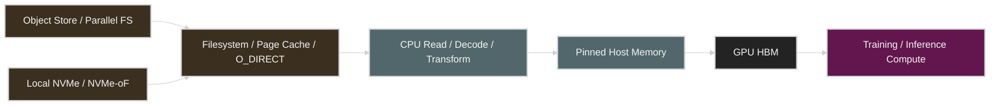

성능 엔지니어의 목표는 위 경로에서 **가장 느린 단계와 불필요한 copy를 찾는 것**이다.


## Why Storage I/O Matters for AI Performance

AI training workload는 대규모 dataset을 반복적으로 읽는다. text는 TB 단위, image/video dataset은 PB 단위가 될 수 있다. 이 데이터가 iteration deadline 안에 도착하지 못하면 GPU utilization이 주기적으로 떨어지고 step time이 길어진다.

일반적인 증상은 다음과 같다.

| 증상 | 가능한 원인 |
| --- | --- |
| iteration 시작마다 GPU idle gap 발생 | DataLoader, storage latency, H2D copy |
| CPU iowait가 높고 GPU utilization이 낮음 | storage throughput 또는 random I/O |
| disk bandwidth는 낮은데 latency가 높음 | small-file metadata lookup, low queue depth |
| worker 수를 늘렸는데 성능이 더 나빠짐 | CPU contention, context switch, storage queue saturation |
| 첫 epoch만 느리고 이후 빨라짐 | Linux page cache warm-up |
| checkpoint 시 전체 cluster가 느려짐 | write burst, page-cache pressure, shared storage contention |
| GPU 수를 늘려도 samples/sec가 증가하지 않음 | input pipeline scale-out 실패 |
| GDS를 켰지만 throughput 변화가 거의 없음 | CPU copy가 기존 병목이 아니었음 |

Chapter 5의 핵심은 다음이다.

> storage 성능은 최대 GB/s 스펙이 아니라, 실제 workload의 sample size, read pattern, concurrency, preprocessing, H2D transfer를 포함한 end-to-end batch delivery time으로 평가해야 한다.


## End-to-End GPU Data Path

전통적인 input path는 다음과 같다.

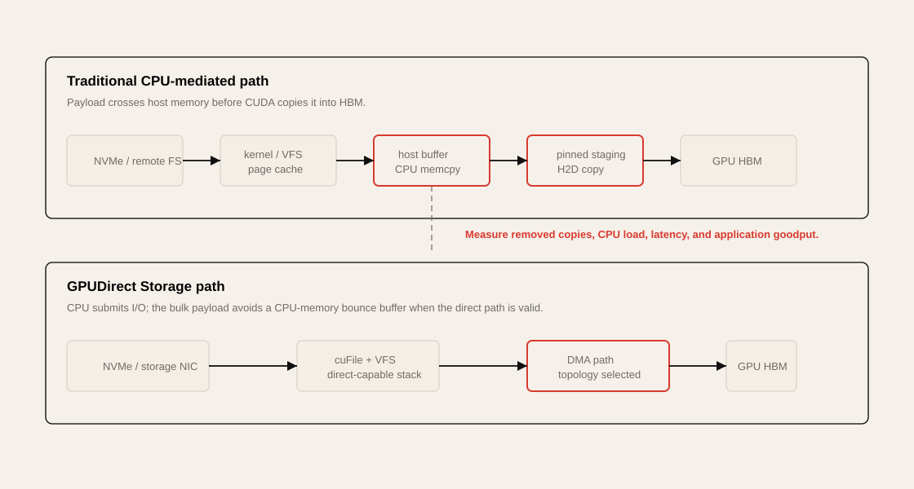


각 단계는 서로 다른 병목을 가진다.

| Stage | Main Metric | Typical Bottleneck |
| --- | --- | --- |
| Storage device | bandwidth, IOPS, latency, queue depth | slow device, insufficient parallelism |
| Filesystem | metadata latency, page-cache hit ratio | small files, lock contention, cache thrashing |
| Host memory | memcpy bandwidth, NUMA locality | bounce buffer, remote NUMA access |
| Preprocessing | CPU utilization, transform time | Python loop, decode, tokenization |
| H2D transfer | PCIe/NVLink-C2C throughput | pageable memory, serialized copies |
| GPU compute | SM busy, Tensor Core utilization | compute/memory-bound kernel |

GDS는 이 경로에서 host memory bounce buffer를 제거한다.

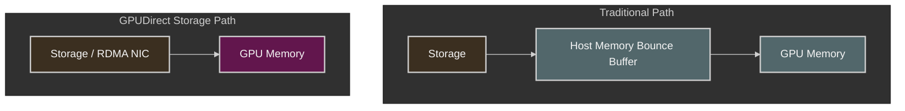

중요한 점은 GDS가 **CPU orchestration까지 없애는 것은 아니라는 것**이다. CPU는 I/O submission과 control을 담당하지만, large data payload가 host memory를 경유하지 않는다.


## Storage Throughput Capacity Planning

필요한 aggregate storage bandwidth는 다음처럼 계산할 수 있다.

```text
Required Storage Throughput
= Bytes per Sample
× Samples per Second per GPU
× Number of GPUs
× Overhead Factor
```

예를 들어 GPU 하나가 초당 1,000개의 sample을 소비하고 sample당 평균 크기가 200 KB라면 다음과 같다.

```text
200 KB/sample × 1,000 samples/s = 200 MB/s per GPU
```

8 GPU node는 약 1.6 GB/s가 필요하다.

```text
200 MB/s × 8 GPUs = 1.6 GB/s
```

72 GPU rack은 단순 계산으로 14.4 GB/s가 필요하다.

```text
200 MB/s × 72 GPUs = 14.4 GB/s
```

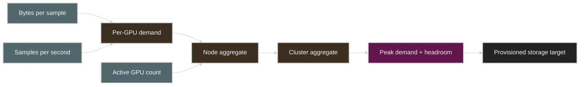

실무에서는 compression ratio, metadata traffic, checkpoint write, retry, concurrent jobs를 고려해 headroom을 둔다.

| Factor | Capacity Planning Meaning |
| --- | --- |
| average bytes/sample | raw file size가 아니라 실제 read bytes 기준 |
| samples/sec/GPU | target throughput 또는 profiler 측정값 |
| number of GPUs | active GPU 수, MIG slice 수가 아님 |
| augmentation ratio | 여러 crop/view를 만들면 logical sample rate 증가 |
| compression ratio | storage bytes는 줄지만 decode cost 증가 |
| concurrent jobs | shared filesystem의 aggregate demand 증가 |
| checkpoint traffic | read workload에 write burst가 겹침 |
| headroom | 보통 peak와 tail latency를 위해 여유 필요 |

### Practical Rule

> GPU를 추가하기 전에 dataset path가 새 GPU 수에 필요한 aggregate bytes/sec를 제공할 수 있는지 먼저 계산한다.


## Fast Storage and Data Locality

성능 관점에서 가장 중요한 원칙은 **데이터를 compute 가까이에 두는 것**이다.

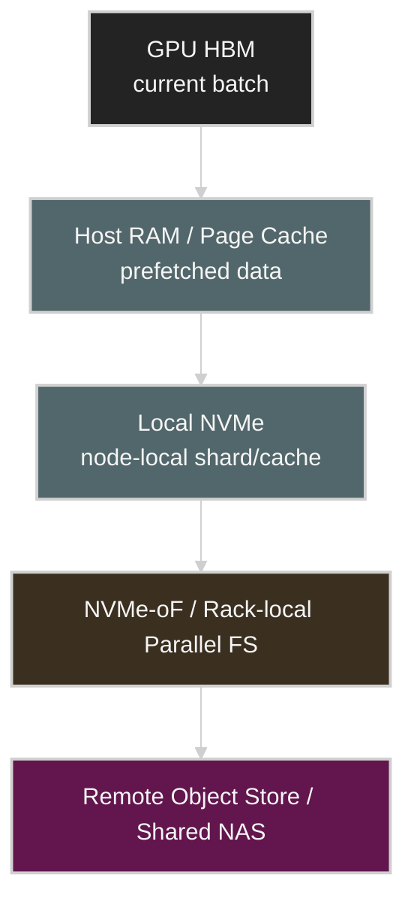

| Data Location | Strength | Risk | Good Fit |
| --- | --- | --- | --- |
| GPU HBM | 가장 빠름 | capacity 제한 | current batch, hot tensors |
| Host RAM | 빠른 cache/prefetch | memory pressure | warm shard, pinned buffers |
| Local NVMe | 높은 throughput, 낮은 jitter | replication cost | active training shard |
| Rack-local NVMe-oF | scale-out과 locality 절충 | fabric dependency | rack-scale shared data |
| Parallel filesystem | 높은 aggregate throughput | metadata/striping tuning 필요 | multinode training |
| Object storage | durability, capacity, low cost | latency와 request overhead | source of truth, staging origin |
| NFS/NAS | 운영 단순성 | scale bottleneck | 소규모 cluster, checkpoint |

### Dataset Sharding

100 TB dataset을 10개 node에 배치한다면 node당 10 TB shard를 두는 방식이 가능하다. PyTorch `DistributedSampler` 또는 framework-level sharding으로 각 rank가 distinct shard를 읽게 한다.

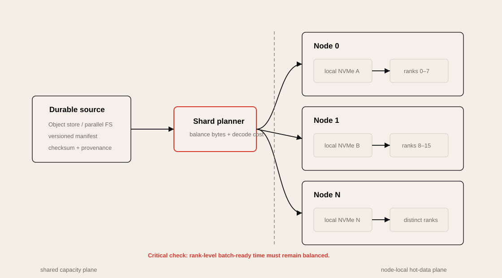

이 구조의 장점은 다음과 같다.

* 동일 데이터를 여러 node가 중복으로 읽는 현상 감소
* storage network hotspot 감소
* local NVMe throughput 활용
* worker별 read pattern이 더 predictable해짐

하지만 shard 크기와 sample complexity가 불균형하면 straggler가 발생한다.

### Measure

* node별 bytes/sec
* rank별 batch-ready time
* shard별 sample count와 average decode time
* local/remote cache hit ratio
* storage server/OST별 load distribution


## Sequential Versus Random Read Patterns

storage는 일반적으로 큰 sequential read에서 최고의 throughput을 낸다. 반대로 작은 random read는 IOPS와 metadata lookup에 제한된다.

| Read Pattern | Characteristics | Primary Metric | Typical Fix |
| --- | --- | --- | --- |
| large sequential | 대역폭 중심 | MB/s, GB/s | read-ahead, larger blocks |
| small random | IOPS/latency 중심 | IOPS, p95 latency | shard packing, parallel reads |
| many tiny files | metadata 중심 | lookup/open latency | tar/WebDataset/Parquet |
| mixed read/write | queue contention | await, queue depth | path separation, QoS |
| checkpoint burst | write amplification | fsync latency, dirty pages | async/sharded checkpoint |

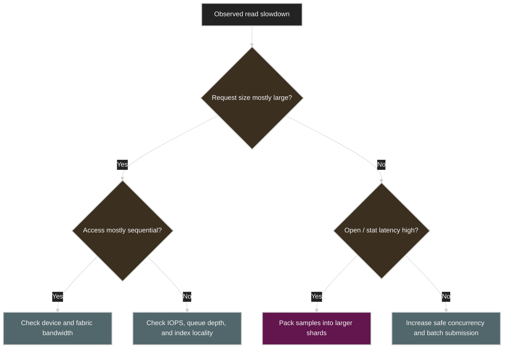

### Why Small Reads Hurt

4 KB read를 반복하면 syscall, filesystem, block layer, device submission overhead가 payload보다 커질 수 있다. 1 MB 단위 read는 같은 1 GB를 읽더라도 request 수가 훨씬 적다.

```text
1 GB / 4 KB  = 262,144 I/O requests
1 GB / 1 MB  = 1,024 I/O requests
```

### Random Read Mitigation

random access가 필수라면 다음을 검토한다.

* 여러 `pread()`를 병렬 실행
* `io_uring`으로 batch submission
* queue depth 증가
* file index를 memory-map
* sample metadata를 별도 compact index로 유지
* node-local cache로 hot shard 유지


## Dataset Layout and the Small-File Problem

수백만 개 JPEG, JSON, text file을 그대로 두면 file open, inode lookup, directory traversal이 병목이 될 수 있다.

권장 container format은 다음과 같다.

| Format | Good Fit | Performance Meaning |
| --- | --- | --- |
| WebDataset tar | image/audio/video sample 묶음 | sequential streaming에 유리 |
| TFRecord | TensorFlow ecosystem | large record stream |
| Parquet | columnar structured data | predicate/column read, compression |
| Arrow IPC | high-speed analytics/interchange | vectorized access |
| indexed `.bin/.idx` | LLM token dataset | mmap, fixed binary access |
| LMDB | key-value random access | many small records 통합 |

### Design Rules

* shard 하나가 지나치게 작으면 metadata overhead가 커진다.
* shard 하나가 지나치게 크면 shuffle granularity와 parallelism이 떨어진다.
* sample size 분산이 크면 rank별 batch-ready time 차이가 커진다.
* training 중 raw text tokenization을 반복하지 않는다.
* object storage에서는 tiny object보다 large object + range read가 유리하다.

### Trade-off

| Larger Shards | Smaller Shards |
| --- | --- |
| sequential throughput 향상 | shuffle granularity 향상 |
| open/list overhead 감소 | worker parallelism 향상 |
| partial corruption 영향 증가 | metadata/request overhead 증가 |
| random sample 접근 복잡 | sample-level 접근 단순 |


## Tuning NVMe and Filesystems

### I/O Scheduler

현대 Linux NVMe는 `blk-mq`를 사용한다. NVMe에서는 보통 `none` 또는 `mq-deadline`이 적합하다.

```bash
cat /sys/block/nvme0n1/queue/scheduler
```

예시 변경:

```bash
echo none | sudo tee /sys/block/nvme0n1/queue/scheduler
```

무조건 변경하지 말고 Before/After benchmark로 확인한다.

### Read-Ahead

```bash
blockdev --getra /dev/nvme0n1
sudo blockdev --setra 4096 /dev/nvme0n1
```

sequential streaming에는 read-ahead 증가가 유리할 수 있다. random access에서는 불필요한 read amplification을 만들 수 있다.

### Filesystem Mount Options

```text
noatime
```

read마다 access-time metadata write를 줄인다.

`XFS`와 `EXT4`는 local NVMe workload에 일반적으로 사용된다. 선택보다 중요한 것은 실제 workload에서 queue, alignment, direct I/O, metadata behavior를 측정하는 것이다.

### RAID

RAID 0은 여러 NVMe의 aggregate throughput을 높일 수 있지만 redundancy가 없다. dataset cache에는 적합할 수 있지만 source of truth나 checkpoint에는 위험하다.

| RAID | Strength | Risk | Suggested Use |
| --- | --- | --- | --- |
| RAID 0 | throughput/capacity 최대 | disk 하나 실패해도 전체 손실 | regenerable dataset cache |
| RAID 1 | read redundancy | usable capacity 50% | metadata, important checkpoint |
| RAID 10 | throughput과 redundancy | 높은 device cost | production checkpoint/storage |

### Queue Depth

NVMe benchmark는 block size와 queue depth를 명시해야 한다.

```bash
fio --name=seq-read \
  --filename=/mnt/nvme/test.bin \
  --rw=read \
  --bs=1M \
  --iodepth=32 \
  --numjobs=4 \
  --direct=1 \
  --size=100G \
  --runtime=60 \
  --time_based \
  --group_reporting
```

### Metrics

* bandwidth: MB/s, GB/s
* IOPS
* average/p95/p99 latency
* `await`
* queue depth
* device utilization
* CPU iowait
* read amplification


## NVIDIA GPUDirect Storage

GPUDirect Storage, GDS는 storage와 GPU memory 사이에 direct DMA path를 제공한다. 전통적인 storage → host memory → GPU memory 경로에서 host memory bounce buffer를 제거한다.

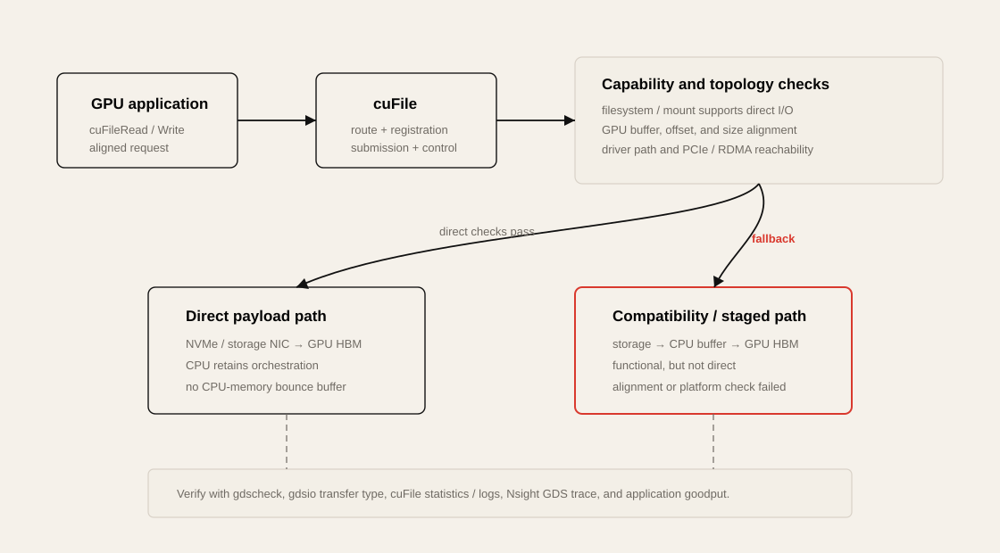

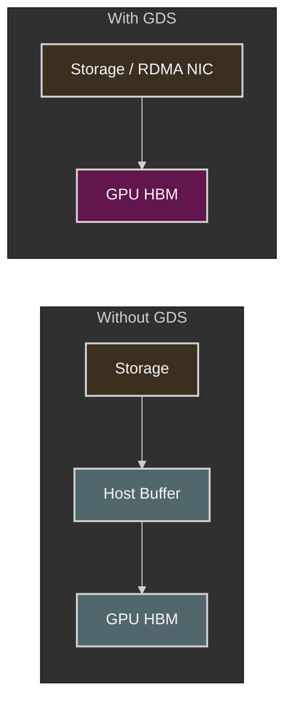

### Main Components

| Component | Role |
| --- | --- |
| `cuFile` | GDS user-space API/library |
| `nvidia-fs` | 많은 filesystem path에서 사용하는 kernel component. CUDA 12.8+의 local NVMe와 DOCA SNAP path에는 필수가 아닐 수 있음 |
| O_DIRECT/direct path | page-cache bounce를 피하는 I/O semantics |
| GPU buffer registration | storage/NIC가 GPU memory를 DMA target으로 사용 |
| compatible filesystem/storage | local NVMe, NVMe-oF, integrated parallel filesystem |

### Synchronous and Asynchronous APIs

* `cuFileRead`
* `cuFileWrite`
* `cuFileReadAsync`
* `cuFileWriteAsync`

async API와 CUDA stream을 사용하면 storage transfer와 GPU compute를 overlap할 수 있다.

### GDS Versus GPUDirect RDMA

| Technology | Data Path |
| --- | --- |
| GPUDirect RDMA | remote NIC ↔ GPU memory |
| GPUDirect Storage | storage/NVMe/filesystem ↔ GPU memory |
| NVLink/NVSwitch | GPU ↔ GPU |
| NVLink-C2C | Grace CPU memory ↔ GPU memory |

### Important Clarification

> GDS는 모든 POSIX read를 자동으로 direct GPU read로 바꾸지 않는다. compatible stack과 `cuFile` path를 실제로 사용해야 한다.


## When GDS Helps and When It Does Not

GDS의 효과는 CPU가 기존 data path에서 병목이었는지에 따라 달라진다.

| Condition | Expected GDS Effect |
| --- | --- |
| CPU memcpy가 saturated | throughput 증가 가능성 큼 |
| CPU preprocessing이 매우 무거움 | CPU cycle 확보 효과 큼 |
| storage가 이미 device limit | throughput 변화 제한적 |
| file size가 너무 작음 | metadata/open overhead가 계속 병목 |
| queue depth가 낮음 | direct path여도 device를 못 채움 |
| preprocessing 후 CPU로 다시 복귀 | extra copy로 이점 상쇄 |
| unsupported filesystem | compatibility/fallback 문제 |

### GDS Adoption Decision

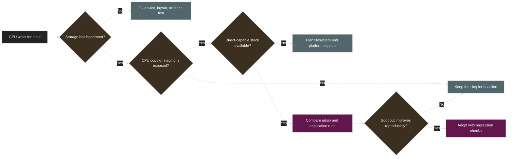

### Verify, Do Not Assume

* CUDA/GDS version별로 필요한 kernel component 확인. CUDA 12.8+ local NVMe/DOCA SNAP에서는 `nvidia-fs`가 필수가 아닐 수 있음
* `gdscheck` 또는 platform verification
* `gdsio` CPU path와 GDS path 비교
* Nsight Systems `--trace=gds`
* application-level samples/sec 비교
* CPU utilization 비교


## Measuring GDS with gdsio

`gdsio`는 storage-to-host 또는 storage-to-GPU path의 throughput과 latency를 비교하는 도구다.

### CPU-Mediated Baseline

```bash
/usr/local/cuda/gds/tools/gdsio \
  -f /mnt/data/large_file \
  -d 0 \
  -w 4 \
  -s 10G \
  -i 1M \
  -I 0 \
  -x 2
```

### GDS Path

```bash
/usr/local/cuda/gds/tools/gdsio \
  -f /mnt/data/large_file \
  -d 0 \
  -w 4 \
  -s 10G \
  -i 1M \
  -I 0 \
  -x 0
```

책의 예시는 다음과 같은 illustrative result를 사용한다.

| Path | Throughput | Average Latency |
| --- | ---: | ---: |
| Storage → CPU → GPU | 8.0 GB/s | 1.25 ms |
| Storage → GPU with GDS | 9.6 GB/s | 1.00 ms |

이 수치를 그대로 기대하면 안 된다. block size, concurrency, filesystem, NVMe/NIC, GPU topology에 따라 결과가 달라진다.

### Benchmark Discipline

* 같은 file, size, block size, queue depth 사용
* cold-cache와 warm-cache 구분
* CPU utilization 함께 기록
* device/NIC theoretical peak와 비교
* 최소 여러 번 반복하고 p50/p95 기록
* background workload 통제
* GDS가 unsupported이면 host fallback 수치를 GDS라고 부르지 않음


## Checkpointing GPU State with cuda-checkpoint

`cuda-checkpoint`는 CUDA process state를 suspend/restore하는 low-level mechanism이다. framework-level model checkpoint와 목적이 다르다.

| Mechanism | Captured State | Main Use |
| --- | --- | --- |
| PyTorch state dict/sharded checkpoint | model, optimizer, scheduler state | training recovery |
| cuda-checkpoint + CRIU | process와 CUDA execution state | preemption, migration, suspend/resume |

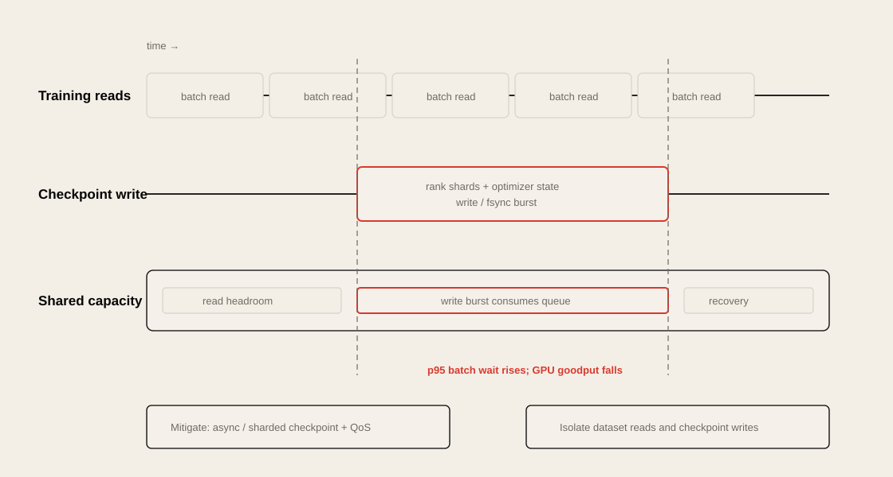

### Conceptual Flow

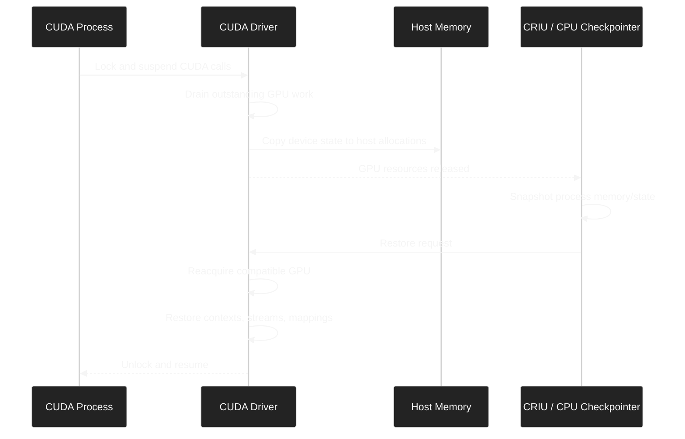

### Performance Lens

suspend time은 대략 다음에 제한된다.

```text
Checkpoint Suspend Time
≈ Device Memory Image Size / Effective GPU-to-Host Bandwidth
+ Driver and Process Coordination Overhead
```

### Risks

* GPU memory image가 크면 suspend 시간이 길다.
* host memory capacity가 부족할 수 있다.
* checkpoint write와 training read가 storage에서 경쟁할 수 있다.
* restore target은 compatible GPU type과 환경이 필요하다.
* framework-level semantic checkpoint를 완전히 대체하지 않는다.


## DeepSeek Fire-Flyer File System

DeepSeek의 Fire-Flyer File System, 3FS는 AI workload의 대규모 random read와 RDMA 중심 data path를 목표로 설계된 distributed filesystem이다.


### Design Direction

* FUSE client와 performance-critical native client 분리
* native client의 asynchronous zero-copy I/O와 batched request 처리
* stateless metadata service와 transactional key-value store
* RDMA-capable fabric
* CRAQ 기반 replicated chunk storage
* AI workload의 random read와 high concurrency 최적화

### Important Distinction

FUSE client가 존재한다고 해서 FUSE path 자체가 GDS direct path를 제공하는 것은 아니다. 3FS의 native client는 FUSE의 memory-copy와 shared-queue 병목을 피하기 위한 별도 asynchronous zero-copy path이며, 이것을 NVIDIA GDS와 동일한 경로로 간주하면 안 된다.

### Performance Engineering Meaning

3FS의 의미는 특정 benchmark 숫자보다 다음에 있다.

> AI storage는 일반-purpose filesystem default에 맞추는 것이 아니라, 실제 training/inference access pattern에 맞게 codesign될 수 있다.

### Trade-off

| Benefit | Cost/Risk |
| --- | --- |
| high aggregate read throughput | 복잡한 운영과 유지보수 |
| RDMA-first data path | fabric dependency |
| random-read optimization | general-purpose workload와 trade-off |
| distributed metadata | failure/recovery complexity |
| native client integration | FUSE보다 높은 성능을 얻는 대신 application integration 필요 |


## Distributed and Parallel Storage Backends

| Backend | Scale | Strength | Bottleneck Risk | Typical Use |
| --- | --- | --- | --- | --- |
| Local NVMe | single node | low latency, high consistency | capacity, replication | active shard/cache |
| NVMe-oF | rack/cluster | remote NVMe semantics | fabric latency/congestion | rack-local pool |
| NFS | small cluster | simple operations | single-server bottleneck | modest dataset/checkpoint |
| Lustre | large cluster | high aggregate bandwidth | striping/metadata tuning | large training dataset |
| IBM Storage Scale/GPFS | large cluster | enterprise parallel FS | complexity/cost | production AI/HPC |
| BeeGFS | large cluster | scalable parallel FS | client/network tuning | AI/HPC data |
| Weka/VAST | enterprise AI | high-performance scale-out | vendor/cost dependency | production GPU cluster |
| Ceph | general distributed storage | flexibility, durability | small-file/latency tuning | mixed workload |
| Object Store | virtually unlimited | durability, low cost | request latency | source-of-truth/staging |

### Selection Questions

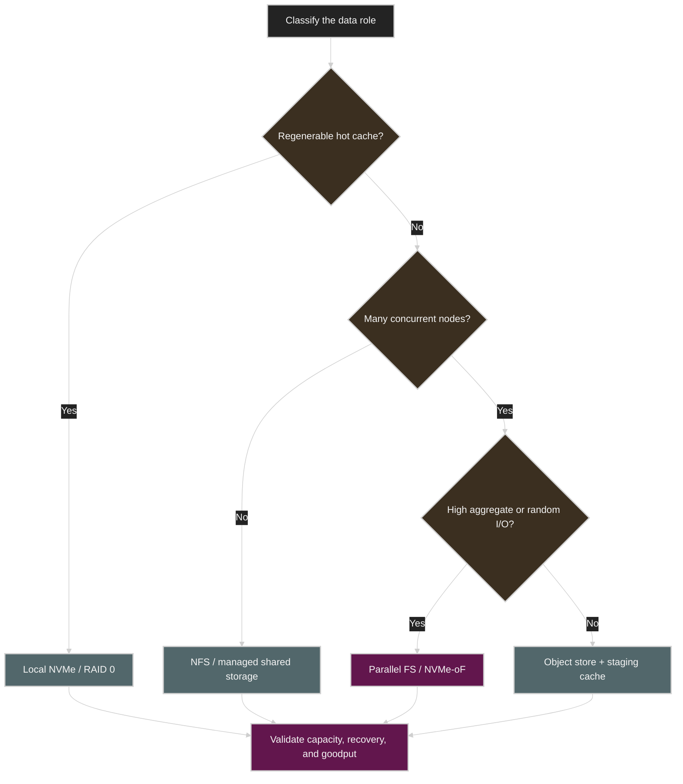


## NFS and Object Storage Tuning

### NFS

NFS는 몇 개 node 수준에서는 실용적이지만 대규모 GPU cluster에서 single-server bottleneck이 되기 쉽다.

예시 mount option:

```bash
mount -t nfs \
  -o rsize=1048576,wsize=1048576,noatime,async,actimeo=60,lookupcache=pos \
  nfs-server:/dataset /mnt/dataset
```

주의할 점:

* `async` durability trade-off 이해
* server-side NVMe 및 NIC capacity 확인
* client 수 증가 시 aggregate bandwidth 측정
* attribute cache가 freshness requirement와 충돌하는지 확인
* read와 checkpoint write traffic 분리 검토

### Object Storage

object storage는 training loop에서 naive small-object read를 반복하면 느리다.

권장 방식:

* training 시작 전에 local NVMe로 stage
* FSx for Lustre 같은 cache layer 사용
* large object + range GET
* `s5cmd` 또는 parallel SDK 사용
* node별 shard를 병렬 download
* dataset manifest와 checksum 유지

### Cache Economics

cloud cache는 성능과 비용을 함께 봐야 한다.

| Question | Metric |
| --- | --- |
| cache가 실제 read를 줄였는가? | hit ratio, object GET 감소 |
| training time이 줄었는가? | step time, job completion time |
| cache warm-up은 얼마나 걸리는가? | stage duration |
| cache 비용이 GPU idle 비용보다 낮은가? | cost per completed training run |


## Striping, Replication, and Compression

### Striping

Lustre 같은 parallel filesystem은 file을 여러 OST에 stripe해 aggregate bandwidth를 높인다.

```bash
lfs setstripe -c 8 /mnt/lustre/dataset/shard-0001.bin
```

| Too Few Stripes | Too Many Stripes |
| --- | --- |
| bandwidth 제한 | metadata/coordination overhead 증가 |
| 특정 OST hotspot | small file에 과도한 분산 |

### Replication

dataset을 모든 node의 local NVMe에 복제하면 network read를 거의 제거할 수 있다.

장점:

* 가장 predictable한 read path
* shared storage hotspot 감소
* network failure 영향 감소

비용:

* storage capacity N배
* staging time
* version consistency
* invalidation/refresh complexity

### Compression

compressed data는 storage와 network bytes를 줄이는 대신 decompression compute를 사용한다.

| Compression Strategy | Benefit | Risk |
| --- | --- | --- |
| JPEG/video codec | media size 절감 | decode CPU/GPU cost |
| Parquet compression | structured data size 절감 | column decode cost |
| LZ4/Snappy | 빠른 decompression | compression ratio 낮음 |
| Deflate | 높은 compression | CPU cost 증가 |
| GPU decode/nvJPEG | CPU offload | GPU cycle과 H2D placement 고려 |

### Decision Rule

> storage와 network가 병목이고 CPU/GPU decode headroom이 있다면 compression이 유리하다. decompression이 새 critical path가 되면 이득이 사라진다.


## Monitoring Storage I/O

### Host and Device Tools

| Tool | What to Observe |
| --- | --- |
| `iostat -x` | throughput, await, queue, utilization |
| `iotop` | process별 I/O |
| `nvme-cli` | NVMe health, SMART, error, latency |
| `fio` | controlled throughput/IOPS baseline |
| `perf` | CPU syscall, memcpy, page fault cost |
| eBPF/BCC | block latency, file open, filesystem wait |
| vendor dashboard | OST/node/cache hotspot |

### GPU-Aware Tools

| Tool | What to Observe |
| --- | --- |
| Nsight Systems | GPU idle gap, copy lane, GDS trace |
| `nsys --trace=gds` | cuFile API timeline |
| DCGM | GPU utilization과 I/O 관련 telemetry |
| PyTorch Profiler | DataLoader, CPU op, H2D copy, CUDA op |
| CUDA events | `.to("cuda")` transfer timing |

### Useful Commands

```bash
iostat -xz 1
```

```bash
sudo iotop -oPa
```

```bash
nvme smart-log /dev/nvme0
```

```bash
nsys profile --trace=cuda,nvtx,gds,osrt \
  -o storage-profile \
  python train.py
```

### DataLoader Wait Measurement

전체 batch delivery time:

```python
start = time.perf_counter()
batch = next(data_iterator)
wait_time = time.perf_counter() - start
```

이 시간에는 background prefetch 결과 대기와 Python path가 포함될 수 있다.

pure Python/transform cost를 isolate하려면 `num_workers=0`으로 비교한다. H2D cost는 `.to("cuda")` 구간을 CUDA event 또는 Nsight copy lane으로 측정한다.

### Metric Matrix

| Metric | Interpretation |
| --- | --- |
| GPU idle before iteration | input starvation 가능성 |
| CPU iowait high | storage wait |
| CPU user high | decode/tokenization/transform 병목 |
| disk utilization 100% | device saturation |
| disk utilization low + latency high | metadata/small-file/serialization 가능성 |
| H2D copy long | pageable memory, interconnect, sync 문제 |
| page-cache hit high | warm cache benefit |
| cache miss/thrashing | working set이 RAM보다 큼 |


## Tuning the Data Pipeline

training input pipeline은 일반적으로 다음 단계를 가진다.

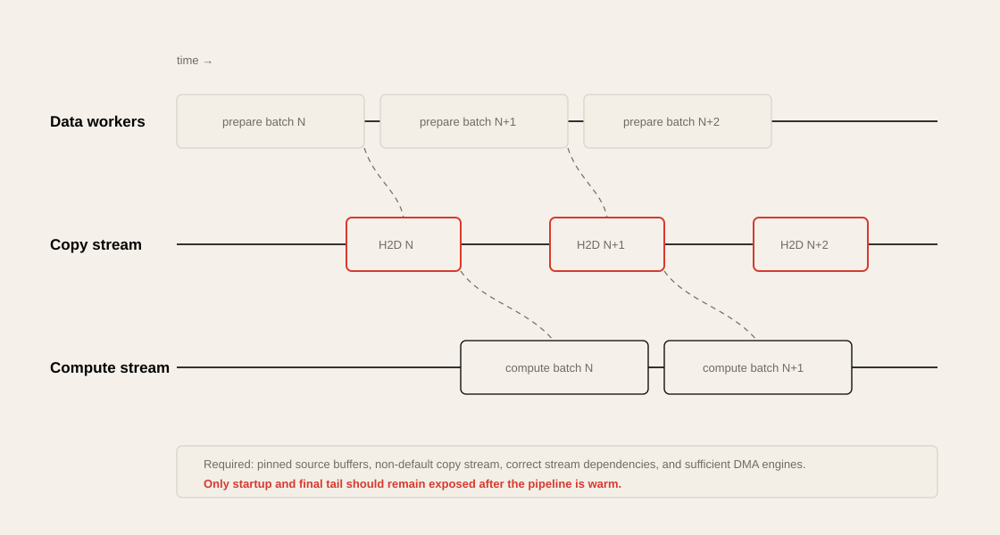


### PyTorch DataLoader Knobs

| Parameter | Role | Risk |
| --- | --- | --- |
| `num_workers` | parallel read/transform process 수 | CPU/I/O contention |
| `pin_memory=True` | page-locked host buffer | memlock capacity |
| `persistent_workers=True` | epoch 간 worker 유지 | long-lived resource |
| `prefetch_factor` | worker당 ahead-of-time batch 수 | host memory pressure |
| `batch_size` | compute efficiency와 read size | HBM/latency/convergence |
| `collate_fn` | sample을 vectorized batch로 조합 | Python bottleneck 가능 |
| `non_blocking=True` | async H2D copy 가능 | pinned source 필요 |

### Example

```python
loader = DataLoader(
    dataset,
    batch_size=32,
    num_workers=8,
    pin_memory=True,
    persistent_workers=True,
    prefetch_factor=4,
)

copy_stream = torch.cuda.Stream()
compute_stream = torch.cuda.current_stream()

for batch in loader:
    with torch.cuda.stream(copy_stream):
        batch_gpu = batch.to("cuda", non_blocking=True)

    compute_stream.wait_stream(copy_stream)
    output = model(batch_gpu)
```

실제 correctness를 위해 tensor lifetime과 stream dependency를 명확히 관리해야 한다.

### Avoid Python Bottlenecks

* per-sample Python loop 제거
* vectorized transform 사용
* Rust/C++ 기반 tokenizer 사용
* logging을 hot path에서 제거
* JSON parsing을 offline preprocessing으로 이동
* fixed-size binary/indexed dataset 사용
* batch-level `collate_fn` 사용

### Isolated DataLoader Benchmark

GPU compute를 제거하고 100 batch delivery time을 측정한다.

```python
start = time.perf_counter()
for i, batch in enumerate(loader):
    if i == 100:
        break
elapsed = time.perf_counter() - start
print(f"batches/sec={100 / elapsed:.2f}")
```

그 다음 real training의 GPU idle time과 비교한다.


## Scaling Data Workers with GPUs

GPU 수를 늘리면 total batch consumption rate도 증가한다. input pipeline이 같은 수준에 머물면 storage bottleneck이 더 크게 드러난다.

```text
1 GPU: 1,000 samples/s
8 GPUs: target 8,000 samples/s
72 GPUs: target 72,000 samples/s
```

worker 수만 단순히 GPU 수에 비례해 늘리면 안 된다. CPU core, NUMA, storage queue, network bandwidth도 함께 scale해야 한다.

| Scale Dimension | Must Scale Together |
| --- | --- |
| GPU count | DataLoader workers/ranks |
| total batch size | storage bytes/sec |
| node count | dataset shard count |
| worker count | CPU core/memory capacity |
| remote reads | NIC and storage server bandwidth |
| checkpoint size | write bandwidth and recovery policy |

### Scaling Efficiency

```text
Scaling Efficiency
= Achieved Throughput on N GPUs
/ (N × Single-GPU Throughput)
```

single GPU가 1,000 samples/s이고 8 GPU가 5,000 samples/s라면 다음과 같다.

```text
5,000 / (8 × 1,000) = 62.5%
```

이때 GPU/communication만 의심하지 말고 input delivery를 함께 측정한다.

### Worker Tuning Experiment

```text
num_workers: 0 → 2 → 4 → 8 → 16
```

각 단계에서 기록한다.

* samples/sec
* batch wait time p50/p95
* CPU utilization
* CPU iowait
* storage throughput
* context switch
* host memory usage
* GPU idle percentage

최고 worker 수는 workload와 node topology마다 다르다.


## NVIDIA DALI

NVIDIA Data Loading Library, DALI는 image/video decode와 augmentation 같은 preprocessing을 optimized C++ 또는 GPU에서 실행한다.

### Good Fit

* JPEG/image decode
* video decode
* resize, crop, normalize
* classification/object detection/segmentation
* CPU preprocessing이 GPU를 굶기는 workload

### Architecture


### Benefit

* CPU core 사용량 감소
* decode/augmentation parallelization
* preprocessing와 model compute overlap
* media accelerator 활용

### Pitfall

GPU에서 JPEG를 decode한 뒤 다시 CPU로 가져와 augmentation하면 H2D → D2H → H2D copy가 생겨 이점이 사라질 수 있다.

### Compare Three Paths

| Path | Expected Behavior |
| --- | --- |
| CPU-only | 단순하지만 CPU bottleneck 가능 |
| DALI-enabled | decode/augmentation offload |
| fully fused GPU preprocessing graph | copy 최소화, 높은 복잡도 |

end-to-end throughput과 CPU/GPU utilization을 기준으로 선택한다.


## NVIDIA NeMo Curator

NeMo Curator는 대규모 text/multimodal dataset을 training 전에 정제하고 구조화하는 offline data preparation framework다.

### Main Work

* cleansing
* deduplication
* filtering
* tokenization preparation
* shuffling
* packing
* synthetic data generation
* distributed preprocessing

### Online Versus Offline Pipeline

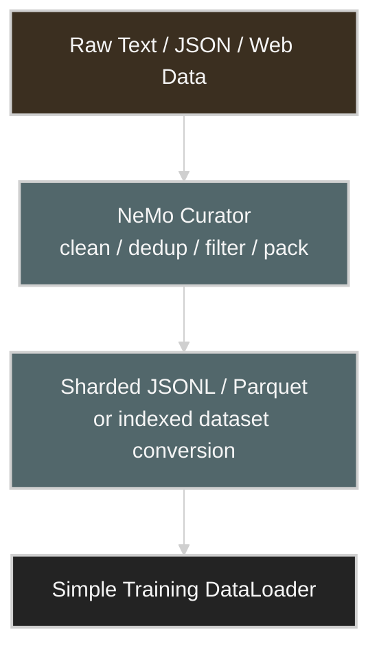

### Performance Meaning

* training hot path에서 string processing 제거
* raw text tokenization 반복 방지
* large packed files로 sequential access 증가
* fixed/padded length로 batch variance 감소
* duplicate data 제거로 wasted compute 감소

### Data Formats

NeMo Curator는 sharded JSONL/Parquet 같은 format을 다루고, downstream training pipeline에서는 memory-mappable `.bin/.idx` indexed dataset으로 변환할 수 있다.

### Pre-Shuffled Copies

N epoch에 대해 서로 다르게 shuffle된 N개 dataset copy를 미리 저장하는 방법도 있다.

| Benefit | Trade-off |
| --- | --- |
| runtime shuffle cost 감소 | disk capacity 증가 |
| predictable sequential read | dataset lifecycle 복잡 |
| CPU overhead 감소 | refresh 시 모든 copy 재생성 |

### Important Clarification

NeMo data loading 자체가 자동으로 GDS path가 되는 것은 아니다. CPU I/O bypass가 필요하면 GDS-compatible storage path를 별도로 통합해야 한다.


## Continuous Profiling and Tuning Workflow

performance tuning은 일회성 작업이 아니라 반복되는 feedback loop다.


### 1. Establish a Baseline

* single GPU samples/sec
* single-node multi-GPU scaling
* multinode scaling
* storage-only `fio`/`gdsio`
* DataLoader-only batches/sec
* checkpoint write/read time

### 2. Profile the Full Timeline

Nsight Systems에서 다음을 본다.

* iteration 사이 GPU idle gap
* H2D copy lane
* NCCL kernels
* CPU DataLoader worker activity
* GDS/cuFile activity
* synchronization/barrier

### 3. Zoom into a Specific Kernel

Nsight Compute로 다음을 본다.

* SM busy
* memory throughput
* warp stalls
* achieved occupancy
* Tensor Core path

storage chapter지만 GPU kernel efficiency가 낮으면 storage 개선 효과가 숨겨질 수 있다.

### 4. Identify the Cause

| Symptom | Hypothesis |
| --- | --- |
| GPU idle before forward | input/DataLoader/H2D |
| GPU idle during all-reduce | network/collective |
| GPU busy but low FLOPS | memory-bound kernel |
| CPU 100%, disk low | preprocessing |
| disk 100%, CPU moderate | storage device |
| one rank consistently slow | shard imbalance/straggler |

### 5. Apply One Change

예시:

* `num_workers` 조정
* shard packing
* local cache
* GDS path
* DALI decode
* offline tokenization
* NCCL/RDMA path 수정
* unnecessary synchronization 제거

여러 변경을 동시에 넣으면 어떤 변경이 효과를 냈는지 알기 어렵다.

### 6. Automate Regression Detection

* nightly benchmark
* samples/sec trend
* p95 batch wait
* GPU idle percentage
* storage throughput
* checkpoint duration
* scaling efficiency

### 7. Document the Last-Known-Good Configuration

기록할 항목:

* kernel/driver/CUDA/PyTorch/NCCL version
* filesystem and mount options
* storage hardware/firmware
* dataset layout/shard count
* DataLoader parameters
* NUMA/CPU affinity
* GDS configuration
* benchmark command and result


## Diagnosing I/O, Communication, and Compute Bottlenecks

### A. I/O Versus CPU Preprocessing

```text
Experiment 1: num_workers=0
Experiment 2: num_workers=N
Experiment 3: preprocessed synthetic/in-memory data
```

| Result | Likely Bottleneck |
| --- | --- |
| in-memory data에서 매우 빨라짐 | storage/preprocessing path |
| workers를 늘릴수록 개선 후 plateau | worker/I/O saturation |
| workers 증가 시 악화 | CPU contention/context switch |
| disk는 낮고 CPU만 높음 | decode/tokenization/transform |

### B. DataLoader Versus H2D Copy

* batch iterator pull time 측정
* `.to("cuda")` 별도 측정
* Nsight copy lane 확인

| Long Stage | Fix Direction |
| --- | --- |
| iterator pull | worker, shard, storage, transform |
| H2D copy | pinned memory, NUMA, PCIe/NVLink-C2C, async copy |
| both | end-to-end pipeline redesign |

### C. Communication Versus Compute

gradient all-reduce data size는 model parameter 수에 주로 의존하고 batch size에는 크게 변하지 않는다. 이를 이용해 batch size를 바꾸며 compute/communication 비율을 조정한다.

예시 baseline:

```text
100 GB/s NIC에서 observed all-reduce = 60 GB/s
```

batch size를 절반으로 줄인다.

* NIC가 계속 60 GB/s면 network가 ceiling일 가능성이 높다.
* NIC가 40 GB/s로 내려가면 GPU compute가 NIC를 충분히 feed하지 못한 것이다.

batch size를 늘린다.

* communication-bound이면 NIC GB/s가 ceiling에 머문다.
* compute-bound이면 iteration에서 communication 비율이 줄어든다.

### D. I/O Versus Communication

GPU idle gap의 위치를 본다.

```text
Iteration start 이전 gap
→ storage/DataLoader/H2D 가능성

Backward 중 NCCL 구간 gap
→ communication 가능성

Kernel 내부 long duration
→ compute/HBM 가능성
```

### Bottleneck Classification

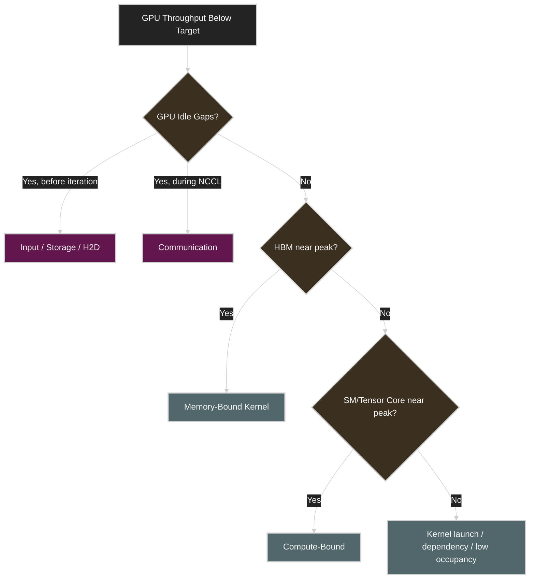


## Storage Bottleneck Lens

| Bottleneck | Symptom | Metric | Tool | Fix Direction |
| --- | --- | --- | --- | --- |
| Device bandwidth | disk util 100%, read ceiling | GB/s, util | `iostat`, `fio` | RAID/parallel FS/more devices |
| Small-file metadata | low GB/s, high open latency | open/stat rate, p95 | eBPF, `strace` | shard packing |
| Random I/O | high await, low sequential BW | IOPS, queue | `fio`, `iostat` | parallel reads, indexing |
| Page-cache thrash | repeated reread, memory pressure | cache hit, reclaim | `vmstat`, perf | direct I/O/local cache |
| CPU preprocessing | CPU 100%, disk underused | CPU user, transform time | perf, PyTorch Profiler | vectorize/offline/DALI |
| Host staging | memcpy CPU high | CPU cycles, H2D time | Nsight Systems | pinned memory/GDS |
| H2D copy | long copy lane | PCIe BW, copy time | Nsight Systems | async copy, NUMA locality |
| Shared FS hotspot | 특정 OST/node overloaded | server BW/latency | vendor telemetry | re-stripe/re-shard |
| Object request overhead | many GETs, low throughput | request count, latency | cloud metrics | larger objects/range GET/cache |
| DataLoader under-parallelism | GPU waits for batch | batch wait | PyTorch Profiler | workers/prefetch |
| DataLoader over-parallelism | context switch, memory growth | CPU/context switch | perf, `pidstat` | worker 감소 |
| Checkpoint burst | iteration stalls, cluster-wide slowdown | write BW, dirty pages | iostat, app timers | async/sharded/path isolation |
| GDS misconfiguration | expected direct path absent | cuFile trace | `gdsio`, `nsys` | driver/filesystem/path verification |
| Shard imbalance | one rank lags | rank batch time | distributed logs | rebalance shards |


## Operational Validation Checklist

### 1. Storage Inventory

```bash
lsblk -o NAME,MODEL,SIZE,ROTA,TYPE,FSTYPE,MOUNTPOINTS
nvme list
```

확인할 것:

* NVMe model/firmware
* PCIe link width/speed
* filesystem
* RAID 구성
* mount path
* NUMA locality

### 2. Device Baseline

```bash
fio --name=seq-read \
  --filename=/mnt/nvme/test.bin \
  --rw=read --bs=1M --iodepth=32 --numjobs=4 \
  --direct=1 --size=100G --runtime=60 --time_based \
  --group_reporting
```

확인할 것:

* sequential read/write
* random read/write
* block size sensitivity
* queue depth sensitivity
* p95/p99 latency

### 3. Filesystem and Scheduler

```bash
cat /sys/block/nvme0n1/queue/scheduler
blockdev --getra /dev/nvme0n1
mount | grep /mnt/data
```

확인할 것:

* `none`/`mq-deadline`
* read-ahead
* `noatime`
* direct I/O support
* container bind mount가 overlay layer를 우회하는지

### 4. NFS/Parallel Filesystem

```bash
nfsstat -m
```

Lustre:

```bash
lfs getstripe /mnt/lustre/dataset/shard-0001.bin
```

확인할 것:

* rsize/wsize
* stripe count
* metadata server load
* OST distribution
* NIC saturation

### 5. GDS Capability

```bash
lsmod | grep nvidia_fs
```

```bash
/usr/local/cuda/gds/tools/gdscheck -p
```

```bash
/usr/local/cuda/gds/tools/gdsio \
  -f /mnt/data/large_file -d 0 -w 4 -s 10G -i 1M -I 0 -x 0
```

확인할 것:

* 설치한 CUDA/GDS version과 storage path에서 필요한 kernel component가 준비되었는지 확인
* CUDA 12.8+ local NVMe/DOCA SNAP path에서는 `nvidia-fs`가 없어도 direct path가 가능한지 version 문서로 확인
* filesystem supported
* direct path active
* CPU path 대비 throughput/latency
* unsupported host에서 explicit failure/skip 여부

### 6. DataLoader Baseline

```text
num_workers = 0, 2, 4, 8, 16
prefetch_factor = 2, 4, 8
pin_memory = false/true
persistent_workers = false/true
```

기록할 것:

* batches/sec
* p50/p95 batch wait
* CPU user/iowait
* host memory
* GPU idle percentage

### 7. End-to-End Timeline

```bash
nsys profile --trace=cuda,nvtx,gds,osrt \
  -o ch05-end-to-end \
  python train.py
```

확인할 것:

* read/decode/copy/compute overlap
* iteration boundary idle gap
* synchronous `.item()`/`synchronize()`
* NCCL wait와 input wait 구분

### 8. Checkpoint

측정할 것:

* checkpoint size
* write duration
* fsync/commit duration
* training pause
* shared storage impact
* restore duration
* checkpoint interval이 expected failure loss와 맞는지

### 9. Cluster Scaling

| Configuration | Record |
| --- | --- |
| 1 GPU | samples/sec, batch wait |
| 8 GPU single node | scaling efficiency |
| 2 nodes | storage/NIC/NCCL change |
| rack scale | aggregate storage throughput |

### 10. Production Alerts

* GPU idle percentage 상승
* p95 batch wait 증가
* checkpoint duration regression
* storage latency spike
* OST/storage node hotspot
* GDS direct path fallback
* object store request error/retry 증가
* NVMe media error/wear warning


## Hands-on Labs

공식 예제 repository의 Chapter 5 경로는 다음과 같다.

```text
code/ch05/
```

### Lab 1. Python Preprocessing Vectorization

**목적**

Python loop 중심 preprocessing과 vectorized path의 차이를 측정한다.

**관련 코드**

```text
code/ch05/baseline_vectorization.py
code/ch05/optimized_vectorization.py
```

**Before**

```bash
python -m cli.aisp bench run \
  --targets ch05:vectorization \
  --profile deep_dive \
  --single-gpu
```

**Change**

* per-element Python loop 제거
* vectorized parsing
* mmap/indexed access 활용

**After**

* CPU preprocessing time
* batches/sec
* GPU idle gap

**Interpretation**

raw storage보다 preprocessing이 더 큰 병목일 수 있다. 공식 Chapter 5 README의 validated example에서는 vectorization이 가장 큰 개선 폭을 보였다.


### Lab 2. DataLoader and Storage CPU Path

**목적**

worker count, pinned memory, caching strategy가 GPU starvation에 미치는 영향을 확인한다.

**관련 코드**

```text
code/ch05/baseline_storage_cpu.py
code/ch05/optimized_storage_cpu.py
```

**Before**

```bash
python baseline_storage_cpu.py --inspect
```

**Change**

* worker 조정
* pinned memory
* persistent worker
* caching/prefetch

**After**

```bash
python optimized_storage_cpu.py --inspect
```

**Interpretation**

CPU wait와 GPU compute의 비율이 어떻게 바뀌는지 본다. 목표는 단순한 disk GB/s가 아니라 GPU idle 감소다.


### Lab 3. GDS Capability Probe

**목적**

host가 실제 cuFile/GDS를 지원하는지 검증한다.

**관련 코드**

```text
code/ch05/gds_cufile_minimal.py
code/ch05/gpudirect_storage_example.py
```

**Before**

CPU-mediated path 또는 unsupported 상태 확인.

**Change**

```bash
python -m ch05.gds_cufile_minimal \
  /tmp/gds_test_file.bin \
  1073741824 \
  --generate
```

**After**

* usable cuFile/GDS path 확인
* unsupported host는 `SKIPPED:`로 명확히 종료

**Interpretation**

host-staged fallback throughput을 GDS 결과로 잘못 발표하지 않는다.


### Lab 4. LLM-Style Streaming and Overlap

**목적**

streaming read, prefetch, compute overlap을 timeline으로 확인한다.

**관련 코드**

```text
code/ch05/baseline_ai.py
code/ch05/optimized_ai.py
code/ch05/storage_io_optimization.py
```

**Before**

read → copy → compute가 직렬화된 timeline.

**Change**

* prefetch
* async copy
* streaming pipeline

**After**

Nsight Systems에서 copy와 compute overlap을 확인한다.

**Interpretation**

이 예제는 overlap/control trace로 유용하지만 모든 환경에서 canonical speedup을 보장하는 benchmark로 사용하지 않는다.


### Lab 5. End-to-End Chapter Comparison

```bash
python -m ch05.compare
```

```bash
python -m cli.aisp bench list-targets --chapter ch05
```

```bash
python -m cli.aisp bench run --targets ch05 --profile minimal
```

**Before → Change → After → Interpretation** 결과를 동일한 artifact format으로 저장한다.


## Practical Tips and Notes

### The Small-File Problem Is Often a Metadata Problem

수백만 개 file을 read할 때 disk bandwidth가 낮다고 해서 device가 느린 것은 아니다. file open/stat/close와 directory lookup이 critical path일 수 있다.

> [!TIP]
> `fio` large-file sequential benchmark는 빠른데 training만 느리다면 dataset layout과 preprocessing을 먼저 의심한다.

### Cache Is Not Always Good

page cache는 dataset working set이 RAM에 들어갈 때 강력하다. 그러나 petabyte dataset이나 random access에서 cache가 계속 evict되면 memory bandwidth와 reclaim overhead만 추가할 수 있다.

> [!WARNING]
> cold-cache와 warm-cache 결과를 섞어서 비교하지 않는다. benchmark마다 cache state를 명시한다.

### GDS Is Not a Checkbox

GDS를 설치했다고 application이 자동으로 `cuFile` path를 사용하는 것은 아니다. filesystem, file descriptor mode, alignment, GPU buffer registration, library integration이 모두 필요하다.

### Pinned Memory Has a Cost

`pin_memory=True`는 H2D transfer를 개선하지만 너무 많은 pinned buffer는 host memory pressure를 만든다.

확인할 것:

* `ulimit -l`
* container `memlock`
* prefetched batch count
* worker별 pinned buffer
* NUMA locality

### More Workers Can Make It Worse

worker를 과도하게 늘리면 다음이 발생한다.

* CPU oversubscription
* context switch 증가
* page-cache contention
* storage queue saturation
* host memory 증가
* random read 증폭

worker tuning은 항상 sweep benchmark로 결정한다.

### Checkpoint Is a Cluster-Wide Workload

checkpoint는 한 job의 내부 동작이 아니라 shared filesystem과 network에 write burst를 만든다.

> [!WARNING]
> 여러 job이 같은 시각에 checkpoint하면 storage tail latency가 크게 흔들릴 수 있다. scheduler-level staggering을 고려한다.

### Separate Read and Checkpoint Paths

가능하다면 active dataset read path와 checkpoint write path를 서로 다른 volume, OST pool, QoS class로 분리한다.

### Dataset Replication Can Be Rational

dataset이 regenerable하고 GPU idle cost가 storage cost보다 크다면 node-local replication은 단순하지만 강력한 방법이다.

### Kubernetes Notes

* dataset과 checkpoint는 container overlay writable layer에 두지 않는다.
* hostPath, local persistent volume, CSI-backed high-performance storage를 사용한다.
* pod CPU request/limit과 DataLoader worker 수를 맞춘다.
* GPU와 local NVMe/NIC NUMA locality를 확인한다.
* I/O isolation은 Kubernetes resource request만으로 충분하지 않을 수 있다.

### On-Prem GPU Cluster Lens

10/25GbE 기반 NAS는 몇 개 GPU에는 충분할 수 있지만, 8 GPU node나 여러 node가 동시에 high-rate dataset을 읽으면 빠르게 ceiling에 도달한다.

예를 들어 10GbE line rate는 약 1.25 GB/s이며 protocol overhead를 제외한 실제 throughput은 더 낮다. 8 GPU가 GPU당 200 MB/s를 요구하면 1.6 GB/s이므로 single 10GbE link로는 부족하다.

### Storage Vendor Benchmark Lens

vendor의 peak throughput은 다음 조건을 함께 확인한다.

* node/NIC 수
* read size
* queue depth
* sequential/random ratio
* compression/deduplication
* client count
* GDS 여부
* cold/warm cache
* redundancy mode

### Quick Field Heuristics

| Situation | First Question | Fast Check |
| --- | --- | --- |
| GPU가 iteration마다 쉬는 구간이 있음 | batch가 늦게 도착하는가? | Nsight timeline |
| `fio`는 빠른데 training은 느림 | small file/Python transform인가? | DataLoader-only benchmark |
| CPU가 800%인데 GPU가 idle | decode/tokenize 병목인가? | perf/PyTorch Profiler |
| worker를 늘려도 개선 없음 | storage queue가 이미 찼는가? | iostat queue/util |
| first epoch만 느림 | page cache warm-up인가? | cold/warm 비교 |
| checkpoint 때 전체가 느림 | shared path write burst인가? | storage telemetry |
| GDS 성능 차이가 없음 | CPU staging이 병목이었는가? | CPU util + gdsio |
| GPU 수 증가 후 scaling 정체 | input bytes/sec도 증가했는가? | aggregate storage BW |
| 특정 rank만 느림 | shard imbalance인가? | rank-level batch time |


## Chapter Summary

Chapter 5의 핵심은 다음이다.

> GPU-based AI system의 storage 최적화 목표는 disk benchmark 점수를 높이는 것이 아니라, dataset이 GPU iteration deadline보다 먼저 도착하도록 전체 input pipeline을 설계하는 것이다.

local NVMe와 data locality는 network hop과 jitter를 줄인다. large sequential shard는 small random file보다 storage throughput을 활용하기 쉽다. parallel filesystem과 object-store cache는 multinode scale에서 aggregate bandwidth를 제공하지만 striping, request size, metadata, staging을 잘못 설계하면 bottleneck이 된다.

GDS는 storage에서 GPU memory로 이동할 때 host bounce buffer를 제거한다. 하지만 GDS는 compatible filesystem과 `cuFile` integration을 요구하며, CPU staging이 원래 병목이 아니면 throughput 개선이 제한적일 수 있다. 따라서 `gdsio`, Nsight Systems, CPU utilization, application samples/sec를 함께 비교해야 한다.

PyTorch DataLoader의 `num_workers`, `pin_memory`, `persistent_workers`, `prefetch_factor`, `non_blocking`은 GPU feeding을 위한 중요한 knob다. 하지만 worker를 무조건 늘리는 것이 아니라 CPU core, NUMA, storage queue, host memory와 함께 조정해야 한다. GPU 수가 증가하면 worker, shard, NIC, storage server bandwidth도 함께 scale-out해야 한다.

DALI는 image/video decode와 augmentation을 GPU 또는 optimized C++로 offload하고, NeMo Curator는 raw dataset cleansing, deduplication, packing, preprocessing을 offline 단계로 옮긴다. 두 도구의 공통 목적은 training hot path를 가능한 한 단순한 sequential read와 GPU compute로 만드는 것이다.

최종적으로 Chapter 5는 다음의 성능 엔지니어링 workflow를 훈련한다.

```text
Storage device가 느린가?
→ fio/iostat로 검증

Filesystem과 dataset layout이 문제인가?
→ open latency, small-file, stripe, read size 확인

CPU preprocessing이 느린가?
→ perf/PyTorch Profiler, vectorization, offline preprocessing

H2D transfer가 느린가?
→ pinned memory, NUMA, async copy, GDS

GPU 수를 늘렸는데 scale이 안 되는가?
→ aggregate input bandwidth와 worker scaling 확인

checkpoint가 goodput을 깎는가?
→ write burst, async/sharded checkpoint, path isolation
```

이번 챕터의 최종 관점은 다음이다.

> AI Systems Performance Engineer는 storage를 용량 장비로 보지 않고, GPU goodput을 만드는 실시간 data delivery system으로 본다.


## Key Terms

| Term | Meaning |
| --- | --- |
| Data Locality | 데이터를 compute node/GPU 가까이에 배치하는 원칙 |
| Sequential Read | 큰 연속 영역을 순서대로 읽는 bandwidth-friendly pattern |
| Random Read | 작은 위치를 불규칙하게 읽는 IOPS/latency-heavy pattern |
| Small-File Problem | 많은 작은 file의 metadata/open overhead가 병목이 되는 현상 |
| NVMe | PCIe 기반 low-latency high-throughput storage protocol/device |
| NVMe-oF | NVMe semantics를 network fabric 너머로 확장하는 protocol |
| `blk-mq` | Linux multi-queue block I/O layer |
| Read-Ahead | sequential access를 예상해 kernel이 미리 읽는 기능 |
| O_DIRECT | page cache를 우회하는 direct I/O mode |
| GDS | GPUDirect Storage, storage와 GPU memory 간 direct DMA path |
| `cuFile` | GDS application API/library |
| `nvidia-fs` | 여러 GDS filesystem path에서 direct DMA integration을 제공하는 kernel component. 필요 여부는 CUDA version과 storage path에 따라 다름 |
| `gdsio` | GDS throughput/latency benchmark tool |
| `cuda-checkpoint` | CUDA process state suspend/restore utility/API |
| CRIU | Linux process checkpoint/restore tool |
| 3FS | DeepSeek Fire-Flyer File System |
| Lustre OST | Lustre의 object storage target |
| Striping | file chunk를 여러 storage target에 분산하는 방식 |
| Page Cache | filesystem data를 host RAM에 cache하는 Linux mechanism |
| Pinned Memory | swap되지 않는 page-locked host memory |
| DataLoader Worker | data read/transform을 병렬 수행하는 worker process |
| Prefetch | 현재 compute 전에 다음 batch를 미리 준비하는 방식 |
| DALI | NVIDIA Data Loading Library |
| NeMo Curator | 대규모 LLM/multimodal dataset preparation framework |
| I/O Bound | storage/data movement가 throughput을 제한하는 상태 |
| Communication Bound | GPU/network collective가 throughput을 제한하는 상태 |
| Compute Bound | GPU arithmetic capacity가 throughput을 제한하는 상태 |
| Scaling Efficiency | GPU 수 증가 대비 실제 throughput 증가 비율 |
| Goodput | useful training/inference work 기준의 end-to-end 처리량 |


## Questions

1. GPU utilization이 낮을 때 storage bottleneck과 CPU preprocessing bottleneck을 어떻게 구분할 수 있는가?
2. sequential read가 random read보다 높은 throughput을 내는 이유는 무엇인가?
3. millions of small files가 AI training에서 왜 문제가 되는가?
4. local NVMe dataset sharding은 shared filesystem 대비 어떤 장점과 비용을 가지는가?
5. GDS가 전통적인 storage-to-GPU path에서 제거하는 것은 무엇인가?
6. GDS를 활성화했는데 throughput이 오르지 않을 수 있는 이유는 무엇인가?
7. `gdsio` benchmark에서 CPU path와 GDS path를 비교할 때 어떤 조건을 동일하게 유지해야 하는가?
8. `cuda-checkpoint`와 PyTorch model checkpoint는 어떻게 다른가?
9. DeepSeek 3FS가 FUSE client의 병목을 줄이기 위해 제공하는 별도 data path는 무엇인가?
10. Lustre striping을 너무 적게 또는 너무 많이 설정하면 어떤 문제가 생기는가?
11. compression이 I/O bottleneck을 줄이는 대신 만드는 trade-off는 무엇인가?
12. PyTorch DataLoader에서 `pin_memory=True`와 `non_blocking=True`를 함께 사용하는 이유는 무엇인가?
13. `num_workers`를 늘릴수록 항상 성능이 좋아지지 않는 이유는 무엇인가?
14. GPU 수를 8배 늘렸을 때 storage/input pipeline에서 함께 증가해야 하는 자원은 무엇인가?
15. DALI를 GPU decode에만 사용한 뒤 데이터를 CPU로 되돌리면 왜 효과가 줄어드는가?
16. NeMo Curator의 offline preprocessing이 training goodput을 개선하는 원리는 무엇인가?
17. batch size 변화 실험으로 communication-bound와 compute-bound를 어떻게 구분할 수 있는가?
18. checkpoint interval을 성능과 신뢰성 관점에서 어떻게 결정해야 하는가?


## Answers

### A1. GPU utilization이 낮을 때 storage bottleneck과 CPU preprocessing bottleneck을 어떻게 구분할 수 있는가?

**disk throughput, CPU iowait, CPU user time, DataLoader transform time을 함께 본다.** CPU iowait와 device utilization이 높으면 storage bottleneck 가능성이 크다. disk는 여유가 있는데 CPU user가 높고 transform/tokenization이 오래 걸리면 preprocessing bottleneck이다. in-memory synthetic dataset과 비교하면 더 명확해진다.

### A2. sequential read가 random read보다 높은 throughput을 내는 이유는 무엇인가?

**sequential read는 적은 수의 큰 I/O request로 device와 filesystem의 bandwidth를 활용하기 쉽다.** random read는 seek, queue, metadata, syscall overhead와 latency가 지배적이다.

### A3. millions of small files가 AI training에서 왜 문제가 되는가?

**payload보다 file open, inode lookup, stat, directory traversal 비용이 커질 수 있기 때문이다.** WebDataset tar, TFRecord, Parquet, Arrow, indexed binary처럼 sample을 large shard로 묶으면 metadata overhead를 줄일 수 있다.

### A4. local NVMe dataset sharding은 shared filesystem 대비 어떤 장점과 비용을 가지는가?

**local NVMe는 낮은 latency와 predictable throughput을 제공하고 shared network read를 줄인다.** 반면 dataset replication, staging, version consistency, local capacity 관리 비용이 생긴다.

### A5. GDS가 전통적인 storage-to-GPU path에서 제거하는 것은 무엇인가?

**host memory bounce buffer와 그에 따른 extra memcpy를 제거한다.** CPU는 I/O control을 담당하지만 data payload는 storage 또는 RDMA NIC에서 GPU memory로 direct DMA될 수 있다.

### A6. GDS를 활성화했는데 throughput이 오르지 않을 수 있는 이유는 무엇인가?

**기존 병목이 CPU staging이 아니라 storage device, filesystem metadata, small-file access, preprocessing일 수 있다.** 또는 application이 실제 `cuFile` path를 사용하지 않거나 unsupported filesystem/fallback path일 수 있다.

### A7. `gdsio` benchmark에서 CPU path와 GDS path를 비교할 때 어떤 조건을 동일하게 유지해야 하는가?

**file, total size, I/O size, concurrency, queue depth, read/write mode, cache state를 동일하게 유지해야 한다.** CPU utilization과 application-level result도 함께 기록한다.

### A8. `cuda-checkpoint`와 PyTorch model checkpoint는 어떻게 다른가?

**cuda-checkpoint는 running CUDA process state를 suspend/restore하기 위한 low-level mechanism이다.** PyTorch checkpoint는 model/optimizer 같은 semantic training state를 저장한다. 두 방식은 상호 보완적이며 완전한 대체 관계가 아니다.

### A9. DeepSeek 3FS가 FUSE client의 병목을 줄이기 위해 제공하는 별도 data path는 무엇인가?

**performance-critical application을 위한 asynchronous zero-copy native client를 제공한다.** metadata open/close/stat은 FUSE 경로를 유지할 수 있지만, bulk I/O는 shared `Iov` memory region과 `Ior` ring을 사용해 batching하고 RDMA storage service로 전달한다. 이 native path는 FUSE의 memory-copy와 shared-queue lock contention을 줄이기 위한 것이며 NVIDIA GDS와 동일한 기술은 아니다.

### A10. Lustre striping을 너무 적게 또는 너무 많이 설정하면 어떤 문제가 생기는가?

**stripe가 너무 적으면 몇 OST의 bandwidth만 사용하고 hotspot이 생긴다.** 너무 많으면 metadata와 coordination overhead가 커지고 작은 file에서는 오히려 비효율적일 수 있다.

### A11. compression이 I/O bottleneck을 줄이는 대신 만드는 trade-off는 무엇인가?

**storage/network bytes는 줄지만 decompression CPU/GPU compute가 증가한다.** decode 단계가 새 critical path가 되지 않는지 측정해야 한다.

### A12. PyTorch DataLoader에서 `pin_memory=True`와 `non_blocking=True`를 함께 사용하는 이유는 무엇인가?

**pinned host memory는 DMA 가능한 안정된 source buffer를 제공하고, nonblocking copy는 H2D transfer를 compute와 overlap할 수 있게 한다.** pageable source에서는 true async transfer 이점이 제한된다.

### A13. `num_workers`를 늘릴수록 항상 성능이 좋아지지 않는 이유는 무엇인가?

**CPU core, memory, filesystem, storage queue가 유한하기 때문이다.** 과도한 worker는 context switch, random I/O, page-cache contention, host memory pressure를 증가시킬 수 있다.

### A14. GPU 수를 8배 늘렸을 때 storage/input pipeline에서 함께 증가해야 하는 자원은 무엇인가?

**aggregate storage bandwidth, dataset shard 수, DataLoader worker capacity, CPU core, host memory, NIC bandwidth를 함께 늘려야 한다.** 그렇지 않으면 GPU 추가 효과가 input bottleneck에 가려진다.

### A15. DALI를 GPU decode에만 사용한 뒤 데이터를 CPU로 되돌리면 왜 효과가 줄어드는가?

**GPU decode 후 D2H copy, CPU transform, 다시 H2D copy가 발생해 불필요한 왕복이 생기기 때문이다.** GPU-friendly preprocessing은 가능하면 GPU graph 안에서 끝내는 것이 좋다.

### A16. NeMo Curator의 offline preprocessing이 training goodput을 개선하는 원리는 무엇인가?

**raw data cleansing, deduplication, tokenization 준비, packing, shuffling을 training 전에 수행해 hot path의 CPU/string processing을 줄인다.** large structured shard를 sequential하게 읽게 만들고 duplicate sample에 낭비되는 GPU compute도 줄인다.

### A17. batch size 변화 실험으로 communication-bound와 compute-bound를 어떻게 구분할 수 있는가?

**gradient communication size를 거의 고정한 채 batch size로 compute 양을 바꾼다.** batch를 줄여도 NIC throughput이 같은 ceiling에 머물면 network-bound 가능성이 높다. NIC throughput이 함께 줄면 GPU compute가 network를 feed하지 못한 compute-bound 가능성이 높다.

### A18. checkpoint interval을 성능과 신뢰성 관점에서 어떻게 결정해야 하는가?

**checkpoint write cost와 expected failure loss를 함께 최소화해야 한다.** 너무 자주 저장하면 training pause와 storage burst가 커지고, 너무 드물면 장애 시 재연산 시간이 커진다. checkpoint duration, MTBF, restore time, shared storage impact를 기반으로 결정한다.


## References

* Chris Fregly, *AI Systems Performance Engineering*, Chapter 5, O'Reilly.
* Official example repository: [cfregly/ai-performance-engineering](https://github.com/cfregly/ai-performance-engineering).
* Official Chapter 5 examples: [code/ch05](https://github.com/cfregly/ai-performance-engineering/tree/main/code/ch05).
* NVIDIA, [GPUDirect Storage Documentation](https://docs.nvidia.com/gpudirect-storage/).
* NVIDIA, [GPUDirect Storage Overview Guide](https://docs.nvidia.com/gpudirect-storage/overview-guide/index.html).
* NVIDIA, [GPUDirect Storage Benchmarking and Configuration Guide](https://docs.nvidia.com/gpudirect-storage/configuration-guide/index.html).
* NVIDIA, [cuda-checkpoint](https://github.com/NVIDIA/cuda-checkpoint).
* DeepSeek, [3FS](https://github.com/deepseek-ai/3FS).
* DeepSeek, [3FS Design Notes](https://github.com/deepseek-ai/3FS/blob/main/docs/design_notes.md).
* NVIDIA, [DALI](https://github.com/NVIDIA/DALI).
* NVIDIA NeMo, [Curator](https://github.com/NVIDIA-NeMo/Curator).
* PyTorch, [DataLoader Documentation](https://pytorch.org/docs/stable/data.html#torch.utils.data.DataLoader).
* PyTorch, [A Guide on Good Usage of `non_blocking` and `pin_memory`](https://docs.pytorch.org/tutorials/intermediate/pinmem_nonblock.html).
