# Chapter 6: GPU Architecture, CUDA Programming, and Maximizing Occupancy

## Table of Contents

* [Goal](#goal)
* [Why GPU Architecture Matters for Performance](#why-gpu-architecture-matters-for-performance)
* [Chapter Performance Mental Model](#chapter-performance-mental-model)
* [GPU Architecture and the SIMT Execution Model](#gpu-architecture-and-the-simt-execution-model)
* [Streaming Multiprocessor and Warp Scheduling](#streaming-multiprocessor-and-warp-scheduling)
* [Threads, Warps, Blocks, and Grids](#threads-warps-blocks-and-grids)
* [Thread Block Clusters and Distributed Shared Memory](#thread-block-clusters-and-distributed-shared-memory)
* [Choosing Threads per Block and Blocks per Grid](#choosing-threads-per-block-and-blocks-per-grid)
* [Blackwell Resource Limits](#blackwell-resource-limits)
* [CUDA Forward and Backward Compatibility](#cuda-forward-and-backward-compatibility)
* [CUDA Kernel Programming Refresher](#cuda-kernel-programming-refresher)
* [1D, 2D, and 3D Kernel Mapping](#1d-2d-and-3d-kernel-mapping)
* [Asynchronous Memory Allocation and Memory Pools](#asynchronous-memory-allocation-and-memory-pools)
* [GPU Memory Hierarchy](#gpu-memory-hierarchy)
* [Registers and Register Pressure](#registers-and-register-pressure)
* [Shared Memory, L1, L2, and HBM](#shared-memory-l1-l2-and-hbm)
* [TMEM and TMA](#tmem-and-tma)
* [Unified Memory](#unified-memory)
* [Maintaining High Occupancy and GPU Utilization](#maintaining-high-occupancy-and-gpu-utilization)
* [Sequential Versus Parallel Vector Add](#sequential-versus-parallel-vector-add)
* [Occupancy Is Not the Same as Performance](#occupancy-is-not-the-same-as-performance)
* [Tuning Occupancy with Launch Bounds](#tuning-occupancy-with-launch-bounds)
* [CUDA Occupancy API](#cuda-occupancy-api)
* [Debugging with NVIDIA Compute Sanitizer](#debugging-with-nvidia-compute-sanitizer)
* [Roofline Model](#roofline-model)
* [Arithmetic Intensity](#arithmetic-intensity)
* [Compute-Bound Versus Memory-Bound](#compute-bound-versus-memory-bound)
* [Profiling with Nsight Systems and Nsight Compute](#profiling-with-nsight-systems-and-nsight-compute)
* [Chapter 6 Official Example Repository](#chapter-6-official-example-repository)
* [GPU Bottleneck Lens](#gpu-bottleneck-lens)
* [Operational Validation Checklist](#operational-validation-checklist)
* [Hands-on Labs](#hands-on-labs)
* [Practical Tips and Notes](#practical-tips-and-notes)
* [Chapter Summary](#chapter-summary)
* [Key Terms](#key-terms)
* [Questions](#questions)
* [Answers](#answers)
* [References](#references)


## Goal

이번 장의 목표는 CUDA 코드를 많이 외우는 것이 아니라, **GPU가 왜 빠르고 왜 느려지는지 실행 구조를 기준으로 설명할 수 있는 mental model**을 만드는 것이다.

핵심 질문은 다음과 같다.

> GPU kernel이 느릴 때 parallelism이 부족한가, occupancy가 낮은가, register/shared-memory pressure가 큰가, 아니면 이미 memory bandwidth 또는 compute ceiling에 도달한 것인가?

Chapter 6는 이후 CUDA 최적화 챕터를 읽기 위한 기반을 만든다.

* SIMT execution model
* SM과 warp scheduler
* thread → warp → block → grid 구조
* kernel launch configuration
* occupancy와 latency hiding
* register/shared-memory resource pressure
* CUDA memory allocation과 memory pool
* GPU memory hierarchy
* Unified Memory와 page migration
* `__launch_bounds__`와 Occupancy API
* Compute Sanitizer
* Roofline Model과 arithmetic intensity
* Nsight Systems / Nsight Compute 기반 profiling

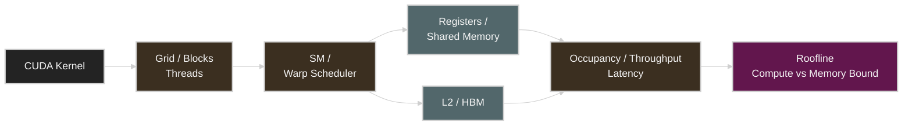

이 장에서 가장 중요한 관점은 다음이다.

> CUDA performance tuning은 thread 수를 무조건 늘리는 일이 아니라, **hardware resource를 과도하게 소모하지 않으면서 latency를 숨길 만큼 충분한 independent work를 공급하는 일**이다.


## Why GPU Architecture Matters for Performance

CPU는 일반적으로 single-thread latency와 control-heavy workload에 강하고, GPU는 같은 연산을 대량의 데이터에 적용하는 throughput-oriented workload에 강하다.

GPU 성능 문제는 흔히 다음 형태로 나타난다.

| 증상 | 가능한 병목 |
| --- | --- |
| GPU utilization이 매우 낮음 | insufficient parallelism, CPU launch gap, data feeding |
| SM은 active하지만 throughput이 낮음 | memory stall, dependency stall, poor instruction mix |
| occupancy가 낮음 | register pressure, shared-memory pressure, block size |
| occupancy는 높은데 kernel이 느림 | memory bandwidth ceiling, low arithmetic intensity |
| block size를 키우면 오히려 느려짐 | fewer resident blocks, register spilling, shared-memory pressure |
| CUDA kernel launch 후 error가 뒤늦게 나타남 | asynchronous error reporting, illegal access |
| Unified Memory 사용 시 latency spike | page fault / migration |
| PyTorch GPU code가 이상하게 느림 | Python loop에서 tiny GPU op를 반복 실행 |
| `cudaMalloc`/`cudaFree`가 자주 보임 | synchronization / allocator overhead |
| GPU 수치상 바쁜데 useful throughput이 낮음 | wrong kernel, serialization, memory-bound execution |

따라서 이 장의 목적은 단순히 CUDA 문법을 배우는 것이 아니다.

> kernel → warp → SM → memory hierarchy → occupancy → profiler를 하나의 성능 경로로 연결하는 것이 목적이다.


## Chapter Performance Mental Model

GPU kernel 성능을 볼 때 다음 순서로 생각하면 편하다.

```text
1. 충분한 parallel work가 있는가?
   ↓
2. block/grid mapping이 hardware에 맞는가?
   ↓
3. register/shared memory 때문에 resident warps가 제한되는가?
   ↓
4. latency를 숨길 만큼 occupancy가 확보되는가?
   ↓
5. warp가 실제로 issue 가능한가, 아니면 stall하는가?
   ↓
6. memory bandwidth ceiling에 닿았는가?
   ↓
7. compute throughput ceiling에 닿았는가?
   ↓
8. end-to-end application에서 이 kernel이 정말 critical path인가?
```

이를 계층으로 보면 다음과 같다.

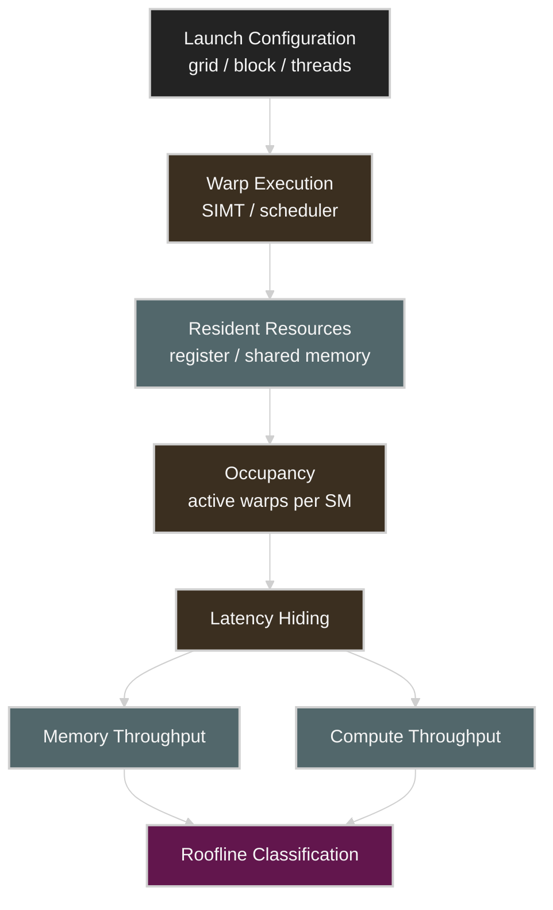

핵심은 **occupancy가 중간 metric**이라는 점이다. 최종 목표는 occupancy 자체가 아니라 kernel runtime과 end-to-end goodput이다.


## GPU Architecture and the SIMT Execution Model

GPU는 수천 개의 lightweight thread를 동시에 실행해 throughput을 높인다. Chapter 6는 NVIDIA GPU의 실행 모델을 SIMT(Single Instruction, Multiple Threads)로 설명한다.

한 warp는 32개의 thread로 구성되며, warp scheduler가 해당 warp의 instruction을 실행한다.

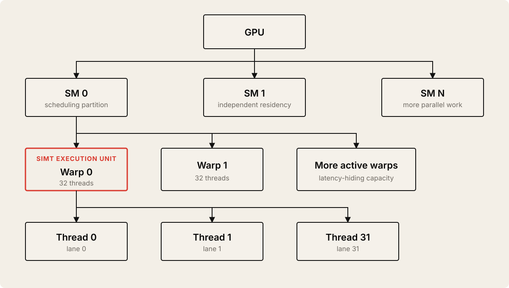

### Performance Meaning

GPU가 memory access를 기다리는 동안 아무 일도 하지 않는다면 latency가 그대로 runtime에 반영된다. 하지만 active warp가 여러 개 있으면 scheduler는 waiting warp 대신 ready warp를 실행할 수 있다.

이것이 **latency hiding**이다.

```text
Warp A → global memory wait ───────────────┐
Warp B → compute compute compute           │
Warp C → load → compute                    ├─ SM stays busy
Warp D → compute → store                   │
                                          ┘
```

따라서 성능 엔지니어는 단순히 "GPU utilization이 낮다"가 아니라 다음을 봐야 한다.

* active warps가 충분한가?
* eligible warp가 있는가?
* warp가 memory dependency 때문에 stall하는가?
* register/shared-memory 사용량이 resident warp 수를 줄이는가?
* issue slot을 채울 independent instruction이 있는가?


## Streaming Multiprocessor and Warp Scheduling

Chapter 6는 Blackwell SM을 예로 들어 여러 warp scheduler가 ready warp를 선택하고, arithmetic pipeline과 memory pipeline에 instruction을 issue하는 구조를 설명한다.

책의 Blackwell 예시에서는 SM을 여러 scheduling partition으로 생각할 수 있다.

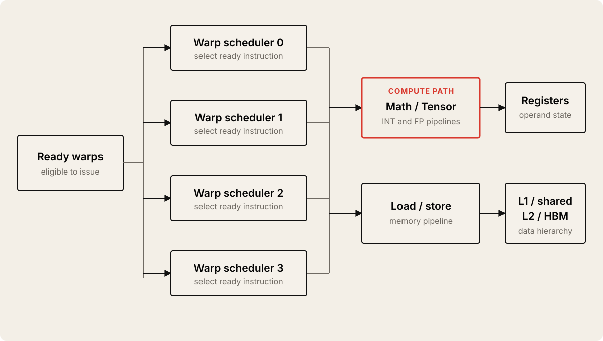

Chapter 6의 포인트는 특정 scheduler 숫자를 외우는 것이 아니다.

> **warp가 issue-ready 상태인지, 그리고 math와 memory pipeline이 얼마나 효율적으로 채워지는지를 profiler로 확인하는 것**이 중요하다.

책도 세부 LD/ST pipeline count는 architecture마다 달라질 수 있으므로 실제 profiling counter와 NVIDIA architecture documentation을 확인하라고 강조한다.

### Main Metrics

| Metric | Meaning | Performance Question |
| --- | --- | --- |
| SM Active / SM Busy | SM이 실제 work를 수행한 비율 | GPU가 놀고 있는가? |
| Active Warps | SM에 resident한 warp 수 | latency hiding 여력이 있는가? |
| Eligible Warps | 현재 issue 가능한 warp 수 | dependency 때문에 막혔는가? |
| Issued Warps | scheduler가 실제로 issue한 정도 | issue pipeline이 채워지는가? |
| Stall Reasons | warp가 진행하지 못한 이유 | memory, dependency, barrier 중 무엇인가? |
| Registers / Thread | thread당 register 사용 | occupancy를 제한하는가? |
| Shared Memory / Block | block당 shared-memory 사용 | resident block 수를 제한하는가? |


## Threads, Warps, Blocks, and Grids

CUDA 실행 계층은 다음과 같다.

```text
Grid
 ├─ Block 0
 │   ├─ Warp 0 → 32 threads
 │   ├─ Warp 1 → 32 threads
 │   └─ ...
 ├─ Block 1
 └─ ...
```

Mermaid로 보면 다음과 같다.

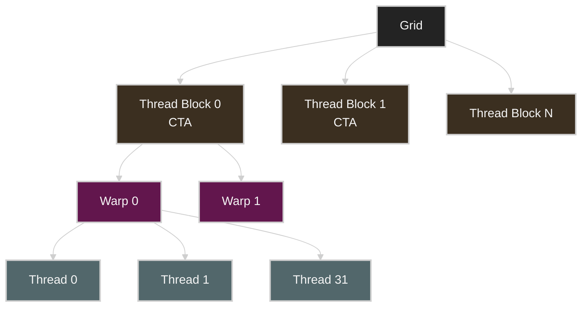

### Thread

kernel function의 한 logical execution instance다.

### Warp

32개의 thread가 하나의 SIMT execution group으로 동작한다.

### Thread Block / CTA

여러 warp가 하나의 block을 구성한다. 같은 block의 thread는 shared memory를 사용하고 `__syncthreads()` 같은 block-level synchronization을 할 수 있다.

### Grid

kernel launch 전체의 block 집합이다.

### Important Rule

> 서로 다른 block은 기본적으로 실행 순서가 보장되지 않는다.

이 독립성이 GPU가 block을 여러 SM에 자유롭게 배치할 수 있게 해 scalability를 만든다.

### Warp Divergence

같은 warp 안에서 thread들이 서로 다른 branch를 선택하면 warp는 branch path를 나눠 실행해야 한다.

```text
Uniform warp
T0 T1 T2 T3 ... T31 → same path → one execution path

Divergent warp
T0 T1 T2 ... → if path
T8 T9 ...    → else path
               ↓
warp executes paths separately with inactive lanes masked
```

중요한 점은 divergence가 **같은 warp 내부**의 문제라는 것이다. 서로 다른 warp가 다른 branch를 타는 것은 같은 의미의 divergence penalty가 아니다.

Chapter 6에서는 개념을 소개하고, 상세한 warp efficiency tuning은 Chapter 8에서 이어진다.


## Thread Block Clusters and Distributed Shared Memory

Chapter 6는 modern GPU에서 thread block cluster와 DSMEM(Distributed Shared Memory)을 짧게 소개한다.

전통적으로 block 간에는 shared memory를 직접 공유할 수 없었다. thread block cluster에서는 cluster에 속한 block들이 hardware-supported cluster synchronization과 DSMEM을 사용할 수 있다.

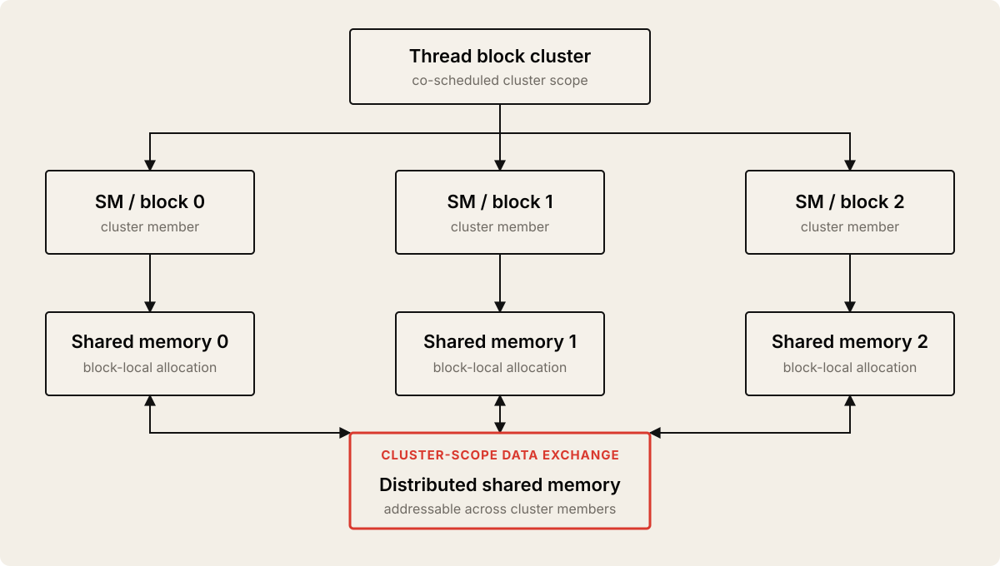

이 장에서는 개념만 기억하면 된다.

> block-local shared memory의 경계를 cluster-level로 확장할 수 있는 modern GPU primitive가 존재한다.

상세한 thread block cluster, DSMEM, cooperative group 최적화는 Chapter 10의 핵심 주제다.


## Choosing Threads per Block and Blocks per Grid

block size는 GPU kernel tuning에서 가장 먼저 실험하는 parameter 중 하나다.

Chapter 6의 출발점은 다음과 같다.

* warp size인 32의 배수 사용
* `128`, `256`, `512` 등을 후보로 benchmark
* book은 `256` threads/block을 일반적인 시작점으로 제시
* register/shared-memory usage와 함께 확인
* 최대 occupancy만 보고 결정하지 않음

### Why Multiples of 32?

예를 들어 block size가 33이라면 두 개의 warp resource를 사용한다.

```text
Block size = 32
Warp 0 → 32/32 active lanes

Block size = 33
Warp 0 → 32/32 active lanes
Warp 1 →  1/32 active lanes
```

두 번째 warp는 31 lane이 idle이지만 scheduler/resource slot은 필요하다.

### Common 1D Launch Formula

```cpp
int threadsPerBlock = 256;
int blocksPerGrid = (N + threadsPerBlock - 1) / threadsPerBlock;

myKernel<<<blocksPerGrid, threadsPerBlock>>>(data, N);
```

`ceil(N / threadsPerBlock)`를 integer arithmetic으로 구현한 것이다.

### Why Bounds Check?

```cpp
int idx = blockIdx.x * blockDim.x + threadIdx.x;
if (idx < N) {
    // valid work
}
```

마지막 block이 input size를 넘어갈 수 있으므로 out-of-bounds access를 방지한다.

### Performance Trade-off

| Block Size | Potential Benefit | Potential Risk |
| --- | --- | --- |
| 64 / 128 | more blocks can fit, flexible scheduling | too little work per block, overhead |
| 256 | balanced starting point | not always optimal |
| 512 | more threads per block | resource pressure may reduce resident blocks |
| 1024 | maximum threads/block class | register/shared-memory pressure, low flexibility |

### Practical Rule

> block size는 architecture trivia가 아니라 **kernel resource usage와 latency hiding의 trade-off knob**다.


## Blackwell Resource Limits

Chapter 6는 Blackwell B200을 예로 thread/block/SM resource limit을 설명한다.

아래 숫자는 **Chapter 6에서 사용하는 Blackwell 예시 기준**이며 GPU generation별로 달라질 수 있다. 실제 운영에서는 `deviceQuery`, CUDA documentation, Nsight Compute를 함께 확인해야 한다.

| Resource | Chapter 6 Blackwell Example | Performance Meaning |
| --- | ---: | --- |
| Warp size | 32 threads | block size를 32의 배수로 잡는 기본 이유 |
| Maximum threads / block | 1,024 | block dimension upper bound |
| Maximum warps / block | 32 | 1,024 / 32 |
| Maximum resident warps / SM | 64 | theoretical occupancy denominator |
| Maximum resident threads / SM | 2,048 | resident block 계산 constraint |
| Maximum active blocks / SM | 32 | tiny block도 무한히 resident할 수 없음 |
| Registers / thread | up to 255 | register pressure가 occupancy를 제한 가능 |
| Registers / SM | book example: 64K 32-bit registers | resident warps와 연결 |
| Shared memory / SM | book example: 228 KB class | block당 shared-memory가 resident blocks 제한 |

### Occupancy Resource Constraint

resident block 수는 여러 hardware limit 중 가장 작은 값으로 결정된다고 생각할 수 있다.

```text
resident blocks per SM ≈ min(
  thread limit / threads per block,
  register limit / registers per block,
  shared-memory limit / shared memory per block,
  architectural block limit
)
```

이를 diagram으로 표현하면 다음과 같다.

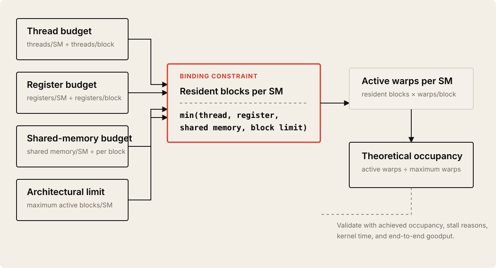

### Senior Engineer Lens

occupancy가 낮다면 "thread를 더 띄우자" 전에 무엇이 occupancy를 제한하는지 확인해야 한다.

* `registers per thread`
* static shared memory
* dynamic shared memory
* threads per block
* block residency
* compiler spill


## CUDA Forward and Backward Compatibility

CUDA binary는 architecture compatibility를 고려해야 한다.

Chapter 6는 PTX와 architecture-specific device code를 함께 포함하는 fat binary를 중심으로 설명한다.

| Artifact | Role | Portability |
| --- | --- | --- |
| PTX | virtual ISA / intermediate representation | newer GPU에서 JIT 가능 |
| CUBIN / SASS | specific GPU architecture machine code | target architecture에 최적화 |
| Fatbin | PTX + one or more architecture binaries | performance + compatibility 균형 |

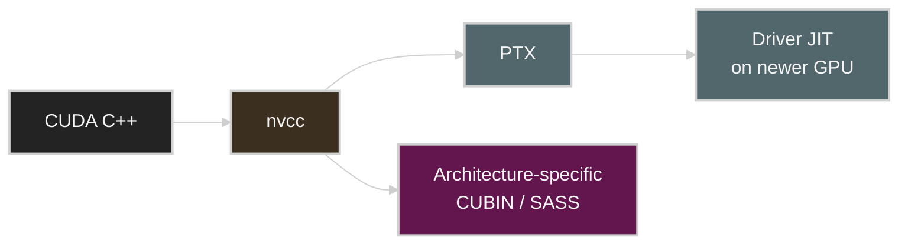

### Validation

책에서는 PTX JIT path를 확인하는 방법으로 다음 환경 변수를 설명한다.

```bash
CUDA_FORCE_PTX_JIT=1 ./your_cuda_app
```

PTX가 binary에 포함되어 있지 않으면 future-target JIT path를 검증할 수 없다.

### Practical Rule

> production CUDA artifact는 current architecture의 optimized code와 forward-compatibility path를 함께 설계한다.

새로운 architecture-specific feature를 강하게 사용할 경우 fallback path가 필요한지도 함께 판단한다.


## CUDA Kernel Programming Refresher

CUDA kernel은 `__global__` function으로 정의하고 CPU(host)에서 launch한다.

```cpp
__global__ void myKernel(float* input, int N) {
    int idx = blockIdx.x * blockDim.x + threadIdx.x;

    if (idx < N) {
        input[idx] *= 2.0f;
    }
}
```

launch는 다음과 같다.

```cpp
const int threadsPerBlock = 256;
const int blocksPerGrid = (N + threadsPerBlock - 1) / threadsPerBlock;

myKernel<<<blocksPerGrid, threadsPerBlock>>>(d_input, N);
```

### Basic Host → Device Flow

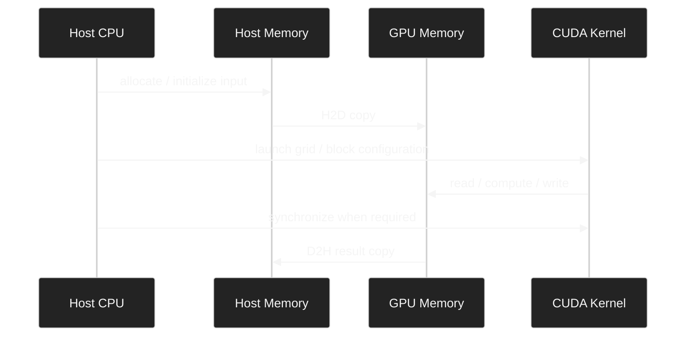

Chapter 6의 기본 flow는 다음과 같다.

1. host memory allocation
2. device memory allocation
3. H2D copy
4. kernel launch
5. synchronization when correctness requires it
6. D2H copy
7. cleanup

### Asynchronous Error Model

CUDA kernel execution은 asynchronous하다. illegal access 같은 device-side error가 host 코드에서 즉시 보이지 않고 이후 synchronization/API call에서 드러날 수 있다.

개발 단계에서는 launch 뒤 error check를 명시적으로 넣어 원인을 가까운 위치에서 잡는 것이 좋다.

```cpp
myKernel<<<blocks, threads>>>(...);

cudaError_t launch_err = cudaGetLastError();
if (launch_err != cudaSuccess) {
    // handle launch error
}

cudaDeviceSynchronize();
```

성능 측정에서는 synchronization을 남발하면 asynchronous execution을 serialize할 수 있으므로 correctness check와 benchmark timing을 구분해야 한다.


## 1D, 2D, and 3D Kernel Mapping

input shape와 thread geometry를 자연스럽게 맞출 수 있다.

### 1D

vector, token array, flat tensor 같은 workload에 적합하다.

```cpp
int idx = blockIdx.x * blockDim.x + threadIdx.x;
```

### 2D

image, matrix에 자연스럽다.

```cpp
int x = blockIdx.x * blockDim.x + threadIdx.x;
int y = blockIdx.y * blockDim.y + threadIdx.y;
```

```cpp
dim3 threadsPerBlock(16, 16);
dim3 blocksPerGrid(
    (width  + threadsPerBlock.x - 1) / threadsPerBlock.x,
    (height + threadsPerBlock.y - 1) / threadsPerBlock.y
);
```

`16 × 16 = 256` threads이므로 warp 단위에도 잘 맞는 흔한 시작점이다.

### 3D

volumetric data, 3D stencil, certain scientific workloads에 사용할 수 있다.

```cpp
dim3 threads(x, y, z);
dim3 grid(gx, gy, gz);
```

### Performance Meaning

차원이 많다고 빨라지는 것이 아니다. 중요한 것은 다음이다.

* work mapping이 data layout과 맞는가?
* contiguous dimension이 memory access와 맞는가?
* block당 thread 수가 resource limit을 넘지 않는가?
* bounds-check divergence가 과도하지 않은가?

memory coalescing 자체는 Chapter 7에서 본격적으로 다룬다.


## Asynchronous Memory Allocation and Memory Pools

Chapter 6는 `cudaMalloc`/`cudaFree`보다 `cudaMallocAsync`/`cudaFreeAsync`와 memory pool 사용을 권장한다. 특히 반복 allocation/free가 많은 long-running workload에서 중요하다.

전통적인 allocation path는 synchronization과 driver/OS overhead를 만들 수 있다.

```text
Repeated loop
cudaMalloc
  ↓
kernel
  ↓
cudaFree
  ↓
repeat
```

stream-ordered memory allocation은 memory pool을 재사용한다.

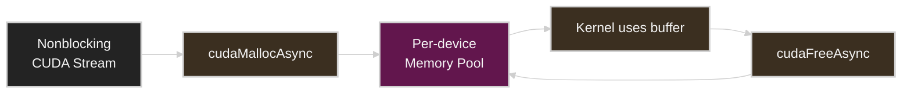

### Example

```cpp
cudaStream_t stream;
cudaStreamCreateWithFlags(&stream, cudaStreamNonBlocking);

float* d_buf = nullptr;
cudaMallocAsync(&d_buf, N * sizeof(float), stream);

myKernel<<<blocks, threads, 0, stream>>>(d_buf, N);

cudaFreeAsync(d_buf, stream);
```

free는 해당 stream의 preceding work가 끝난 뒤 안전하게 처리된다.

### Why It Matters

| Traditional | Stream-Ordered / Pool-Based |
| --- | --- |
| repeated allocation path | freed block reuse |
| broader synchronization risk | stream-order semantics |
| allocator latency spikes | smoother repeated allocation |
| fragmentation risk | pool reuse can reduce churn |

### PyTorch Connection

PyTorch의 CUDA caching allocator도 같은 방향의 문제를 해결한다. tensor마다 raw `cudaMalloc()`/`cudaFree()`를 호출하는 대신 memory를 reserve/cache해 재사용한다.

성능 엔지니어 입장에서는 framework allocator를 볼 때 다음 metric을 구분해야 한다.

* allocated memory
* reserved memory
* active memory
* fragmentation
* OOM headroom


## GPU Memory Hierarchy

GPU memory는 하나의 단일 저장소가 아니다.

Chapter 6에서 기억해야 할 구조는 다음과 같다.

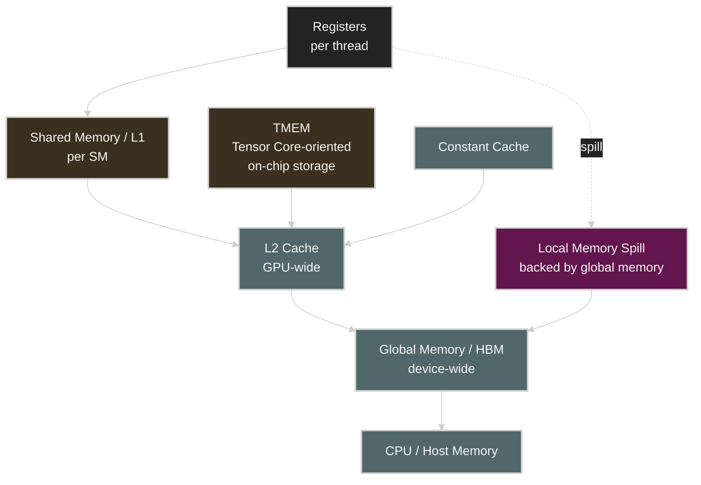

### General Principle

> data를 가능한 한 hierarchy의 위쪽에서 재사용하고, expensive global-memory traffic을 줄이는 것이 GPU performance의 핵심이다.

책의 Blackwell memory hierarchy table은 register, shared/L1, TMEM, constant cache, L2, local memory, global HBM을 비교한다. latency/bandwidth 숫자는 architecture와 access pattern에 따라 달라지므로 절대값을 외우기보다 상대적 계층을 이해하는 것이 중요하다.

| Tier | Scope | Typical Role | Main Risk |
| --- | --- | --- | --- |
| Registers | thread | temporary values, accumulators | register pressure / spilling |
| Shared Memory / L1 | SM / block | tile reuse, producer-consumer data | capacity, bank conflict |
| TMEM | SM / Tensor Core path | Tensor Core operand/accumulator support | specialized access model |
| Constant Cache | SM | warp-broadcast read-only data | divergent access serialization |
| L2 | GPU-wide | cross-SM reuse, HBM traffic reduction | low hit rate |
| HBM | device-wide | weights, activations, global arrays | latency/bandwidth ceiling |
| Local Memory | thread semantics, DRAM-backed | spill storage | very expensive spill traffic |
| Host Memory | CPU/system | staging, offload, Unified Memory tier | migration/interconnect latency |


## Registers and Register Pressure

register는 thread-local variable과 compiler temporary를 저장하는 가장 빠른 영역이다.

하지만 register 수는 무한하지 않다.

thread당 register 사용량이 커지면 다음 현상이 발생할 수 있다.

```text
More registers per thread
        ↓
Fewer threads/warps fit on the SM
        ↓
Lower occupancy
        ↓
Less latency hiding
```

반대로 compiler에게 register를 너무 적게 쓰도록 강제하면 spill이 발생할 수 있다.

```text
Too few registers allowed
        ↓
register spill
        ↓
local memory
        ↓
HBM traffic
        ↓
large latency penalty
```

즉 register tuning은 양쪽 위험이 있다.

| Too Many Registers | Too Few Registers |
| --- | --- |
| occupancy 감소 | spilling 증가 |
| fewer resident warps | local-memory traffic 증가 |
| latency hiding 감소 | HBM pressure 증가 |

### What to Measure

Nsight Compute에서 다음을 확인한다.

* registers per thread
* achieved occupancy
* local load/store traffic
* spill load/store
* warp stall reason
* kernel duration

### Practical Rule

> register를 줄이는 것이 목적이 아니라, **spill 없이 충분한 latency hiding을 확보하는 sweet spot**을 찾는 것이 목적이다.


## Shared Memory, L1, L2, and HBM

### Shared Memory

block 내부 thread가 low-latency로 data를 재사용하는 programmer-managed on-chip memory다.

shared-memory usage가 너무 크면 SM에 동시에 resident할 수 있는 block 수가 줄어 occupancy가 낮아질 수 있다.

### L1

SM에 가까운 cache로 repeated access와 locality에 도움을 준다.

### L2

GPU 전체 SM이 공유하는 cache로 HBM access를 줄이는 중요한 tier다.

### HBM

capacity와 bandwidth는 크지만 on-chip memory보다 latency가 높다. 따라서 모든 operation이 HBM까지 왕복하면 memory-bound가 되기 쉽다.

```text
Best case
global load → L2 → shared/register reuse → many FLOPs

Poor reuse
global load → one tiny operation → global store
global load → one tiny operation → global store
...
```

후자의 arithmetic intensity가 낮아 roofline의 memory-bound 영역으로 이동한다.

### Chapter 7 Bridge

Chapter 6는 memory hierarchy를 소개하고, Chapter 7에서는 이를 실제 access pattern 수준으로 확장한다.

* coalesced global memory access
* vectorized access
* tiling
* shared-memory reuse
* bank conflict
* async prefetch
* TMA


## TMEM and TMA

Chapter 6는 Blackwell의 TMEM(Tensor Memory)과 Hopper의 compute capability 9.0부터 제공되는 TMA(Tensor Memory Accelerator)를 함께 소개한다.

TMEM은 일반적인 CUDA pointer memory와 동일하게 다루는 범용 memory가 아니라 Tensor Core execution path와 결합된 specialized on-chip storage로 설명된다.

TMA는 bulk/tensor data movement를 지원해 data movement workload를 줄이고 compute pipeline이 arithmetic에 집중하도록 하는 방향의 hardware feature다.

개념적으로 다음처럼 이해하면 된다.


Chapter 6에서는 architecture awareness 정도만 필요하다. `tcgen05`, UMMA, warp specialization, cluster-level execution과의 결합은 뒤 챕터에서 더 깊게 다룬다.


## Unified Memory

Unified Memory(CUDA Managed Memory)는 CPU와 GPU에서 하나의 address space를 사용하는 programming model을 제공한다.

```cpp
void* ptr = nullptr;
cudaMallocManaged(&ptr, size);
```

편리하지만 performance engineer에게 중요한 문제는 **page placement와 migration**이다.

### Demand Migration

```text
GPU accesses page
       ↓
page currently placed on CPU side
       ↓
page fault / migration
       ↓
data movement
       ↓
GPU continues
```

이 migration이 kernel critical path에서 발생하면 latency spike가 생길 수 있다.

### Prefetch

Chapter 6는 `cudaMemPrefetchAsync()`를 사용해 kernel이 data를 필요로 하기 전에 placement를 유도하는 방식을 설명한다.

```cpp
cudaMemPrefetchAsync(ptr, size, gpuId, stream);
```

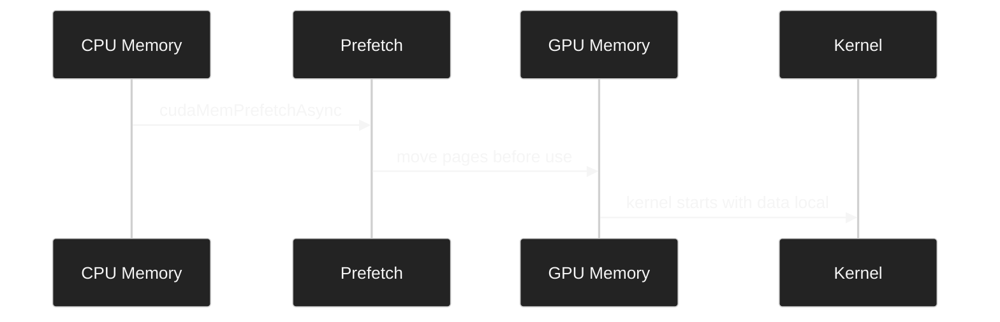

### Memory Advice

책에서 다루는 대표 API는 다음과 같다.

```cpp
cudaMemAdvise(ptr, size, cudaMemAdviseSetPreferredLocation, gpuId);
cudaMemAdvise(ptr, size, cudaMemAdviseSetReadMostly, gpuId);
cudaMemAdvise(ptr, size, cudaMemAdviseSetAccessedBy, otherGpuId);
```

### Stream Attachment

```cpp
cudaStreamAttachMemAsync(stream, ptr, 0, cudaMemAttachSingle);
```

특정 stream과 managed-memory range의 relationship을 명시해 migration/synchronization behavior를 더 통제하는 데 사용할 수 있다.

### Performance Lens

| Unified Memory Benefit | Risk |
| --- | --- |
| programming simplicity | hidden page migration |
| shared address space | unexpected page fault |
| easier oversubscription model | remote/lower-tier memory latency |
| prefetch/advice support | placement policy tuning 필요 |

### Practical Rule

> Unified Memory로 code가 동작한다고 해서 data placement problem이 사라진 것은 아니다.

profiler에서 page migration과 kernel stall을 확인해야 한다.


## Maintaining High Occupancy and GPU Utilization

occupancy는 SM의 theoretical maximum warp capacity 중 실제 active warp가 차지하는 비율이다.

개념적으로 다음과 같다.

```text
Occupancy = Active Warps / Maximum Resident Warps
```

Chapter 6는 occupancy를 latency hiding과 연결한다.

### Low Occupancy

```text
few active warps
    ↓
one warp waits for memory
    ↓
no other ready warp
    ↓
SM idle cycles
```

### Higher Occupancy

```text
many active warps
    ↓
warp A waits
    ↓
scheduler issues warp B/C/D
    ↓
latency hidden
```

### Occupancy Limiters

* too few blocks
* too few threads
* register pressure
* dynamic shared memory
* static shared memory
* block size
* architecture resident-block limit

### Metrics

| Metric | Question |
| --- | --- |
| Theoretical Occupancy | resource calculation상 최대 occupancy는? |
| Achieved Occupancy | runtime에서 실제 occupancy는? |
| Active Warps | 몇 warp가 resident한가? |
| Eligible Warps | 그 중 issue 가능한 warp가 있는가? |
| SM Busy | 실제 compute pipeline이 바쁜가? |
| DRAM Throughput | occupancy보다 memory BW가 ceiling인가? |
| Tensor/ALU Throughput | compute ceiling인가? |

### Important Distinction

**GPU Utilization ≠ Occupancy**

* GPU utilization: 관찰 구간 동안 GPU가 work를 수행했는지에 가까운 device-level activity metric
* occupancy: 한 SM에서 warp residency가 theoretical maximum 대비 어느 정도인지 나타내는 kernel-level concept

둘은 관련되지만 같은 metric이 아니다.


## Sequential Versus Parallel Vector Add

Chapter 6는 아주 단순한 vector add로 GPU parallelism의 차이를 설명한다.

### Sequential Anti-Pattern

한 thread가 N개 element를 loop로 처리한다.

```cpp
__global__ void addSequential(const float* A,
                              const float* B,
                              float* C,
                              int N) {
    if (blockIdx.x == 0 && threadIdx.x == 0) {
        for (int i = 0; i < N; ++i) {
            C[i] = A[i] + B[i];
        }
    }
}
```

GPU를 essentially scalar processor처럼 사용한다.

### Parallel Version

```cpp
__global__ void addParallel(const float* A,
                            const float* B,
                            float* C,
                            int N) {
    int idx = blockIdx.x * blockDim.x + threadIdx.x;
    if (idx < N) {
        C[idx] = A[idx] + B[idx];
    }
}
```

launch:

```cpp
int threads = 256;
int blocks = (N + threads - 1) / threads;
addParallel<<<blocks, threads>>>(A, B, C, N);
```

### PyTorch Anti-Pattern

```python
for i in range(N):
    C[i] = A[i] + B[i]
```

이런 Python loop는 tiny GPU operation을 반복 launch하는 형태가 되어 GPU parallelism을 제대로 활용하지 못한다.

### PyTorch Vectorized Path

```python
C = A + B
```

high-level framework를 사용할 때도 핵심은 동일하다.

> Python에서 GPU operation을 scalar loop로 쪼개지 말고 tensor/vectorized operation으로 표현한다.

### Book's Illustrative Comparison

Chapter 6의 예시는 sequential과 parallel kernel을 비교해 다음과 같은 방향의 차이를 보여준다.

| Metric | Sequential | Parallel | Meaning |
| --- | ---: | ---: | --- |
| Kernel execution time | high | much lower | enough parallel work |
| GPU utilization | very low | high | device is actually fed |
| Achieved occupancy | very low | higher | more resident warps |
| Warp execution efficiency | very low | high | useful lanes increase |

책의 표 숫자는 예시/교육 목적이며 actual hardware에서는 반드시 직접 benchmark해야 한다.

### Timeline Mental Model

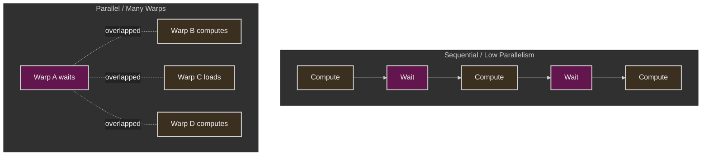


## Occupancy Is Not the Same as Performance

이 장에서 가장 중요한 함정 중 하나다.

높은 occupancy는 latency hiding에 도움이 되지만 **100% occupancy가 항상 최대 performance를 의미하지 않는다.**

가능한 경우는 다음과 같다.

### Case 1. Low Occupancy Is the Bottleneck

* insufficient blocks
* high register usage
* high shared-memory usage
* memory latency exposed

이 경우 occupancy를 높이면 성능이 좋아질 수 있다.

### Case 2. Memory Bandwidth Is Already Saturated

occupancy를 더 높여도 HBM bandwidth ceiling은 올라가지 않는다.

```text
Occupancy 55% → HBM 95% utilized
Occupancy 85% → HBM 95% utilized

Result: little or no speedup
```

### Case 3. More Registers Increase Per-Thread Throughput

occupancy를 조금 낮추더라도 thread당 더 많은 register를 써서 ILP와 data reuse를 높이면 전체 throughput이 더 좋아질 수 있다.

### Case 4. Too Much Occupancy Causes Spill

compiler resource restriction을 너무 강하게 하면 local-memory spill이 생겨 성능이 악화될 수 있다.

### Practical Rule

> occupancy는 목적 함수가 아니라 **latency hiding을 설명하는 diagnostic metric**이다.

최종 판정은 kernel runtime, achieved throughput, stall reason, memory traffic으로 한다.


## Tuning Occupancy with Launch Bounds

CUDA의 `__launch_bounds__`는 compiler에게 kernel launch/resource expectation을 알려준다.

```cpp
__global__ __launch_bounds__(256, 8)
void myKernel(...) {
    // ...
}
```

개념적으로 두 정보가 중요하다.

* maximum threads per block expectation
* desired minimum resident blocks per SM

compiler는 이 정보를 register allocation, inlining, unrolling decision에 사용할 수 있다.

### Why It Can Help

```text
Without hint
compiler uses many registers/thread
       ↓
fewer resident warps
       ↓
low occupancy

With suitable launch bounds
register use may be constrained
       ↓
more resident warps
       ↓
better latency hiding
```

### Risk

register cap이 너무 aggressive하면 spill로 인해 더 느려질 수 있다.

```text
Higher occupancy
     but
Local-memory spill
     ↓
HBM traffic
     ↓
slower kernel
```

### What to Compare

| Before / After Metric | Why |
| --- | --- |
| registers/thread | compiler resource change 확인 |
| theoretical occupancy | resource model 변화 |
| achieved occupancy | actual runtime behavior |
| local load/store | spill 발생 확인 |
| DRAM throughput | spill-induced memory pressure 확인 |
| kernel duration | final success criterion |


## CUDA Occupancy API

runtime에서 kernel resource usage를 기반으로 launch configuration 후보를 계산할 수 있다.

Chapter 6는 `cudaOccupancyMaxPotentialBlockSize()`를 소개한다.

```cpp
int minGridSize = 0;
int bestBlockSize = 0;

cudaOccupancyMaxPotentialBlockSize(
    &minGridSize,
    &bestBlockSize,
    myKernel,
    dynSmemBytes,
    0
);
```

그 다음 input size를 cover하는 grid와 occupancy saturation을 위한 minimum grid를 함께 고려한다.

```cpp
int gridSize = std::max(
    minGridSize,
    (N + bestBlockSize - 1) / bestBlockSize
);
```

### Important Point

Occupancy API가 내놓은 "max occupancy" configuration이 반드시 fastest configuration은 아니다.

책은 주변 candidate block size도 직접 benchmark하라고 강조한다.

예를 들어:

```text
Occupancy API says 256 threads/block

Benchmark candidates:
128
256
512

Compare:
- runtime
- registers/thread
- achieved occupancy
- L2 behavior
- DRAM throughput
```

### Practical Rule

> Occupancy API는 답을 주는 optimizer가 아니라 **좋은 search starting point**다.


## Debugging with NVIDIA Compute Sanitizer

CUDA는 수천 개 thread가 동시에 실행되므로 traditional debugger만으로 memory/race/sync bug를 찾기 어렵다.

Compute Sanitizer는 correctness를 위한 NVIDIA tool suite다.

```bash
compute-sanitizer [--tool toolname] [options] ./application
```

Chapter 6가 설명하는 네 가지 주요 tool은 다음과 같다.

| Tool | Detects | Example Problem |
| --- | --- | --- |
| `memcheck` | out-of-bounds, misaligned access, memory errors | invalid global/shared access |
| `racecheck` | shared-memory data hazards | RAW/WAR/WAW race |
| `initcheck` | uninitialized global-memory read | missing write/copy |
| `synccheck` | invalid synchronization use | barrier mismatch |

### Example CI Pattern

```bash
compute-sanitizer \
  --tool memcheck \
  --error-exitcode 1 \
  ./my_cuda_test
```

### NVTX

NVTX annotation과 kernel filters를 활용하면 큰 application의 특정 region만 검사하거나 profiler와 동일한 semantic region을 공유하기 쉽다.

### Why Correctness Is a Performance Topic

undefined behavior나 race를 가진 kernel은 benchmark 숫자가 빨라도 production optimization으로 인정할 수 없다.

성능 개선은 다음 조건을 동시에 만족해야 한다.

```text
Correct result
+ reproducible benchmark
+ profiler evidence
+ stable resource behavior
= valid optimization
```


## Roofline Model

Roofline Model은 kernel이 compute ceiling에 막히는지 memory bandwidth ceiling에 막히는지 시각적으로 판단하는 모델이다.

축은 일반적으로 다음과 같다.

* X-axis: Arithmetic Intensity = FLOPs / Byte
* Y-axis: Achieved Compute Performance = FLOPs/s

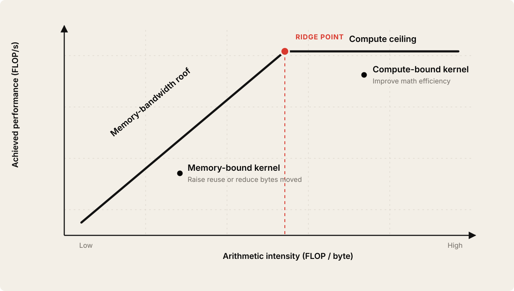

roofline graph는 diagonal memory roof와 horizontal compute roof가 만나는 형태다.

### Ridge Point

개념적으로 다음과 같다.

```text
Ridge Point ≈ Peak Compute Throughput / Peak Memory Bandwidth
```

Chapter 6는 Blackwell-class representative example로 약 `80 TFLOP/s` FP32와 `8 TB/s` HBM bandwidth를 사용해 약 `10 FLOP/Byte` ridge point를 설명한다.

이 숫자는 개념 이해용이며 실제 GPU, precision, sparse/dense mode, sustained throughput에 따라 달라진다.


## Arithmetic Intensity

Arithmetic intensity는 memory에서 가져온 byte당 얼마나 많은 arithmetic work를 하는지 보여준다.

### Vector Add Example

두 개의 FP32를 load한다.

```text
A = 4 bytes
B = 4 bytes
```

한 번 add한다.

```text
1 FLOP
```

결과 하나를 store한다.

```text
C = 4 bytes
```

총 12 bytes 이동에 1 FLOP이므로:

```text
Arithmetic Intensity = 1 FLOP / 12 Bytes
                     ≈ 0.083 FLOP/Byte
```

매우 낮다.

따라서 vector add는 일반적으로 memory bandwidth 영향을 크게 받는 유형으로 이해할 수 있다.

### How to Increase Arithmetic Intensity

* data reuse 증가
* tiling
* kernel fusion
* lower precision
* recomputation vs reload trade-off
* compressed representation
* Tensor Core-friendly math

Chapter 6는 lower precision이 byte traffic을 줄이는 관점도 설명한다.

| Format | Bytes per Value | Memory Pressure Direction |
| --- | ---: | --- |
| FP32 | 4 | highest among listed |
| FP16 / BF16 | 2 | about half FP32 |
| FP8 | 1 | lower |
| FP4 | 0.5 logical storage | even lower |

실제 speedup은 memory path, Tensor Core support, quantization/dequantization, accuracy trade-off까지 함께 봐야 한다.


## Compute-Bound Versus Memory-Bound

### Memory-Bound

증상:

* DRAM/HBM throughput 높음
* ALU/Tensor Core throughput 상대적으로 낮음
* memory-related warp stall 많음
* arithmetic intensity 낮음
* occupancy를 더 높여도 성능 개선이 작음

대표적인 최적화 방향:

* data reuse
* memory coalescing
* tiling
* lower precision
* cache locality
* vectorized access
* kernel fusion

### Compute-Bound

증상:

* compute pipeline throughput 높음
* memory bandwidth에는 여유
* arithmetic intensity 높음
* Tensor Core/ALU가 critical resource

대표적인 최적화 방향:

* Tensor Core utilization
* reduced precision
* instruction efficiency
* kernel fusion
* algorithmic FLOP reduction
* compiler/codegen improvement

### Mixed Reality

실제 LLM workload는 phase마다 다르다.

책은 inference context에서 prefill과 decode가 서로 다른 resource profile을 가질 수 있음을 예고한다.

```text
Prefill
large matrix operations
→ often more compute-intensive

Decode
repeated weight/KV movement per token
→ often more memory-bandwidth sensitive
```

상세 내용은 inference chapters에서 이어진다.

### Decision Matrix

| Observation | Likely Direction |
| --- | --- |
| HBM near ceiling + low compute | memory-bound |
| Tensor/ALU near ceiling + HBM moderate | compute-bound |
| both low | insufficient parallelism, launch gaps, dependency, synchronization |
| occupancy low + memory stalls | resource/parallelism-limited |
| occupancy high + HBM ceiling | memory bandwidth-limited |
| occupancy moderate + strong ILP + good throughput | possibly already efficient |


## Profiling with Nsight Systems and Nsight Compute

Chapter 6는 두 profiler를 함께 사용해야 한다는 점을 강조한다.

### Nsight Systems

"언제" 문제가 발생하는지 본다.

* CPU/GPU timeline
* kernel launch gaps
* H2D / D2H copies
* synchronization
* stream overlap
* NVTX ranges
* GPU idle region

### Nsight Compute

"왜" 특정 kernel이 느린지 본다.

* achieved occupancy
* registers/thread
* shared-memory usage
* SM throughput
* memory throughput
* cache behavior
* warp stall reason
* instruction-level metrics
* roofline analysis

### Recommended Workflow


### Example Commands from Chapter 6 Style

```bash
nsys profile \
  --stats=true \
  -t cuda,nvtx \
  -o parallel_nsys_report \
  ./your_app
```

```bash
ncu \
  --section SpeedOfLight \
  --target-processes all \
  -o parallel_ncu_report \
  ./your_app
```

metric name은 Nsight Compute version과 architecture에 따라 달라질 수 있으므로 hard-coded counter 하나에 의존하지 않는다.

### Detecting Broken Overlap

Chapter 6는 synchronous copy와 asynchronous copy가 timeline에서 어떻게 다른지도 설명한다.

```text
Bad
H2D ────────
             Kernel ────────
                              H2D ────────

Good
H2D batch N+1 ────────
      Kernel batch N ─────────────
```

`cudaMemcpyAsync()`를 호출했다고 자동으로 overlap되는 것은 아니다.

다음을 함께 확인한다.

* pinned/page-locked host memory인가?
* separate/nonblocking stream인가?
* dependency가 올바른가?
* default-stream synchronization이 개입하는가?
* copy engine과 kernel이 실제 timeline에서 겹치는가?


## Chapter 6 Official Example Repository

공식 예제 repository의 Chapter 6 경로는 다음과 같다.

```text
code/ch06/
```

공식 Chapter 6 README는 이 장을 CUDA programming fundamentals, occupancy, launch bounds, ILP, memory layout, allocator experiment 중심으로 구성한다.

### Important Scope Note

공식 repo의 `code/ch06`에는 **책 Chapter 6 본문보다 조금 더 앞선 실험**도 포함되어 있다.

예를 들어:

* ILP experiment
* shared-memory bank conflict experiment
* autotuning
* quantization ILP

이 주제들은 책에서는 뒤 챕터에서 더 깊게 다뤄진다. 따라서 repo의 ch06 디렉터리는 **Chapter 6 fundamentals + 이후 CUDA optimization의 bridge lab**로 보는 것이 좋다.

### Directory Highlights

공식 README에서 확인되는 주요 파일/그룹은 다음과 같다.

| Path | Purpose |
| --- | --- |
| `my_first_kernel.cu`, `simple_kernel.cu` | CUDA kernel fundamentals |
| `2d_kernel.cu` | 2D grid/block mapping |
| `baseline_add_cuda.cu`, `optimized_add_cuda_parallel.cu` | sequential/parallel add style comparison |
| `baseline_add.py`, `optimized_add.py` | framework-level add comparison |
| `occupancy_api.cu` | CUDA Occupancy API example |
| `unified_memory.cu` | Unified Memory behavior |
| `memory_pool_tuning.cu` | memory pool tuning |
| `stream_ordered_allocator/` | stream-ordered allocator experiments |
| `baseline_launch_bounds*.{py,cu}`, `optimized_launch_bounds*.{py,cu}` | launch-bounds experiments |
| `baseline_attention_ilp.py`, `optimized_attention_ilp.py` | ILP teaching workload |
| `baseline_elementwise_ilp.py`, `optimized_elementwise_ilp.py` | elementwise ILP experiment |
| `baseline_autotuning.py`, `optimized_autotuning.py` | launch/schedule autotuning experiment |
| `compare.py`, `Makefile` | benchmark/build harness |

### Official Repro Commands

공식 Chapter 6 README에서 제시하는 benchmark entry point는 다음과 같다.

```bash
python -m ch06.compare
python -m cli.aisp bench list-targets --chapter ch06
python -m cli.aisp bench run --targets ch06 --profile minimal
```

profiler-heavy run 예시는 다음과 같다.

```bash
python -m cli.aisp bench run \
  --targets ch06:add \
  --profile deep_dive \
  --single-gpu
```

```bash
python -m cli.aisp bench run \
  --targets ch06:attention_ilp \
  --profile deep_dive \
  --single-gpu
```

```bash
python -m cli.aisp bench run \
  --targets ch06:autotuning \
  --profile deep_dive \
  --single-gpu
```

### Repository Benchmark Caveat

공식 repo의 Chapter 6 README도 `add`, `attention_ilp` 같은 일부 baseline이 교육 목적의 intentionally naive baseline임을 명시한다.

따라서 수백 배~수천 배 같은 delta를 production expectation으로 해석하면 안 된다.

핵심은 숫자의 크기가 아니라 다음을 연결하는 것이다.

```text
Code change
   ↓
launch/resource behavior change
   ↓
profiler counter change
   ↓
wall-clock improvement
```

### Makefile Profiling Targets

공식 `code/ch06/Makefile`에는 architecture-aware build와 profiler target이 포함되어 있다.

예:

```bash
make all
make test
make profile-nsys
make profile-ncu
make profile-all
```

Makefile은 build 시 `-lineinfo`와 `-Xptxas=-v`를 사용한다. 이 정보는 source correlation과 register/compiler resource output을 확인할 때 유용하다.


## GPU Bottleneck Lens

| Bottleneck | Symptom | Metric | Tool | Fix Direction |
| --- | --- | --- | --- | --- |
| Insufficient parallelism | GPU/SM activity가 매우 낮음 | SM busy, active warps | Nsight Systems / Compute | more blocks/threads, vectorized ops |
| Underfilled warps | warp lanes 낭비 | warp execution efficiency | Nsight Compute | block size, data mapping |
| Register pressure | occupancy 낮음, spill 가능 | registers/thread, local load/store | Nsight Compute, ptxas | block tuning, refactor, launch bounds |
| Shared-memory pressure | resident block 수 제한 | shared memory/block, occupancy | Nsight Compute | smaller tile/block, layout redesign |
| Memory-bound | HBM throughput 높고 compute 낮음 | DRAM throughput, arithmetic intensity | Nsight Compute Roofline | reuse, tiling, lower precision |
| Compute-bound | ALU/Tensor path가 ceiling | compute throughput | Nsight Compute | Tensor Core, reduced precision, algorithm |
| Dependency-bound | occupancy는 있는데 issue 안 됨 | eligible warps, stall dependency | Nsight Compute | ILP, pipeline restructuring |
| Barrier/sync bound | frequent wait region | barrier stalls, timeline gaps | Nsight Systems / Compute | reduce synchronization |
| Allocation overhead | allocation/free가 hot path에 반복 | CUDA API time | Nsight Systems | memory pool, async allocator |
| Unified Memory migration | latency spike/page fault | migration activity, kernel stall | Nsight Systems | prefetch, memory advice |
| H2D serialization | copy와 kernel이 순차 실행 | copy lanes / streams | Nsight Systems | pinned memory, nonblocking stream |
| Functional bug | illegal access/race | sanitizer report | Compute Sanitizer | correctness fix first |


## Operational Validation Checklist

### 1. GPU Architecture Inventory

```bash
nvidia-smi -L
nvidia-smi -q
```

확인할 것:

* GPU model
* driver/CUDA compatibility
* memory capacity
* clock/power state
* MIG mode 여부

CUDA sample이 설치되어 있다면 `deviceQuery`로 hardware limits를 함께 남긴다.

### 2. Build Target and Compiler Output

공식 repo Makefile은 architecture-specific target을 사용한다.

확인할 것:

* target SM architecture
* PTX inclusion policy
* `ptxas` register usage
* shared-memory usage
* spill warning

compiler line info는 profiler source correlation에 유용하다.

### 3. Baseline Launch Configuration

record:

```text
threads/block
blocks/grid
dynamic shared memory/block
registers/thread
kernel duration
```

block size 후보를 최소한 몇 개 비교한다.

```text
128
256
512
```

### 4. Occupancy

Nsight Compute에서 확인:

* theoretical occupancy
* achieved occupancy
* active warps
* registers/thread
* shared-memory limit
* resident block limit

### 5. Stall Reasons

occupancy가 괜찮아도 warp가 issue하지 못할 수 있다.

확인:

* memory dependency
* execution dependency
* barrier
* instruction issue
* scoreboard-related stalls

상세 stall interpretation은 Chapter 8에서 이어진다.

### 6. Memory Hierarchy

확인:

* L1/L2 reuse
* HBM throughput
* local-memory traffic
* spill 여부
* global memory traffic

### 7. Allocation Path

Nsight Systems CUDA API lane에서 다음이 hot path에 반복되는지 확인한다.

```text
cudaMalloc
cudaFree
cudaDeviceSynchronize
```

반복된다면 pool/async allocator를 검토한다.

### 8. Unified Memory

managed allocation을 사용할 경우:

* page migration이 iteration critical path에 있는가?
* `cudaMemPrefetchAsync`가 필요한가?
* preferred location이 맞는가?
* multi-GPU accessed-by policy가 맞는가?

### 9. H2D / D2H Overlap

Nsight Systems copy lane에서:

* copy와 kernel이 실제 overlap하는가?
* pinned memory인가?
* stream이 nonblocking인가?
* unexpected synchronization이 있는가?

### 10. Roofline

각 critical kernel에 대해:

* arithmetic intensity
* achieved memory throughput
* achieved compute throughput
* ridge point 대비 위치

를 기록한다.

### 11. Functional Correctness

CI 또는 개발 pipeline에서:

```bash
compute-sanitizer --tool memcheck --error-exitcode 1 ./test
```

필요에 따라 racecheck/initcheck/synccheck도 적용한다.

### 12. Reproducible Benchmark Metadata

최소한 다음을 저장한다.

```text
GPU model
GPU clocks / power cap
CUDA version
Driver version
Compiler target
Kernel input size
Launch configuration
Registers/thread
Shared memory/block
Profiler version
Warmup count
Iteration count
```


## Hands-on Labs

Chapter 6는 가능하면 **Before → Change → After → Interpretation** 구조로 실습하는 것이 좋다.


### Lab 1. Sequential Versus Parallel Add

**목적**

GPU를 scalar processor처럼 사용하는 코드와 충분한 parallelism을 제공하는 kernel의 차이를 profiler로 확인한다.

**관련 코드**

공식 repo `code/ch06`:

```text
baseline_add_cuda.cu
optimized_add_cuda_parallel.cu
baseline_add.py
optimized_add.py
```

공식 repo의 exact target naming은 revision에 따라 달라질 수 있으므로 현재 `code/ch06/README.md`와 `bench list-targets`를 기준으로 확인한다.

**Before**

sequential/naive path 측정:

* kernel duration
* GPU/SM activity
* achieved occupancy
* warp execution efficiency

**Change**

* one thread per element
* threads/block 후보 256
* enough blocks to cover N
* Python loop 대신 vectorized tensor op

**After**

동일 input size로 재측정.

**Interpretation**

성능 차이를 단순히 "CUDA라서 빠르다"가 아니라 다음으로 설명한다.

```text
parallel threads 증가
→ active warps 증가
→ latency hiding 증가
→ SM utilization 증가
→ runtime 감소
```

**Tools**

* Nsight Systems
* Nsight Compute
* repo benchmark harness


### Lab 2. Occupancy API and Block Size Sweep

**목적**

max occupancy suggestion과 actual fastest block size가 같은지 검증한다.

**관련 코드**

```text
code/ch06/occupancy_api.cu
```

**Before**

fixed block size 256으로 기록:

```text
kernel time
registers/thread
achieved occupancy
SM throughput
DRAM throughput
```

**Change**

* Occupancy API suggestion 확인
* 128 / 256 / 512 sweep

**After**

각 configuration을 동일 조건으로 benchmark.

**Interpretation**

max occupancy가 fastest runtime인지 확인한다.

예상 가능한 결론:

```text
Highest occupancy != lowest latency
```

memory behavior, register pressure, ILP가 함께 작용할 수 있다.


### Lab 3. Launch Bounds and Register Pressure

**목적**

compiler launch hint가 register allocation과 occupancy에 미치는 영향을 확인한다.

**관련 코드**

공식 repo README 기준:

```text
baseline_launch_bounds*.{py,cu}
optimized_launch_bounds*.{py,cu}
```

**Before**

* registers/thread
* achieved occupancy
* spill load/store
* runtime

**Change**

`__launch_bounds__` 또는 repo optimized variant 적용.

**After**

같은 input으로 재측정.

**Interpretation**

두 경우를 구분한다.

```text
A. occupancy ↑, spill 없음, runtime ↓ → useful
B. occupancy ↑, spill ↑, runtime ↑ → over-constrained
```

**Tools**

* `nvcc -Xptxas=-v`
* Nsight Compute


### Lab 4. Unified Memory Prefetch

**목적**

managed memory의 demand migration과 proactive prefetch 차이를 timeline에서 확인한다.

**관련 코드**

```text
code/ch06/unified_memory.cu
```

**Before**

managed allocation을 사용하고 demand access behavior 측정.

확인:

* page migration
* kernel start stall
* H2D/data movement timing

**Change**

kernel launch 전에:

```cpp
cudaMemPrefetchAsync(...)
```

필요하면 preferred location/read-mostly advice 적용.

**After**

same input으로 timeline 재측정.

**Interpretation**

prefetch가 migration을 critical path 밖으로 이동시켰는지 확인한다.


### Lab 5. cudaMalloc Versus Async Memory Pool

**목적**

반복 allocation/free가 있는 workload에서 allocator synchronization/churn을 확인한다.

**관련 코드**

공식 repo README 기준:

```text
code/ch06/memory_pool_tuning.cu
code/ch06/stream_ordered_allocator/
```

**Before**

loop에서 synchronous allocation/free 수행.

측정:

* CUDA API time
* synchronization
* iteration variance
* memory footprint

**Change**

* nonblocking stream
* `cudaMallocAsync`
* `cudaFreeAsync`
* memory pool reuse

**After**

same iteration count로 재측정.

**Interpretation**

allocation overhead가 application critical path였는지 판단한다.


### Lab 6. Roofline Classification

**목적**

critical kernel을 compute-bound / memory-bound로 분류한다.

**관련 코드**

Chapter 6 add kernel 또는 repo의 다른 simple CUDA target 사용.

**Before**

Nsight Compute로:

* arithmetic intensity
* HBM throughput
* compute throughput
* achieved occupancy

측정.

**Change**

memory-bound kernel이면 한 가지 변경만 적용한다.

예:

* lower precision
* more data reuse
* vectorized operation

**After**

roofline point가 어떻게 이동했는지 확인.

**Interpretation**

optimization 전후를 다음처럼 기록한다.

```text
Before: low AI + high HBM utilization → memory-bound
Change: bytes/op 감소
After: AI 증가 + achieved FLOPs 증가
```


### Lab 7. Compute Sanitizer CI Gate

**목적**

성능 benchmark 전에 functional correctness를 자동 검증한다.

**Before**

CUDA test를 일반 실행만 한다.

**Change**

CI 또는 local script에 추가:

```bash
compute-sanitizer \
  --tool memcheck \
  --error-exitcode 1 \
  ./cuda_test
```

필요한 kernel만 filter한다.

**After**

intentional out-of-bounds/race test가 CI에서 failure 처리되는지 확인.

**Interpretation**

performance regression뿐 아니라 correctness regression도 gate해야 한다.


## Practical Tips and Notes

이 섹션은 Chapter 6의 내용을 실제 AI infrastructure / MLOps 환경에 적용할 때의 실전 관점이다.

### GPU Utilization Alone Is Not Enough

`nvidia-smi`에서 95%가 보여도 kernel이 좋은 것은 아니다.

가능한 상황:

```text
GPU util 95%
HBM bandwidth 95%
Tensor throughput 15%
```

memory-bound일 수 있다.

반대로:

```text
GPU util 95%
HBM bandwidth 30%
Tensor throughput 90%
```

compute-bound일 수 있다.

따라서 minimum set은 다음이다.

* kernel runtime
* SM throughput
* HBM throughput
* achieved occupancy
* registers/thread
* stall reasons
* end-to-end throughput

### Occupancy Is a Means, Not a Goal

100% occupancy를 달성하려고 register를 과도하게 줄이거나 tile을 작게 만들면 오히려 성능이 떨어질 수 있다.

가장 빠른 kernel이 50~70% occupancy일 수 있다.

benchmark가 답이다.

### Do Not Guess Block Size

256이 좋은 시작점일 뿐 정답이 아니다.

simple sweep를 자동화한다.

```text
64
128
256
512
1024 (if legal/useful)
```

각 configuration에서 resource/throughput을 기록한다.

### Watch Compiler Resource Usage

CUDA binary build 시 compiler output도 observability다.

```bash
nvcc -Xptxas=-v ...
```

확인:

* registers
* stack
* spill
* shared memory

source code만 보고 register pressure를 정확히 추측하기 어렵다.

### Avoid Python Scalar Loops Around GPU Ops

MLOps/LLMOps 관점에서 native CUDA를 직접 작성하지 않아도 이 교훈은 매우 중요하다.

```python
# bad pattern
for i in range(N):
    y[i] = f(x[i])
```

가능하면:

```python
y = f(x)
```

또는 `torch.compile`, vectorized tensor operation, existing fused operator를 우선 검토한다.

### Synchronization Can Destroy Overlap

디버깅을 위해 넣은 다음 코드가 benchmark에 남으면 pipeline을 serialize할 수 있다.

```cpp
cudaDeviceSynchronize();
```

또는 PyTorch에서 CPU로 scalar를 꺼내는 operation이 hidden sync를 만들 수 있다.

correctness가 필요한 위치와 timing을 위한 synchronization을 명확히 구분한다.

### Unified Memory Is Not Free HBM

managed memory는 memory capacity problem을 쉽게 만들지만 locality problem까지 해결해주지는 않는다.

prefetch와 advice가 필요한지 profiling으로 판단한다.

### Memory Pool Tuning Can Trade Memory for Latency

pool이 freed buffer를 오래 보유하면 allocation latency는 줄지만 reserved memory가 커질 수 있다.

반대로 너무 자주 trim하면 allocator overhead가 다시 커질 수 있다.

### Compute Sanitizer Before Performance Claims

race/out-of-bounds가 있는 kernel의 빠른 숫자는 의미가 없다.

correctness → performance 순서로 검증한다.

### Roofline Is a Classification Tool

roofline은 "어떤 optimization category를 먼저 시도할지" 결정하는 데 좋다.

```text
Memory-bound
→ memory traffic / reuse / precision

Compute-bound
→ math pipeline / Tensor Core / algorithm
```

roofline 자체가 모든 stall cause를 설명하지는 않는다. dependency, synchronization, launch overhead는 별도로 profiler로 봐야 한다.

### MLOps Engineer Lens

CUDA kernel을 직접 개발하지 않더라도 다음 상황에서 Chapter 6 mental model이 필요하다.

* Nsight Compute 결과 리뷰
* Triton kernel tuning review
* `torch.compile` generated kernel regression
* custom extension 검증
* vLLM/SGLang/TensorRT-LLM kernel performance issue
* quantization kernel 비교
* GPU generation upgrade validation
* vendor benchmark 검증

즉 목표는 CUDA specialist가 되는 것이 아니라:

> **kernel-level metric을 읽고 문제를 올바른 owner/layer로 routing할 수 있는 것**이다.

### Kubernetes / GPU Cluster Lens

kernel performance는 pod placement만으로 해결되지 않지만, reproducible benchmark를 위해 node 상태가 일정해야 한다.

최소한 다음을 고정한다.

* GPU model
* MIG mode
* power cap
* thermal state
* driver/CUDA version
* container image
* input size
* affinity/topology

같은 kernel benchmark가 node마다 다르면 software code보다 먼저 hardware/system condition을 의심할 수 있다.

### Quick Field Heuristics

| Situation | First Question | Fast Check |
| --- | --- | --- |
| GPU가 거의 안 바쁨 | enough work를 launch했는가? | Nsight Systems + grid/block size |
| occupancy가 매우 낮음 | register/shared memory가 제한하는가? | Nsight Compute occupancy section |
| occupancy 높지만 느림 | memory ceiling인가? | Roofline / DRAM throughput |
| block 512가 256보다 느림 | resource residency가 줄었는가? | registers, active blocks |
| kernel 변경 후 갑자기 HBM traffic 증가 | spill이 생겼는가? | local load/store |
| Unified Memory에서 가끔 latency spike | page migration인가? | Nsight Systems UM activity |
| async copy인데 overlap 안 됨 | pinned memory/stream 조건이 맞는가? | copy timeline |
| Python GPU code가 느림 | tiny op를 loop로 launch하는가? | CPU launch timeline |
| 새 GPU에서 binary가 실행 안 됨 | PTX/fatbin policy가 맞는가? | build flags, PTX JIT test |
| kernel은 빨라졌는데 app은 그대로 | critical path가 아니었는가? | end-to-end Nsight Systems |


## Chapter Summary

Chapter 6의 핵심은 다음이다.

> GPU performance는 많은 thread를 launch하는 것만으로 결정되지 않는다. thread가 warp로 묶여 SM에서 scheduling되고, register/shared memory 같은 finite resource를 소비하며, memory hierarchy를 통해 data를 공급받는 전체 execution model을 이해해야 한다.

GPU는 SIMT execution model을 사용하고 warp 단위로 instruction을 실행한다. 충분한 active warp가 있으면 한 warp가 memory latency를 기다리는 동안 다른 warp를 실행해 latency를 숨길 수 있다. 이것이 occupancy가 중요한 이유다.

하지만 occupancy를 100%로 만드는 것이 최종 목표는 아니다. register를 더 많이 써서 ILP를 높이는 편이 더 빠를 수 있고, memory bandwidth가 이미 saturated라면 occupancy를 높여도 성능이 오르지 않는다. 반대로 register를 너무 제한해 spill이 발생하면 local memory와 HBM traffic이 증가해 더 느려질 수 있다.

따라서 kernel optimization은 다음과 같이 진행해야 한다.

```text
Launch enough work
→ inspect occupancy/resources
→ inspect stalls
→ inspect memory throughput
→ inspect compute throughput
→ classify with roofline
→ change one variable
→ benchmark again
```

CUDA memory allocation도 performance path다. 반복적인 `cudaMalloc`/`cudaFree` 대신 stream-ordered `cudaMallocAsync`/`cudaFreeAsync`와 memory pool을 사용하면 synchronization과 allocation churn을 줄일 수 있다. PyTorch caching allocator도 비슷한 목적을 가진다.

GPU memory hierarchy에서는 registers, shared/L1, L2, HBM이 capacity와 latency trade-off를 가진다. HBM은 빠른 high-bandwidth memory지만 on-chip storage보다 latency가 크므로 data reuse를 높여 global-memory traffic을 줄이는 것이 중요하다. Blackwell에서는 TMEM/TMA 같은 specialized data-movement path도 등장하며, 이후 챕터에서 더 깊게 다룬다.

Unified Memory는 programming complexity를 줄이지만 page migration이라는 hidden performance cost를 만들 수 있다. `cudaMemPrefetchAsync`, memory advice, stream attachment를 통해 placement를 더 명시적으로 관리할 수 있다.

마지막으로 Roofline Model은 arithmetic intensity를 기준으로 kernel을 memory-bound와 compute-bound로 분류한다. 이 분류를 통해 "더 많은 occupancy"가 필요한지, "더 적은 bytes"가 필요한지, "더 많은 Tensor Core utilization"이 필요한지 optimization 방향을 정할 수 있다.

성능 엔지니어링 관점에서 Chapter 6를 한 문장으로 요약하면 다음과 같다.

> **GPU가 느릴 때 먼저 thread 수를 늘리는 것이 아니라, profiler로 SM residency, warp progress, memory traffic, compute throughput을 측정해 실제 ceiling을 찾아야 한다.**

이 mental model은 이후 Chapter 7의 memory access pattern, Chapter 8의 warp stall/occupancy/ILP, Chapter 9의 arithmetic intensity와 Tensor Core 최적화를 이해하는 기반이 된다.


## Key Terms

| Term | Meaning |
| --- | --- |
| SIMT | Single Instruction, Multiple Threads GPU execution model |
| SM | Streaming Multiprocessor, GPU의 주요 execution unit |
| Thread | CUDA kernel의 logical execution instance |
| Warp | 32 thread로 구성되는 SIMT scheduling/execution group |
| Thread Block / CTA | 같은 shared memory와 block-level synchronization을 공유하는 thread group |
| Grid | kernel launch 전체 block 집합 |
| Warp Scheduler | ready warp의 instruction을 execution pipeline으로 issue하는 hardware scheduler |
| Warp Divergence | 한 warp 내부 thread가 다른 control-flow path를 실행하는 현상 |
| Occupancy | resident active warp 수를 architecture maximum과 비교한 비율 |
| Latency Hiding | waiting warp 대신 다른 ready warp를 실행해 latency를 감추는 방식 |
| Register Pressure | thread당 register 사용량이 높아 occupancy/residency를 제한하는 현상 |
| Register Spill | register에 못 담은 값이 local memory로 내려가는 현상 |
| Shared Memory | block에서 직접 관리하는 low-latency on-chip memory |
| L1 Cache | SM-local cache hierarchy |
| L2 Cache | GPU-wide shared cache |
| HBM | GPU device global high-bandwidth memory |
| Local Memory | thread-local semantics를 가지지만 실제로 global-memory backed일 수 있는 spill space |
| Constant Memory | small read-only data와 warp broadcast에 유리한 CUDA memory space |
| TMEM | Blackwell Tensor Core path의 specialized on-chip Tensor Memory |
| TMA | Tensor Memory Accelerator, tensor/bulk data movement hardware |
| CUDA Managed Memory | CPU/GPU unified address-space allocation model |
| Page Migration | managed page가 CPU/GPU memory tier 사이 이동하는 현상 |
| `cudaMemPrefetchAsync` | managed memory를 target device로 사전 이동시키는 API |
| Memory Advice | preferred location/read-mostly/accessed-by policy hint |
| `cudaMallocAsync` | stream-ordered asynchronous GPU memory allocation |
| CUDA Memory Pool | freed GPU allocation을 재사용하는 pool mechanism |
| `__launch_bounds__` | compiler에 block/residency expectation을 제공하는 kernel annotation |
| Occupancy API | kernel resource usage를 기반으로 launch configuration 후보를 계산하는 CUDA API |
| Compute Sanitizer | CUDA memory/race/init/synchronization correctness tool suite |
| Roofline Model | compute ceiling과 memory bandwidth ceiling을 함께 보는 performance model |
| Arithmetic Intensity | transferred byte당 수행되는 FLOP 수 |
| Ridge Point | memory-bound와 compute-bound 영역이 만나는 arithmetic intensity threshold |
| Memory-Bound | memory bandwidth/latency가 performance ceiling인 상태 |
| Compute-Bound | arithmetic pipeline throughput이 performance ceiling인 상태 |
| Nsight Systems | end-to-end CPU/GPU timeline profiler |
| Nsight Compute | per-kernel GPU performance profiler |
| NVTX | profiler timeline에 semantic range/marker를 추가하는 annotation API |


## Questions

1. GPU가 CPU보다 throughput-oriented workload에 유리한 이유를 SIMT와 latency hiding 관점에서 설명하면?
2. thread, warp, block, grid는 각각 어떤 역할을 가지는가?
3. block size를 warp size인 32의 배수로 선택하는 이유는 무엇인가?
4. block size를 크게 하면 occupancy가 항상 올라가지 않는 이유는 무엇인가?
5. achieved occupancy가 낮을 때 가장 먼저 확인할 resource는 무엇인가?
6. occupancy와 GPU utilization은 어떻게 다른가?
7. occupancy가 높아도 kernel이 느릴 수 있는 이유는 무엇인가?
8. register pressure가 occupancy와 성능에 어떤 영향을 주는가?
9. register 사용량을 너무 강하게 줄이면 어떤 문제가 생길 수 있는가?
10. `cudaMallocAsync`/`cudaFreeAsync`가 반복적인 `cudaMalloc`/`cudaFree`보다 유리할 수 있는 이유는?
11. GPU memory hierarchy에서 reusable data를 register/shared/L2 쪽에 유지하려는 이유는?
12. local memory가 이름과 달리 성능상 "local/on-chip"으로 생각하면 안 되는 이유는?
13. TMEM과 TMA는 Chapter 6에서 어떤 역할로 소개되는가?
14. Unified Memory가 편리하지만 performance surprise를 만들 수 있는 이유는?
15. `cudaMemPrefetchAsync`는 Unified Memory의 어떤 문제를 줄이려는가?
16. sequential vector add와 parallel vector add의 본질적 성능 차이는 무엇인가?
17. Python loop로 GPU tensor element를 하나씩 처리하면 왜 느릴 수 있는가?
18. `__launch_bounds__`를 사용할 때 occupancy 증가만 보면 안 되는 이유는?
19. CUDA Occupancy API가 제시한 block size를 그대로 정답으로 쓰면 안 되는 이유는?
20. Compute Sanitizer의 memcheck, racecheck, initcheck, synccheck는 각각 어떤 종류의 bug를 찾는가?
21. arithmetic intensity란 무엇인가?
22. Roofline Model의 ridge point는 무엇을 의미하는가?
23. vector add가 일반적으로 memory-bound 성격을 가지는 이유는?
24. Nsight Systems와 Nsight Compute는 각각 어떤 질문에 답하는 도구인가?
25. `cudaMemcpyAsync`를 사용했는데 copy와 kernel이 overlap되지 않을 때 무엇을 확인해야 하는가?
26. kernel runtime은 빨라졌는데 application throughput이 그대로라면 어떤 결론을 내릴 수 있는가?


## Answers

### A1. GPU가 CPU보다 throughput-oriented workload에 유리한 이유를 SIMT와 latency hiding 관점에서 설명하면?

**GPU는 많은 lightweight thread를 warp 단위로 동시에 유지하고, 한 warp가 memory/dependency를 기다릴 때 다른 ready warp를 실행해 latency를 숨긴다.** 같은 연산을 대량 데이터에 적용하는 workload에서 이 구조가 높은 throughput을 만든다.

### A2. thread, warp, block, grid는 각각 어떤 역할을 가지는가?

**thread는 kernel의 개별 execution instance, warp는 32 thread의 SIMT execution group, block은 shared memory와 block-level synchronization을 공유하는 thread group, grid는 한 kernel launch의 전체 block 집합이다.**

### A3. block size를 warp size인 32의 배수로 선택하는 이유는 무엇인가?

**partial warp를 줄이기 위해서다.** 예를 들어 33-thread block은 두 warp slot이 필요하지만 두 번째 warp에서는 한 lane만 useful work를 수행한다.

### A4. block size를 크게 하면 occupancy가 항상 올라가지 않는 이유는 무엇인가?

**큰 block은 thread 수뿐 아니라 register와 shared-memory resource를 많이 소비해 동시에 resident할 수 있는 block 수를 줄일 수 있기 때문이다.** occupancy는 여러 resource constraint의 최소값으로 결정된다.

### A5. achieved occupancy가 낮을 때 가장 먼저 확인할 resource는 무엇인가?

**threads/block, registers/thread, shared memory/block, active block limit을 함께 확인한다.** 하나만 보면 원인을 놓칠 수 있다. Nsight Compute occupancy section과 compiler resource output을 함께 보는 것이 좋다.

### A6. occupancy와 GPU utilization은 어떻게 다른가?

**occupancy는 SM의 warp residency 비율이고, GPU utilization은 관찰 시간 동안 device가 work를 수행했는지에 가까운 activity metric이다.** 높은 utilization이 100% occupancy를 의미하지도 않고, 높은 occupancy가 높은 useful throughput을 보장하지도 않는다.

### A7. occupancy가 높아도 kernel이 느릴 수 있는 이유는 무엇인가?

**memory bandwidth가 이미 saturated됐거나, dependency stall/barrier가 많거나, arithmetic intensity가 낮거나, inefficient instruction path를 타고 있을 수 있다.** occupancy는 latency hiding metric이지 최종 performance metric이 아니다.

### A8. register pressure가 occupancy와 성능에 어떤 영향을 주는가?

**thread당 register가 많으면 SM register file에서 동시에 유지할 수 있는 thread/warp 수가 줄어 occupancy가 낮아질 수 있다.** 하지만 register를 많이 사용하는 것이 ILP/data reuse에 도움이 되는 경우도 있어 무조건 줄이면 안 된다.

### A9. register 사용량을 너무 강하게 줄이면 어떤 문제가 생길 수 있는가?

**register spill이 발생해 local memory로 내려갈 수 있다.** local memory가 global-memory backed라면 HBM traffic과 latency가 크게 증가해 occupancy 개선보다 큰 손해가 날 수 있다.

### A10. `cudaMallocAsync`/`cudaFreeAsync`가 반복적인 `cudaMalloc`/`cudaFree`보다 유리할 수 있는 이유는?

**stream-order semantics와 memory pool reuse를 이용해 global synchronization과 repeated allocation overhead를 줄일 수 있기 때문이다.** 특히 long-running loop에서 allocator latency와 fragmentation churn을 줄이는 데 유리하다.

### A11. GPU memory hierarchy에서 reusable data를 register/shared/L2 쪽에 유지하려는 이유는?

**HBM은 bandwidth는 높지만 on-chip memory보다 latency가 크다.** 같은 data를 여러 번 HBM에서 가져오는 대신 register/shared/cache에서 재사용하면 byte movement를 줄이고 arithmetic intensity를 높일 수 있다.

### A12. local memory가 이름과 달리 성능상 "local/on-chip"으로 생각하면 안 되는 이유는?

**CUDA local memory는 thread-local address semantics를 의미할 뿐, register spill 같은 경우 실제 storage는 off-chip global memory에 backed될 수 있다.** 따라서 spill은 매우 비싼 memory traffic이 될 수 있다.

### A13. TMEM과 TMA는 Chapter 6에서 어떤 역할로 소개되는가?

**TMEM은 Blackwell Tensor Core execution path와 결합된 specialized on-chip storage, TMA는 tensor/bulk data movement를 hardware로 지원하는 accelerator로 소개된다.** 상세한 programming pattern은 뒤 챕터에서 확장된다.

### A14. Unified Memory가 편리하지만 performance surprise를 만들 수 있는 이유는?

**data가 필요한 device에 resident하지 않으면 page fault와 migration이 kernel 실행 중 발생할 수 있기 때문이다.** hidden movement가 critical path에 들어오면 latency spike가 생긴다.

### A15. `cudaMemPrefetchAsync`는 Unified Memory의 어떤 문제를 줄이려는가?

**first-touch demand migration을 kernel 실행 전에 미리 수행해 page-fault stall을 critical path에서 제거하거나 overlap하려는 것이다.**

### A16. sequential vector add와 parallel vector add의 본질적 성능 차이는 무엇인가?

**sequential version은 GPU의 많은 SM/warp를 거의 사용하지 않고 한 thread가 모든 element를 처리한다. parallel version은 element별 thread를 launch해 많은 warp를 active하게 만들고 latency hiding과 throughput을 활용한다.**

### A17. Python loop로 GPU tensor element를 하나씩 처리하면 왜 느릴 수 있는가?

**각 iteration마다 작은 GPU operation을 serial하게 launch하게 되어 Python/control overhead와 kernel-launch overhead가 누적되기 때문이다.** tensor-level vectorized operation으로 표현하면 하나 또는 소수의 large parallel kernel로 처리할 수 있다.

### A18. `__launch_bounds__`를 사용할 때 occupancy 증가만 보면 안 되는 이유는?

**compiler가 register를 줄이는 과정에서 spill, unrolling 감소, instruction count 증가가 발생할 수 있기 때문이다.** 최종적으로 kernel runtime과 local-memory traffic을 같이 봐야 한다.

### A19. CUDA Occupancy API가 제시한 block size를 그대로 정답으로 쓰면 안 되는 이유는?

**API는 resource model을 기반으로 occupancy를 높이는 configuration을 제안하지만 cache behavior, ILP, memory bandwidth, instruction scheduling까지 모두 최적화하지는 않는다.** 주변 block size를 실제 benchmark해야 한다.

### A20. Compute Sanitizer의 memcheck, racecheck, initcheck, synccheck는 각각 어떤 종류의 bug를 찾는가?

**memcheck는 invalid/misaligned memory access, racecheck는 shared-memory data hazard, initcheck는 uninitialized global-memory read, synccheck는 invalid synchronization usage를 찾는다.**

### A21. arithmetic intensity란 무엇인가?

**off-chip memory에서 이동한 byte당 수행되는 floating-point operation 수다.** 보통 FLOP/Byte로 표현하며 값이 낮을수록 memory-bound 성향이 강하다.

### A22. Roofline Model의 ridge point는 무엇을 의미하는가?

**memory bandwidth ceiling과 compute throughput ceiling이 만나는 arithmetic intensity threshold다.** ridge 왼쪽은 memory-bound 영역, 오른쪽은 compute-bound 영역으로 해석한다.

### A23. vector add가 일반적으로 memory-bound 성격을 가지는 이유는?

**두 input을 읽고 한 output을 쓰는 byte traffic에 비해 arithmetic operation 수가 매우 적기 때문이다.** Chapter 6의 FP32 예시는 12 bytes 이동에 1 FLOP 정도의 낮은 arithmetic intensity를 보여준다.

### A24. Nsight Systems와 Nsight Compute는 각각 어떤 질문에 답하는 도구인가?

**Nsight Systems는 end-to-end timeline에서 언제 idle/sync/copy/launch가 발생하는지 보여주고, Nsight Compute는 특정 kernel이 register, occupancy, memory throughput, stall, instruction efficiency 때문에 왜 느린지 설명한다.**

### A25. `cudaMemcpyAsync`를 사용했는데 copy와 kernel이 overlap되지 않을 때 무엇을 확인해야 하는가?

**host memory가 pinned인지, stream이 올바르게 분리되었는지, default-stream barrier가 있는지, dependency가 serialization을 강제하는지, hardware copy engine과 kernel이 실제로 concurrent 가능한지 확인한다.** 반드시 Nsight Systems timeline으로 검증한다.

### A26. kernel runtime은 빨라졌는데 application throughput이 그대로라면 어떤 결론을 내릴 수 있는가?

**그 kernel이 application의 critical path가 아니었거나 다른 stage가 새로운 bottleneck이 된 것이다.** microbenchmark 개선을 end-to-end goodput 개선으로 자동 해석하면 안 된다.


## References

* Chris Fregly, *AI Systems Performance Engineering*, Chapter 6, O'Reilly.
* Official example repository: [cfregly/ai-performance-engineering](https://github.com/cfregly/ai-performance-engineering).
* Official Chapter 6 examples: [code/ch06](https://github.com/cfregly/ai-performance-engineering/tree/main/code/ch06).
* NVIDIA, [CUDA C++ Programming Guide](https://docs.nvidia.com/cuda/cuda-c-programming-guide/).
* NVIDIA, [CUDA C++ Best Practices Guide](https://docs.nvidia.com/cuda/cuda-c-best-practices-guide/).
* NVIDIA, [Blackwell Tuning Guide](https://docs.nvidia.com/cuda/blackwell-tuning-guide/).
* NVIDIA, [CUDA Programming Guide: Asynchronous Data Copies](https://docs.nvidia.com/cuda/cuda-programming-guide/04-special-topics/async-copies.html).
* NVIDIA, [Nsight Systems Documentation](https://docs.nvidia.com/nsight-systems/).
* NVIDIA, [Nsight Compute Documentation](https://docs.nvidia.com/nsight-compute/).
* NVIDIA, [Nsight Compute Profiling Guide](https://docs.nvidia.com/nsight-compute/ProfilingGuide/).
* NVIDIA, [Compute Sanitizer Documentation](https://docs.nvidia.com/compute-sanitizer/).
